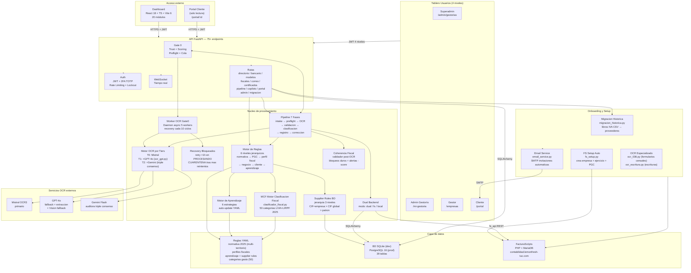

# 02 — Arquitectura General SFCE

> **Estado:** ✅ COMPLETADO
> **Actualizado:** 2026-03-01
> **Fuentes:** `sfce/api/app.py`, `sfce/core/backend.py`, `sfce/db/modelos.py`

---

## Qué es SFCE

SFCE (Sistema de Fiabilidad Contable España) es una plataforma SaaS diseñada para gestorías que automatiza el ciclo completo de contabilidad usando OCR e inteligencia artificial. El sistema recibe documentos contables (facturas de clientes, facturas de proveedores, nóminas, extractos bancarios, notas de crédito) y los procesa hasta dejarlos registrados en el software contable con los asientos correctos, sin intervención manual en casos estándar.

El público objetivo son gestorías que gestionan múltiples empresas cliente. SFCE actúa como capa de automatización sobre FacturaScripts (software contable PHP/MariaDB), añadiendo inteligencia de clasificación, validación normativa y aprendizaje continuo. Cada gestoría tiene su propio espacio aislado (multi-tenant), y dentro de ella gestiona las empresas de sus clientes.

Lo que diferencia a SFCE de otros sistemas contables es la combinación de triple consenso OCR (Mistral + GPT-4o + Gemini) con un motor de reglas contables de 6 niveles jerárquicos (normativa > PGC > perfil fiscal > negocio > cliente > aprendizaje). Este motor no solo clasifica documentos sino que aprende de correcciones pasadas, se actualiza automáticamente y aplica las reglas del BOE para cada modelo fiscal. El resultado es un sistema que mejora con el uso y reduce el tiempo de procesamiento en cada ciclo.

---

## Diagrama de componentes



---

## Jerarquia de usuarios (Tablero Usuarios)

El sistema implementa 4 niveles de acceso, cada uno con permisos y vistas propias:

```
Superadmin (nivel 4)
├── Crea y gestiona gestorías
├── /admin/gestorias
└── Gestoría (nivel 3 — tenant raíz)
    ├── Admin gestoría: invita asesores, gestiona plan
    ├── /mi-gestoria
    └── Gestor / Asesor (nivel 2)
        ├── Gestiona empresas del cliente
        ├── Invita clientes finales al portal
        └── Cliente final (nivel 1)
            ├── Acceso solo lectura a sus empresas
            └── /portal → /portal/:id (multi-empresa)
```

Flujo de invitación: token JWT 7 días → `POST /api/auth/aceptar-invitacion?token=xxx` → nuevo usuario con contraseña → JWT de sesión.

Archivos clave: `sfce/api/rutas/auth_rutas.py`, `sfce/api/rutas/admin.py`, `sfce/api/rutas/portal.py`, `sfce/core/email_service.py`

---

## Multi-tenant

La arquitectura multi-tenant sigue una jerarquía de tres niveles: **Gestoría → Empresas → Documentos**. Cada gestoría es un tenant independiente; sus datos nunca se mezclan con los de otras gestorías.

```
Gestoría (tenant raíz)
├── Empresa A (cliente de la gestoría)
│   ├── Documentos (facturas, nóminas, extractos...)
│   ├── Asientos contables
│   └── Modelos fiscales
├── Empresa B
│   └── ...
└── Empresa C
    └── ...
```

El aislamiento se implementa en dos capas:

| Capa | Mecanismo |
|------|-----------|
| JWT | El token incluye `gestoria_id`. Toda petición autenticada lleva el tenant implícito. |
| BD | Todas las tablas con datos de empresa tienen columna `empresa_id`. El helper `verificar_acceso_empresa()` comprueba que la empresa pertenece a la gestoría del token antes de servir datos. |
| FacturaScripts | Cada empresa tiene su propio `idempresa` en FS. Todas las llamadas a la API incluyen `idempresa` explícitamente. |

El endpoint de listado `listar_empresas()` filtra automáticamente por `gestoria_id` del JWT, garantizando que un usuario de una gestoría nunca vea empresas de otra.

---

## Dual Backend

El Dual Backend (`sfce/core/backend.py`) es la capa de abstracción que permite a SFCE escribir simultáneamente en dos destinos: **FacturaScripts** (el software contable real) y la **BD local** (SQLite/PostgreSQL del SFCE).

**Por qué existe:** FacturaScripts no expone todos los datos que necesita el dashboard en tiempo real. Las consultas complejas (P&G, KPIs, conciliación bancaria) son inviables sobre la API REST de FS. La BD local permite consultas analíticas rápidas mientras FS sigue siendo la fuente de verdad contable para modelos fiscales y documentación legal.

**Modos de operación:**

| Modo | Uso | Comportamiento |
|------|-----|----------------|
| `"dual"` | Producción | Escribe en FS + BD local simultáneamente |
| `"fs"` | Legacy / migración | Solo escribe en FacturaScripts |
| `"local"` | Testing / offline | Solo escribe en BD local |

**Parámetro `solo_local=True`:** Se usa al sincronizar asientos que FS ya generó automáticamente (por ejemplo, los asientos que `crearFacturaCliente` produce internamente). Con `solo_local=True`, el backend solo persiste en BD local sin reenviar a FS, evitando duplicados.

**Flujo de sincronización post-corrección:**

```
crearFactura* → FS genera asiento automatico
      ↓
Pipeline aplica correcciones (asientos invertidos, divisas, suplidos)
      ↓
_sincronizar_asientos_factura_a_bd() con solo_local=True
      ↓
BD local refleja el estado FINAL corregido (no el estado bruto de FS)
```

Si FS falla durante una operación dual, el backend marca el registro como `pendiente_sync` para reintento posterior.

---

## Módulos implementados

| Módulo | Estado | Tests | Ubicación principal |
|--------|--------|-------|---------------------|
| Pipeline 7 Fases | ✅ Completo | 18 tasks / E2E OK | `sfce/phases/` |
| Motor OCR por Tiers | ✅ Completo | 21 tests | `sfce/core/ocr_*.py` |
| OCR GPT Companion | ✅ Completo | 4 tests | `sfce/core/ocr_gpt.py` |
| Worker OCR Gate0 | ✅ Completo | 7 tests | `sfce/core/worker_ocr_gate0.py` |
| Recovery Bloqueados | ✅ Completo | 6 tests | `sfce/core/recovery_bloqueados.py` |
| Coherencia Fiscal | ✅ Completo | 13 tests | `sfce/core/coherencia_fiscal.py` |
| Motor de Reglas (6 niveles) | ✅ Completo | — | `sfce/core/`, `reglas/*.yaml` |
| Normativa multi-territorio | ✅ Completo | — | `sfce/normativa/2025.yaml` |
| Motor de Aprendizaje | ✅ Completo | 21 tests | `sfce/core/aprendizaje.py` |
| MCF Motor Clasificacion Fiscal | ✅ Completo | 70 tests | `sfce/core/clasificador_fiscal.py`, `reglas/categorias_gasto.yaml` |
| Supplier Rules BD | ✅ Completo | 5 tests | `sfce/core/supplier_rules.py` |
| Modelos Fiscales (28 modelos) | ✅ Completo | 544 tests | `sfce/modelos_fiscales/` |
| Tablero Usuarios (4 niveles) | ✅ Completo | 12 tasks impl. | `sfce/api/rutas/auth_rutas.py`, `admin.py`, `portal.py` |
| Email Service | ✅ Completo | — | `sfce/core/email_service.py` |
| OCR Especializado (036/Escrituras) | ✅ Completo | — | `sfce/core/ocr_036.py`, `sfce/core/ocr_escritura.py` |
| FS Setup Auto | ✅ Completo | — | `sfce/core/fs_setup.py` |
| Migracion Historica | ✅ Completo | — | `sfce/core/migracion_historica.py`, `sfce/api/rutas/migracion.py` |
| Dashboard (20 módulos) | ✅ Completo | Build OK | `dashboard/src/features/` |
| Bancario (Norma 43 + XLS) | ✅ Completo | 112 tests | `sfce/conectores/bancario/` |
| Directorio Empresas | ✅ Completo | 65 tests | `sfce/db/modelos.py`, `sfce/api/rutas/directorio.py` |
| Seguridad (JWT + 2FA + Lockout) | ✅ Completo | 39 tests | `sfce/api/auth.py`, `sfce/api/rate_limiter.py` |
| Multi-tenant | ✅ Completo | 4 E2E PASS | `sfce/api/rutas/`, migracion 004 |
| Gate 0 (Trust + Scoring) | ✅ Completo | — | `sfce/api/rutas/gate0.py` |
| PWA (Service Worker + offline) | ✅ Completo | Build OK | `dashboard/vite.config.ts`, `public/sw.js` |
| Portal Cliente | ✅ Completo | — | `sfce/api/rutas/portal.py`, `dashboard/src/features/portal/` |
| Generador de Datos de Prueba | ✅ Completo | 189 tests | `tests/datos_prueba/generador/` |
| Dual Backend FS+BD | ✅ Completo | Integrado | `sfce/core/backend.py` |
| Correo (CAP-Web) | Planificado | — | `docs/plans/2026-03-01-prometh-ai-fases-4-6.md` |
| Certificados AAPP (CertiGestor) | Planificado | — | `docs/plans/2026-03-01-prometh-ai-fases-4-6.md` |
| Copiloto IA | Planificado | — | — |

**Total tests actuales: 2133 PASS**

---

## Stack tecnológico

### Backend Python

| Tecnología | Rol |
|-----------|-----|
| FastAPI (Python 3.12+) | Framework API REST + WebSocket |
| SQLAlchemy 2.x | ORM, compatible SQLite y PostgreSQL |
| SQLite / PostgreSQL 16 | BD desarrollo / producción |
| JWT (python-jose) | Autenticación stateless |
| pyotp + qrcode | 2FA TOTP |
| Uvicorn | Servidor ASGI |
| Mistral API | OCR primario (Tier 0) |
| OpenAI GPT-4o | OCR fallback + extracción + Vision (Tier 1) |
| Google Gemini Flash | Triple consenso OCR (Tier 2) |
| WeasyPrint | Generación PDF modelos fiscales |
| smtplib | Email SMTP para invitaciones |
| pytest (2133 tests) | Suite de tests |

### Frontend

| Tecnología | Rol |
|-----------|-----|
| React 18 + TypeScript strict | UI principal |
| Vite 6 | Bundler + dev server |
| Tailwind CSS v4 | Estilos utility-first |
| shadcn/ui | Componentes accesibles |
| Recharts | Gráficos KPIs y P&G |
| TanStack Query v5 | Cache y sincronización servidor |
| Zustand | Estado global (empresa activa, auth) |
| @tanstack/react-virtual | Listas virtualizadas |
| vite-plugin-pwa + Workbox | PWA, cache-first assets, offline |
| DOMPurify | Sanitización HTML (XSS) |

### Infraestructura

| Tecnología | Rol |
|-----------|-----|
| Docker + Nginx | Contenedores y proxy inverso |
| Hetzner (65.108.60.69) | Servidor VPS |
| FacturaScripts (PHP + MariaDB 10.11) | Software contable base |
| Let's Encrypt | Certificados TLS |
| ufw + DOCKER-USER chain | Firewall servidor |
| Hetzner Object Storage (Helsinki) | Backups (7d/4w/12m) |
| Uptime Kuma | Monitorización servicios |

---

## Normativa multi-territorio

El archivo `sfce/normativa/2025.yaml` centraliza los tipos impositivos, umbrales y regímenes especiales para todos los territorios fiscales de España:

| Territorio | Régimen IVA | Notas |
|-----------|-------------|-------|
| Península + Baleares | General | Tipos 0%, 4%, 10%, 21% |
| Canarias | IGIC | Tipos propios, no IVA |
| Navarra | Foral | Convenio económico |
| País Vasco | Foral | Concierto económico |
| Ceuta / Melilla | IPSI | Tipos propios |

El Motor de Reglas selecciona automáticamente la normativa del territorio correspondiente al perfil fiscal de cada empresa.

---

## Motor de Clasificación Fiscal (MCF)

El MCF (`sfce/core/clasificador_fiscal.py`) asigna automáticamente cuentas PGC y tipos de deducibilidad a cada línea de factura, basándose en el catálogo `reglas/categorias_gasto.yaml` (50 categorías fiscales, cobertura LIVA + LIRPF 2025).

Categorías cubiertas: hostelería, construcción, alimentación, bebidas, limpieza, packaging, representación, alquiler maquinaria, suplidos aduaneros, material de oficina, servicios profesionales, viajes, y más.

Cuando el MCF no puede clasificar automáticamente, activa el **wizard interactivo** en `intake._descubrimiento_interactivo`, que sustituye los 8 inputs manuales anteriores por un único flujo guiado.

---

## Principios de diseño

**1. Motor de reglas en lugar de código ad-hoc**
Las reglas contables (tipos de IVA, cuentas PGC, regímenes fiscales) se expresan en YAML versionado (`reglas/*.yaml`), no en código Python. Esto permite actualizar la normativa de un año sin tocar el motor, y facilita auditorías: cualquier decisión contable tiene su regla explícita en texto legible.

**2. Dual backend para separar fuente de verdad de analítica**
FacturaScripts es la fuente de verdad legal (genera los PDFs de modelos fiscales, firma asientos). La BD local es la fuente de verdad analítica (queries rápidas para dashboard, KPIs, conciliación). Separar ambos roles evita sobrecargar FS con consultas analíticas que no está diseñado para responder.

**3. Triple consenso OCR para máxima fiabilidad**
Un solo motor OCR tiene tasas de error inaceptables para datos contables. El sistema usa tres motores en cascada: si el primero (Mistral) obtiene consenso en campos clave, no se activan los siguientes (coste cero adicional). Solo cuando hay ambigüedad se invoca el segundo y tercer motor, que actúa como auditor. El resultado es alta fiabilidad con coste mínimo en el caso común.

**4. Aprendizaje continuo sin intervención manual**
Cada corrección manual que hace un usuario (cambiar la cuenta contable de un proveedor, ajustar el tipo de IVA) se registra como regla en `reglas/aprendizaje.yaml`. En el siguiente ciclo, el mismo patrón se resuelve automáticamente. El sistema mejora con el uso real de cada gestoría.

**5. Multi-tenant por diseño, no por retrofit**
El aislamiento de gestorías se implementa en la capa de datos (columna `gestoria_id`) y en la capa de autenticación (JWT con `gestoria_id`). No existe una ruta de acceso que eluda esta verificación: `verificar_acceso_empresa()` se llama antes de cualquier operación con datos de empresa, y el ORM filtra por `gestoria_id` en todas las consultas de listado.

**6. Resiliencia ante fallos OCR**
El Worker OCR Gate0 ejecuta el procesamiento de forma asíncrona con 5 workers paralelos. Si un documento queda atascado en estado PROCESANDO más de 1 hora, Recovery Bloqueados lo reintenta automáticamente. Tras el número máximo de reintentos sin éxito, el documento pasa a CUARENTENA para revisión manual, nunca se pierde silenciosamente.
