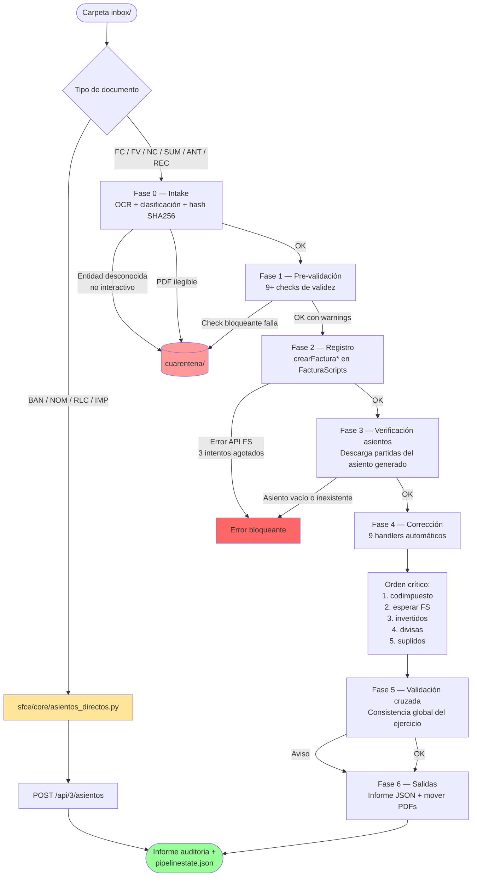
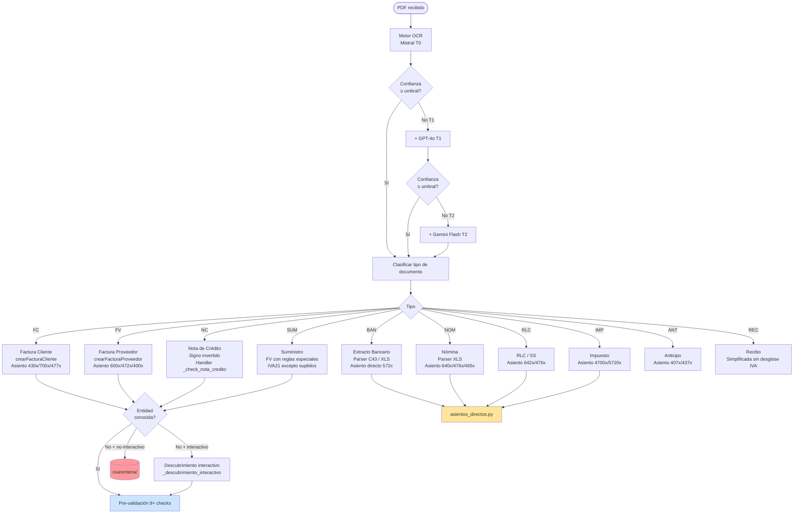

# Pipeline SFCE — Las 7 Fases

El pipeline SFCE orquesta el procesamiento completo de documentos contables desde la carpeta `inbox/` de un cliente hasta su registro verificado en FacturaScripts y la base de datos local. Ejecuta 7 fases secuenciales con quality gates entre cada una.

---

## 1. Tabla resumen de fases

| Fase | Nombre | Módulo | Función entrada | Qué hace | Fallo → |
|------|--------|--------|-----------------|----------|---------|
| 0 | Intake | `sfce/phases/intake.py` | `ejecutar_intake()` | OCR, clasificación de tipo de documento, identificación de entidad | `cuarentena/` |
| 1 | Pre-validación | `sfce/phases/pre_validation.py` | `ejecutar_pre_validacion()` | 9+ checks de validez antes de tocar FacturaScripts | `cuarentena/` |
| 2 | Registro | `sfce/phases/registration.py` | `ejecutar_registro()` | Crea factura/asiento en FacturaScripts vía API REST | error bloqueante |
| 3 | Verificación asientos | `sfce/phases/asientos.py` | `ejecutar_asientos()` | Descarga el asiento generado por FS y verifica que existe | error bloqueante |
| 4 | Corrección | `sfce/phases/correction.py` | `ejecutar_correccion()` | 9 handlers correctores: cuadre, divisas, IVA, subcuentas | error bloqueante |
| 5 | Validación cruzada | `sfce/phases/cross_validation.py` | `ejecutar_cruce()` | Consistencia global del ejercicio: IVA, balance, libro diario | warning / error |
| 6 | Salidas | `sfce/phases/output.py` | `ejecutar_salidas()` | Informe JSON, mover PDFs procesados, historial de confianza | error no bloqueante |

> En modo `--dry-run`, solo se ejecutan las fases 0 y 1. Las fases 2-6 se omiten.

---

## 2. Tipos de documento

| Tipo | Nombre completo | Ruta en el pipeline |
|------|-----------------|---------------------|
| FC | Factura de cliente (emitida) | OCR completo → fases 0-6 |
| FV | Factura de proveedor (recibida) | OCR completo → fases 0-6 |
| NC | Nota de crédito | OCR completo → fases 0-6 |
| SUM | Suministro (luz, agua, teléfono, seguro) | OCR completo → fases 0-6 |
| BAN | Extracto bancario (Norma 43 TXT o XLS) | **Asiento directo** — sin OCR |
| NOM | Nómina | **Asiento directo** — sin OCR |
| RLC | RLC / cotización Seguridad Social | **Asiento directo** — sin OCR |
| IMP | Impuesto / liquidación AEAT | **Asiento directo** — sin OCR |
| ANT | Anticipo | OCR simplificado → fases 0-6 |
| REC | Recibo | OCR simplificado → fases 0-6 |

Los tipos **BAN, NOM, RLC e IMP** no pasan por los motores OCR. Se procesan en `sfce/core/asientos_directos.py`, que construye el asiento directamente desde los datos estructurados del archivo (parser C43 para BAN, XLS para nóminas, etc.) y lo registra en FacturaScripts vía `POST /api/3/asientos`.

---

## 3. Flags del pipeline

| Flag | Tipo | Descripción |
|------|------|-------------|
| `--cliente NOMBRE` | requerido | Nombre de la subcarpeta del cliente en `clientes/` (ej: `elena-navarro`) |
| `--ejercicio AAAA` | opcional | Año contable (ej: `2025`). Si se omite, usa el del `config.yaml` del cliente |
| `--inbox DIR` | opcional | Subcarpeta de entrada dentro de la carpeta del cliente. Default: `inbox` |
| `--dry-run` | flag | Solo ejecuta intake + pre-validación, sin registrar nada en FacturaScripts |
| `--resume` | flag | Retoma desde la última fase completada según `pipeline_state.json` |
| `--fase N` | entero 0-6 | Ejecuta una sola fase específica (0=intake, 1=pre-val, ..., 6=salidas) |
| `--force` | flag | Continúa aunque un quality gate falle (útil para diagnóstico) |
| `--no-interactivo` | flag | Entidades desconocidas van a cuarentena en lugar de preguntar al usuario |
| `--verbose` | flag | Activa logging en nivel DEBUG |

### Comando de uso completo

```bash
export $(grep -v '^#' .env | xargs)
python scripts/pipeline.py --cliente elena-navarro --ejercicio 2025 --inbox inbox_muestra --no-interactivo
```

---

## 4. Estado del pipeline

### Archivo `pipeline_state.json`

Ubicado en `clientes/<nombre-cliente>/pipeline_state.json`. Contiene:

```json
{
  "fases_completadas": ["intake", "pre_validacion", "registro"],
  "resultado_intake": { "documentos": [...], "cuarentena": [...] },
  "resultado_pre_validacion": { ... },
  "ultima_fase": "registro",
  "ultima_actualizacion": "2025-03-01T14:32:00"
}
```

Campos clave:
- `fases_completadas`: lista de nombres de fases ya ejecutadas con éxito
- `resultado_<fase>`: salida completa de cada fase (documentos procesados, errores, estadísticas)
- `ultima_fase`: nombre de la última fase completada
- `ultima_actualizacion`: timestamp ISO 8601

### Comportamiento de `--resume`

Al arrancar con `--resume`, el pipeline lee `pipeline_state.json` y omite las fases que ya figuran en `fases_completadas`. Continúa desde la siguiente fase pendiente usando los datos guardados de la fase anterior como entrada.

Esto permite recuperarse de interrupciones sin volver a ejecutar llamadas OCR costosas ni re-registrar facturas ya creadas en FacturaScripts.

### Corrupción del estado

Si el proceso es interrumpido **durante el guardado** del JSON (crash, kill de proceso), el archivo puede quedar malformado. Síntoma: `json.JSONDecodeError` al arrancar.

Solución: borrar el archivo y reejecutar desde cero.

```bash
rm clientes/<nombre-cliente>/pipeline_state.json
python scripts/pipeline.py --cliente <nombre-cliente> --ejercicio 2025
```

---

## 5. Detalle de cada fase

### Fase 0 — Intake

- **Módulo**: `sfce/phases/intake.py`
- **Función principal**: `ejecutar_intake()` → `_procesar_un_pdf()`

#### Qué hace

1. Escanea la carpeta `inbox/` (o la indicada en `--inbox`) buscando archivos PDF
2. Calcula hash SHA256 de cada PDF como clave de identidad única
3. **Cache OCR**: si existe `.ocr.json` junto al PDF con el mismo hash, reutiliza la extracción anterior sin llamar a ninguna API
4. Extrae texto del PDF (PyPDF2) y convierte a imagen base64 si el texto es insuficiente
5. Clasifica el tipo de documento (`_clasificar_tipo_documento()`) usando el texto y metadatos
6. Identifica la entidad emisora/receptora (`_identificar_entidad()`) comparando CIF/nombre contra el `config.yaml` del cliente
7. Construye el objeto `DocumentoConfianza` con todos los datos extraídos y el nivel de confianza

#### Procesamiento paralelo

Se usan **5 workers** simultáneos (configurable) para procesar PDFs en paralelo. Con GPT-4o en el tier de pago gratuito (30K TPM), 5 workers saturan el rate limit. En ese caso reducir a 2-3 workers o usar solo Mistral como motor primario.

#### Sistema de tiers OCR

| Tier | Motores activos | Se activa cuando |
|------|-----------------|------------------|
| T0 | Solo Mistral OCR3 | Confianza ≥ umbral tras Mistral |
| T1 | Mistral + GPT-4o | Confianza Mistral < umbral |
| T2 | Mistral + GPT-4o + Gemini Flash | Confianza T1 < umbral |

La función `_votacion_tres_motores()` recibe las extracciones de los tres motores y elige los campos por votación mayoritaria. Si dos motores coinciden en un campo, ese valor gana.

#### Condiciones de cuarentena

- Entidad no encontrada en `config.yaml` y modo `--no-interactivo`
- Hash duplicado (mismo PDF ya procesado en este lote)
- PDF ilegible (texto vacío + imagen no generada)
- Tipo de documento no reconocido

---

### Fase 1 — Pre-validación

- **Módulo**: `sfce/phases/pre_validation.py`
- **Función principal**: `ejecutar_pre_validacion()`

#### Checks implementados

| Check | Función | Tipo | Qué verifica |
|-------|---------|------|-------------|
| CHECK 1 | `_validar_cif_formato()` | Bloqueante (FC/FV) / Warning (otros) | Formato CIF/NIF válido (algoritmo de verificación) |
| CHECK 2 | `_validar_entidad_existe()` | Bloqueante | Entidad conocida en `config.yaml` o FacturaScripts |
| CHECK 3 | `_validar_divisa()` | Warning | Divisa reconocida (EUR, USD, GBP...) |
| CHECK 4 | `_validar_tipo_iva()` | Warning | Tipo IVA coherente con el régimen del cliente |
| CHECK 5 | `_validar_fecha_ejercicio()` | Bloqueante (FC/FV) / Warning | Fecha dentro del ejercicio activo |
| CHECK 6 | `_validar_importe_positivo()` | Bloqueante | Total > 0 (NC pueden ser negativos) |
| CHECK 7 | `_validar_cuadre_base_iva_total()` | Warning | `base + IVA ≈ total` (tolerancia 1 céntimo) |
| CHECK 8 | `_validar_no_duplicado()` | Bloqueante | No existe otro doc con mismo CIF + fecha + importe en el lote actual |
| CHECK 9 | `_validar_no_existe_en_fs()` | Bloqueante | No existe ya en FacturaScripts (consulta API) |
| — | `ejecutar_checks_aritmeticos()` | Warning | Checks aritméticos adicionales (módulo `sfce.core.aritmetica`) |
| — | `_check_nomina_cuadre()` | Warning (NOM) | Bruto - retenciones ≈ neto |
| — | `_check_nomina_irpf()` | Warning (NOM) | IRPF dentro de rango razonable |
| — | `_check_nomina_ss()` | Warning (NOM) | SS dentro de rango razonable |
| — | `_check_suministro_cuadre()` | Warning (SUM) | Cuadre base + IVA en suministros |
| — | `_check_bancario_importe()` | Warning (BAN) | Importe del movimiento no nulo |
| — | `_check_rlc_cuota()` | Warning (RLC) | Cuota RLC positiva |

Los checks **bloqueantes** mueven el documento a `cuarentena/` con el motivo anotado. Los checks de tipo **warning** se registran en el log y en el informe final pero no detienen el procesamiento.

---

### Fase 2 — Registro

- **Módulo**: `sfce/phases/registration.py`
- **Función principal**: `ejecutar_registro()`

#### Qué hace

1. **`_asegurar_entidades_fs()`**: verifica que el proveedor/cliente existe en FacturaScripts. Si no existe, lo crea vía `POST /api/3/proveedores` o `POST /api/3/clientes`. Los proveedores **no deben** llevar `codsubcuenta` del `config.yaml` (que es la cuenta de gasto 600x) — FS auto-asigna la subcuenta 400x correcta.

2. **`_construir_form_data()`**: prepara el payload para la API de FacturaScripts. La API de `crearFactura*` requiere **form-encoded** (NO JSON). Las líneas van como JSON string dentro del campo `lineas`. El campo `codejercicio` **siempre** se pasa explícitamente para evitar que FS asigne la factura al ejercicio de otra empresa.

3. **Loop de aprendizaje** (3 intentos): si la llamada a FS falla, el `Resolutor` del motor de aprendizaje intenta resolver el error (crear subcuenta faltante, corregir campo null, adaptar campos OCR, etc.) antes del siguiente intento.

4. **`_corregir_asientos_proveedores()`** y **`_corregir_divisas_asientos()`**: correcciones post-registro aplicadas a todos los documentos del lote antes de la sincronización.

5. **`_sincronizar_asientos_factura_a_bd()`**: tras las correcciones, sincroniza el asiento final de FS a la base de datos local SQLite/PostgreSQL. La sincronización ocurre **después** de las correcciones para capturar el estado final, no el intermedio.

#### Orden de registro para FC (facturas cliente)

Las facturas de cliente deben crearse en **orden cronológico estricto**. FacturaScripts valida que el número de factura incremente junto con la fecha dentro del mismo `codejercicio` + `codserie`. Si se crea una factura con fecha anterior a una ya existente con número menor, la API devuelve 422 y todas las inserciones posteriores del lote fallan. Solución: pre-generar todas las fechas del año, ordenar ASC, crear en ese orden.

---

### Fase 3 — Verificación de asientos

- **Módulo**: `sfce/phases/asientos.py`
- **Función principal**: `ejecutar_asientos()`

#### Qué hace

1. Para cada documento registrado en la fase anterior, obtiene el `idasiento` generado por FacturaScripts (`_obtener_asiento_factura()`)
2. Descarga las partidas del asiento (`_obtener_partidas_asiento()`)
3. Verifica que el asiento existe y tiene al menos una partida con importe > 0
4. Guarda los datos del asiento en el estado del pipeline para uso en la fase de corrección

Esta fase actúa como gate: si FacturaScripts generó el asiento correctamente, se puede continuar. Si el asiento no existe o está vacío, la fase falla y el pipeline se detiene (a menos que se use `--force`).

---

### Fase 4 — Corrección automática

- **Módulo**: `sfce/phases/correction.py`
- **Función principal**: `ejecutar_correccion()`

#### Los 9 handlers de corrección

| Handler | Función | Qué corrige |
|---------|---------|------------|
| 1 | `_check_cuadre()` | Suma de debe ≠ suma de haber en el asiento |
| 2 | `_check_divisas()` | Facturas en divisa extranjera: convierte importes a EUR con la tasa de conversión |
| 3 | `_check_nota_credito()` | NC con signo incorrecto en debe/haber |
| 4 | `_check_intracomunitaria()` | Facturas intracomunitarias: aplica IVA0 + autorepercusión (asientos 472/477) |
| 5 | `_check_reglas_especiales()` | Suplidos aduaneros: IVA0 + reclasificación de 600 a 4709 |
| 6 | `_check_subcuenta()` | Subcuenta de gasto incorrecta (ej: cuenta genérica 6000000000 → cuenta específica del proveedor) |
| 7 | `_check_importe()` | Importe del asiento incoherente con la suma de líneas de factura |
| 8 | `_check_subcuenta_lado()` | Debe/Haber en la subcuenta incorrecta (asientos "invertidos") |
| 9 | `_check_iva_por_linea()` | Tipo IVA incorrecto en cada línea de factura (codimpuesto) |
| 10 | `_check_irpf_factura_cliente()` | IRPF en facturas emitidas a clientes con retención |

Cada handler devuelve una lista de correcciones a aplicar. `_aplicar_correccion()` ejecuta las correcciones vía PUT a la API de FacturaScripts.

---

### Fase 5 — Validación cruzada

- **Módulo**: `sfce/phases/cross_validation.py`
- **Función principal**: `ejecutar_cruce()`

#### Checks de validación cruzada

| Check | Función | Qué verifica |
|-------|---------|-------------|
| Gastos vs 600 | `_check_gastos_vs_600()` | Total gastos del ejercicio ≈ saldo cuenta 600 |
| Ingresos vs 700 | `_check_ingresos_vs_700()` | Total ingresos ≈ saldo cuenta 700 |
| IVA repercutido | `_check_iva_repercutido()` | IVA de FC suma ≈ saldo cuenta 477 |
| IVA soportado | `_check_iva_soportado()` | IVA de FV suma ≈ saldo cuenta 472 |
| Autoliquidación | `_check_autoliq_equilibrada()` | 472 - 477 = resultado Modelo 303 esperado |
| Facturas vs asientos | `_check_facturas_vs_asientos()` | Cada factura tiene exactamente un asiento asociado |
| Libro diario | `_check_libro_diario()` | Suma total debe = suma total haber en el libro diario |
| Modelo 303 | `_check_modelo_303()` | Coherencia con las cuotas calculadas del 303 |
| Balance | `_check_balance()` | Activo = Pasivo + Patrimonio neto |
| Cruce proveedores | `_check_cruce_por_proveedor()` | Saldo pendiente por proveedor ≈ partidas 400x abiertas |
| Cruce clientes | `_check_cruce_por_cliente()` | Saldo pendiente por cliente ≈ partidas 430x abiertas |
| Personal/servicios | `_check_personal_servicios()` | Coherencia nóminas registradas vs partidas 640x |
| Auditor IA | `_check_auditor_ia()` | Revisión semántica por Gemini Flash de los asientos del ejercicio |

Los checks de esta fase generan **warnings**, no errores bloqueantes (salvo desequilibrio grave del libro diario). El informe final los incluye con semáforo verde/amarillo/rojo.

---

### Fase 6 — Salidas

- **Módulo**: `sfce/phases/output.py`
- **Función principal**: `ejecutar_salidas()`

#### Qué hace

1. **`_mover_pdfs_procesados()`**: mueve los PDFs de `inbox/` a `procesados/` (con éxito) o deja en `cuarentena/` los que fallaron
2. **`_generar_informe_auditoria()`**: genera `informe_<fecha>.json` en la carpeta del cliente con el resumen completo del procesamiento:
   - Documentos procesados: total, éxitos, cuarentena, errores
   - Checks fallidos por documento
   - Correcciones aplicadas
   - Alertas de validación cruzada
3. **`_actualizar_historial_confianza()`**: actualiza el histórico de niveles de confianza OCR para seguimiento de la evolución del motor
4. Actualiza `pipeline_state.json` con el resultado final

---

## 6. Orden critico de correcciones

**ADVERTENCIA: el orden de las correcciones en la Fase 4 es estricto e inamovible. Si se altera, FacturaScripts regenera los asientos automáticamente al detectar cambios en las líneas de factura, deshaciendo los cambios aplicados en pasos anteriores.**

El orden obligatorio es:

1. Corregir `codimpuesto` en líneas de factura (IVA21 → IVA0 para suplidos aduaneros)
2. Esperar a que FacturaScripts regenere el asiento tras el cambio de codimpuesto
3. Corregir asientos invertidos (debe/haber en lado incorrecto)
4. Corregir divisas (importes USD → EUR con tasa de conversión)
5. Reclasificar suplidos (cuenta 600 → cuenta 4709)

La razón es que cualquier PUT a `lineasfacturaproveedores` dispara una regeneración automática del asiento en FacturaScripts, borrando todas las partidas manuales que se hubieran creado. Por eso, las correcciones de asiento (pasos 3-5) siempre van **después** de los cambios en líneas de factura (paso 1).

---

## 7. Diagrama de flujo



---

## 8. Árbol de decisión por tipo de documento


