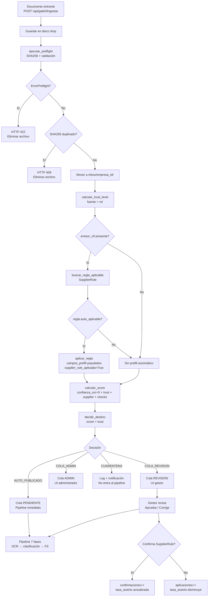

# 04 — Gate 0: Preflight, Cola y Scoring

> **Estado:** ✅ COMPLETADO
> **Actualizado:** 2026-03-02
> **Fuentes:** `sfce/core/gate0.py`, `sfce/api/rutas/gate0.py`, `sfce/db/modelos.py`

---

Gate 0 es el punto de entrada unificado para todos los documentos del sistema. Antes de iniciar el
pipeline de 7 fases, cada archivo pasa por un proceso de validación, deduplicación, cálculo de
confianza y decisión automática. El resultado queda registrado en la tabla `cola_procesamiento`.

---

## 1. Trust Levels

El nivel de confianza refleja la fiabilidad del origen del documento. Se asigna automáticamente en
función de la fuente y el rol del usuario que realiza la ingesta.

### Enum `TrustLevel`

```python
class TrustLevel(str, Enum):
    MAXIMA = "MAXIMA"   # sistema, certigestor, worker_interno
    ALTA   = "ALTA"     # portal_gestor, gestor, asesor
    MEDIA  = "MEDIA"    # email_empresa_conocida
    BAJA   = "BAJA"     # cliente directo, email anonimo
```

### Tabla de asignación

| Nivel  | Fuentes que lo activan                                    | Roles que lo activan                         |
|--------|-----------------------------------------------------------|----------------------------------------------|
| MAXIMA | `sistema`, `certigestor`, `worker_interno`                | —                                            |
| ALTA   | `portal_gestor`, `gestor`, `asesor`                       | `asesor`, `admin_gestoria`, `superadmin`     |
| MEDIA  | `email_empresa_conocida`                                  | —                                            |
| BAJA   | cualquier otra fuente (p.ej. `portal` con rol cliente)    | —                                            |

### Función `calcular_trust_level(fuente, rol)`

```python
def calcular_trust_level(fuente: str, rol: str = "") -> TrustLevel
```

- `fuente`: cadena que identifica el canal de entrada (p.ej. `"sistema"`, `"portal_gestor"`, `"email_empresa_conocida"`).
- `rol`: rol del usuario autenticado (p.ej. `"asesor"`, `"admin_gestoria"`, `"superadmin"`).

La función evalúa en orden: MAXIMA → ALTA (fuente o rol) → MEDIA → BAJA por defecto.

---

## 2. Preflight

El preflight es la primera barrera antes de encolar un documento. Valida integridad, tamaño,
estructura PDF y detecta duplicados por contenido (SHA256).

### Función `ejecutar_preflight(ruta_archivo, empresa_id, sesion, nombre_original)`

Pasos que realiza:

1. Verifica que el archivo existe y no está vacío.
2. Comprueba que el tamaño no supera el límite de **25 MB**.
3. Sanitiza el nombre del archivo (`sanitizar_nombre_archivo`).
4. Si es PDF, valida la estructura con `validar_pdf()`.
5. Calcula el hash **SHA256** del contenido binario.
6. Consulta `cola_procesamiento` buscando un registro con el mismo SHA256, misma `empresa_id`
   y `estado = 'COMPLETADO'`. Si existe → duplicado.

### Estructura `ResultadoPreflight`

```python
@dataclass
class ResultadoPreflight:
    sha256: str             # hash SHA256 del contenido (hexdigest, 64 chars)
    duplicado: bool         # True si ya existe en cola con estado COMPLETADO
    tamano_bytes: int       # tamaño del archivo en bytes
    nombre_sanitizado: str  # nombre limpio, sin caracteres peligrosos
```

### Excepción `ErrorPreflight`

`ErrorPreflight` (subclase de `ValueError`) se lanza cuando:

- El archivo no existe en disco.
- El archivo tiene 0 bytes.
- El tamaño supera 25 MB.
- El PDF tiene estructura inválida (cabecera corrupta, sin páginas, etc.).

El endpoint `POST /api/gate0/ingestar` captura `ErrorPreflight` y devuelve HTTP 422.
Los duplicados detectados por SHA256 devuelven HTTP 409 (sin lanzar la excepción).

---

## 3. Scoring y decisión automática

Tras el preflight, el sistema calcula un score 0-100 que combina **cinco factores** ponderados.
El 5o factor (coherencia fiscal) se añadio para integrar la validacion post-OCR directamente
en la decision de admision.

### Función `calcular_score()`

```python
def calcular_score(
    confianza_ocr: float,              # 0.0 – 1.0, confianza reportada por el motor OCR
    trust_level: TrustLevel,
    supplier_rule_aplicada: bool,      # True si existe SupplierRule auto_aplicable para el CIF
    checks_pasados: int,               # checks de pre-validación que pasaron
    checks_totales: int,
    coherencia: Optional[ResultadoCoherencia] = None,  # resultado del validador fiscal post-OCR
) -> float
```

**Pesos de los 5 factores:**

| Factor                      | Constante        | Peso  | Contribución máxima                                   |
|-----------------------------|------------------|-------|-------------------------------------------------------|
| Confianza OCR               | `_PESO_OCR`      | 0.45  | `confianza_ocr * 100 * 0.45`                         |
| Bonus trust level           | `_PESO_TRUST`    | 0.25  | 0 / 5 / 15 / 25 puntos (fijo según TrustLevel)       |
| Bonus supplier rule         | `_PESO_SUPPLIER` | 0.15  | 15 puntos si `supplier_rule_aplicada=True`, 0 si no  |
| Coherencia fiscal (5º)      | `_PESO_COHERENCIA` | 0.10 | `coherencia.score * 0.10` (0 si no hay coherencia)  |
| Ratio checks pre-validación | `_PESO_CHECKS`   | 0.05  | `(checks_pasados/checks_totales) * 100 * 0.05`       |

> Los pesos OCR y Checks fueron reducidos (0.50→0.45 y 0.10→0.05) al incorporar el 5o factor
> para que la suma total siga siendo 100.

**Bonus por trust level:**

| TrustLevel | Bonus |
|------------|-------|
| MAXIMA     | 25    |
| ALTA       | 15    |
| MEDIA      | 5     |
| BAJA       | 0     |

El resultado se redondea a 2 decimales y se limita a 100.0.

> Nota: En la ingesta inicial (Gate 0 HTTP), el OCR todavía no se ha ejecutado, por lo que
> `confianza_ocr=0.0` y `coherencia=None`, usando un score conservador. El score definitivo
> se recalcula dentro del pipeline tras la fase de OCR y validacion de coherencia.

### Función `decidir_destino(score, trust, coherencia)` — umbrales exactos

```python
def decidir_destino(
    score: float,
    trust: TrustLevel,
    coherencia: Optional[ResultadoCoherencia] = None,
) -> Decision
```

**Bloqueo duro por coherencia fiscal:**

Si `coherencia` tiene `errores_graves=True`, la decision es **CUARENTENA inmediata**,
independientemente del score y del trust level. Este bloqueo se evalua antes que los umbrales.

**Umbrales de score (aplicados solo si no hay bloqueo duro):**

| Condición                                         | Decisión          |
|---------------------------------------------------|-------------------|
| `coherencia.errores_graves == True`               | CUARENTENA        |
| score >= 95 **y** trust in (MAXIMA, ALTA)         | AUTO_PUBLICADO    |
| score >= 85 **y** trust == ALTA                   | AUTO_PUBLICADO    |
| score >= 70                                       | COLA_REVISION     |
| score >= 50                                       | COLA_ADMIN        |
| score < 50                                        | CUARENTENA        |

### Enum `Decision`

```python
class Decision(str, Enum):
    AUTO_PUBLICADO = "AUTO_PUBLICADO"  # procesamiento automático sin revisión
    COLA_REVISION  = "COLA_REVISION"   # requiere revisión por el gestor
    COLA_ADMIN     = "COLA_ADMIN"      # requiere revisión por administrador
    CUARENTENA     = "CUARENTENA"      # rechazado, no entra al pipeline
```

---

## 4. Tabla `cola_procesamiento`

Registra cada documento que pasa por Gate 0, con su estado, score y decisión.

```sql
CREATE TABLE cola_procesamiento (
    id                INTEGER PRIMARY KEY AUTOINCREMENT,
    empresa_id        INTEGER NOT NULL,
    documento_id      INTEGER,            -- NULL hasta que el pipeline registra el doc
    nombre_archivo    VARCHAR(500) NOT NULL,
    ruta_archivo      VARCHAR(1000) NOT NULL,
    estado            VARCHAR(20) DEFAULT 'PENDIENTE',
    trust_level       VARCHAR(20) DEFAULT 'BAJA',
    score_final       FLOAT,
    decision          VARCHAR(30),
    hints_json        TEXT DEFAULT '{}',
    sha256            VARCHAR(64),
    datos_ocr_json    TEXT,               -- JSON con datos extraídos por OCR (nullable)
    coherencia_score  FLOAT,             -- Score coherencia fiscal 0-100 (nullable)
    worker_inicio     DATETIME,          -- Timestamp inicio procesamiento (para recovery)
    reintentos        INTEGER DEFAULT 0, -- Contador de reintentos por recovery
    created_at        DATETIME,
    updated_at        DATETIME
);
```

### Descripción de campos

| Campo             | Tipo         | Descripción                                                                                 |
|-------------------|--------------|---------------------------------------------------------------------------------------------|
| `id`              | Integer PK   | Identificador único del item en cola                                                        |
| `empresa_id`      | Integer      | Empresa a la que pertenece el documento (no nullable, indexado)                             |
| `documento_id`    | Integer      | FK al documento creado en BD tras completar el pipeline (nullable al inicio)                |
| `nombre_archivo`  | String(500)  | Nombre sanitizado del archivo                                                               |
| `ruta_archivo`    | String(1000) | Ruta absoluta en disco del archivo almacenado                                               |
| `estado`          | String(20)   | Estado actual: `PENDIENTE`, `PROCESANDO`, `COMPLETADO`, `ERROR`                             |
| `trust_level`     | String(20)   | Nivel de confianza asignado en Gate 0 (valor del enum `TrustLevel`)                         |
| `score_final`     | Float        | Score 0-100 calculado por `calcular_score()`                                                |
| `decision`        | String(30)   | Decisión de routing (valor del enum `Decision`)                                             |
| `hints_json`      | Text         | JSON con campos pre-rellenados por SupplierRule (`tipo_doc`, `subcuenta_gasto`, etc.)       |
| `sha256`          | String(64)   | Hash SHA256 del contenido binario; usado para deduplicación (indexado)                      |
| `datos_ocr_json`  | Text         | JSON con los datos extraídos por OCR tras procesamiento. Nullable hasta que el worker actua.|
| `coherencia_score`| Float        | Score de coherencia fiscal (0-100) calculado por `CoherenciaFiscal` post-OCR. Nullable.    |
| `worker_inicio`   | DateTime     | Timestamp de cuando el worker inició el procesamiento. Usado por `RecoveryBloqueados` para detectar docs atascados en `PROCESANDO` >1h. |
| `reintentos`      | Integer      | Contador de reintentos ejecutados por `RecoveryBloqueados`. Al llegar a `MAX_REINTENTOS` el doc pasa a CUARENTENA. |
| `created_at`      | DateTime     | Timestamp de inserción (UTC)                                                                |
| `updated_at`      | DateTime     | Timestamp de última modificación (auto-update en cada cambio)                              |

Los estados posibles para `estado`:

- `PENDIENTE` — recién encolado, esperando worker
- `PROCESANDO` — worker en ejecución
- `COMPLETADO` — pipeline finalizado sin errores
- `ERROR` — pipeline terminó con fallo; ver logs

---

## 5. Tabla `documento_tracking`

Almacena el historial completo de transiciones de estado de cada documento. Cada vez que un
documento cambia de estado (en `cola_procesamiento` o en el pipeline), se inserta una fila nueva.

```sql
CREATE TABLE documento_tracking (
    id           INTEGER PRIMARY KEY AUTOINCREMENT,
    documento_id INTEGER NOT NULL,
    estado       VARCHAR(30) NOT NULL,
    timestamp    DATETIME DEFAULT CURRENT_TIMESTAMP,
    actor        VARCHAR(50) DEFAULT 'sistema',
    detalle_json TEXT DEFAULT '{}'
);
```

### Descripción de campos

| Campo         | Tipo        | Descripción                                                                  |
|---------------|-------------|------------------------------------------------------------------------------|
| `documento_id`| Integer     | ID del documento (cola o BD) al que pertenece el evento (indexado)           |
| `estado`      | String(30)  | Nombre del estado al que transicionó (p.ej. `PENDIENTE`, `OCR_OK`, `ERROR`) |
| `timestamp`   | DateTime    | Momento exacto de la transición (UTC)                                        |
| `actor`       | String(50)  | Quién produjo el cambio: `sistema`, email del gestor, nombre del worker, etc.|
| `detalle_json`| Text        | JSON con contexto adicional: score, decisión, motivo de rechazo, etc.        |

Uso típico: para mostrar en el dashboard el historial cronológico de un documento (audit trail
visible por el gestor), o para depurar por qué un documento quedó en cuarentena.

---

## 6. Tabla `supplier_rules`

Esta tabla fue añadida para implementar el aprendizaje por proveedor. Cada vez que un gestor
confirma cómo clasificar una factura de un emisor, el sistema aprende y puede pre-rellenar
automáticamente esos campos en futuras ingestas del mismo CIF.

```sql
CREATE TABLE supplier_rules (
    id                    INTEGER PRIMARY KEY AUTOINCREMENT,
    empresa_id            INTEGER,            -- NULL = regla global
    emisor_cif            VARCHAR(20),
    emisor_nombre_patron  VARCHAR(200),
    tipo_doc_sugerido     VARCHAR(10),
    subcuenta_gasto       VARCHAR(20),
    codimpuesto           VARCHAR(10),
    regimen               VARCHAR(30),
    aplicaciones          INTEGER DEFAULT 0,
    confirmaciones        INTEGER DEFAULT 0,
    tasa_acierto          FLOAT DEFAULT 0.0,
    auto_aplicable        BOOLEAN DEFAULT FALSE,
    nivel                 VARCHAR(20) DEFAULT 'empresa',
    created_at            DATETIME,
    updated_at            DATETIME
);
```

### Descripción de campos

| Campo                  | Tipo         | Descripción                                                                       |
|------------------------|--------------|-----------------------------------------------------------------------------------|
| `empresa_id`           | Integer      | Empresa a la que aplica la regla. `NULL` = regla global para todas las empresas  |
| `emisor_cif`           | String(20)   | CIF/NIF del emisor. Indexado para búsqueda rápida en Gate 0                      |
| `emisor_nombre_patron` | String(200)  | Patrón de nombre del emisor (alternativa cuando no hay CIF)                      |
| `tipo_doc_sugerido`    | String(10)   | Tipo de documento pre-rellenado (`FV`, `SUM`, `NC`, etc.)                        |
| `subcuenta_gasto`      | String(20)   | Subcuenta contable sugerida (p.ej. `6280000000` para suministros)                |
| `codimpuesto`          | String(10)   | Código de IVA sugerido (`IVA21`, `IVA10`, `IVA0`, etc.)                         |
| `regimen`              | String(30)   | Régimen fiscal sugerido (`general`, `intracomunitario`, `importacion`, etc.)     |
| `aplicaciones`         | Integer      | Número total de veces que la regla se ha aplicado (automáticamente o sugerida)   |
| `confirmaciones`       | Integer      | Número de veces que el gestor ha confirmado que la regla era correcta             |
| `tasa_acierto`         | Float        | `confirmaciones / aplicaciones` — fiabilidad de la regla (0.0 – 1.0)            |
| `auto_aplicable`       | Boolean      | Si `True`, se aplica sin intervención humana cuando se detecta el CIF en Gate 0  |
| `nivel`                | String(20)   | `"empresa"` (solo para `empresa_id`) o `"global"` (aplica a todas las empresas) |

### Ciclo de aprendizaje

```
Documento ingresado con emisor_cif conocido
  → Gate 0 busca SupplierRule para (empresa_id, emisor_cif)
     → Si existe y auto_aplicable=True:
          aplicar_regla() → campos_prefill populados
          supplier_rule_aplicada=True → +15 puntos al score
     → Si existe pero auto_aplicable=False:
          sugerir en UI (COLA_REVISION muestra los campos sugeridos)

Gestor revisa y confirma la clasificación
  → aplicaciones += 1
  → confirmaciones += 1
  → tasa_acierto = confirmaciones / aplicaciones
  → Si tasa_acierto >= umbral configurable (típico 0.90):
       auto_aplicable = True  (próximas ingestas son automáticas)

Gestor corrige la clasificación
  → aplicaciones += 1
  → tasa_acierto disminuye
  → Si tasa_acierto cae por debajo del umbral:
       auto_aplicable = False  (vuelve a requerir revisión)
```

---

## 7. API Gate 0

### `POST /api/gate0/ingestar`

Punto de entrada unificado. Requiere autenticación.

**Body** (multipart/form-data):

| Campo        | Tipo    | Requerido | Descripción                                    |
|--------------|---------|-----------|------------------------------------------------|
| `archivo`    | File    | Sí        | Archivo PDF (u otro formato admitido)          |
| `empresa_id` | int     | Sí        | ID de la empresa destino                       |
| `emisor_cif` | string  | No        | CIF del emisor para búsqueda de SupplierRule   |

**Respuesta exitosa** (HTTP 202):

```json
{
  "cola_id": 42,
  "nombre": "factura_proveedor_2025-01.pdf",
  "sha256": "a3f1c9...",
  "trust_level": "ALTA",
  "score_inicial": 22.5,
  "estado": "COLA_REVISION",
  "supplier_rule_aplicada": false,
  "campos_prefill": {}
}
```

**Códigos de error:**

| Código | Causa                                                       |
|--------|-------------------------------------------------------------|
| 401    | Sin autenticación                                           |
| 409    | Documento duplicado (SHA256 ya procesado con COMPLETADO)   |
| 413    | ZIP demasiado grande (solo endpoint `/ingestar-zip`)        |
| 422    | Preflight fallido (archivo vacío, >25MB, PDF inválido, etc.)|
| 500    | Error interno inesperado                                    |

### `POST /api/gate0/ingestar-zip`

Ingesta masiva. Recibe un ZIP, extrae todos los PDFs internos y los encola individualmente.
Trust level asignado: ALTA (upload manual por gestor).
Limite de tamano del ZIP: **500 MB**.

**Respuesta** (HTTP 202):

```json
{
  "encolados": 12,
  "rechazados": 1,
  "errores": ["factura_corrupta.pdf: PDF inválido"]
}
```

**Codigos de error adicionales para ZIP:**

| Codigo | Causa                          |
|--------|--------------------------------|
| 413    | ZIP > 500 MB                   |

### `GET /api/gate0/worker/estado`

Consulta el estado del worker OCR que procesa la cola en background.
Requiere autenticacion.

**Respuesta** (HTTP 200):

```json
{
  "activo": true,
  "pendientes": 3,
  "procesados_hoy": 17
}
```

| Campo            | Tipo    | Descripcion                                                              |
|------------------|---------|--------------------------------------------------------------------------|
| `activo`         | bool    | `true` si la task asyncio del worker esta viva y no ha terminado         |
| `pendientes`     | int     | Items en cola con `estado = "PENDIENTE"` en este momento                 |
| `procesados_hoy` | int     | Items con `estado = "PROCESADO"` y `updated_at >= hoy`                   |

### Gestión de la cola (endpoints estándar BD)

Los documentos en `COLA_REVISION` o `COLA_ADMIN` se gestionan desde el dashboard. Los endpoints
de la API que cubren esta operativa son:

| Método | Ruta                                    | Acción                                           |
|--------|-----------------------------------------|--------------------------------------------------|
| GET    | `/api/gate0/cola`                       | Listar items de la cola (filtrado por estado/empresa) |
| GET    | `/api/gate0/cola/{id}`                  | Detalle de un item específico                    |
| POST   | `/api/gate0/cola/{id}/aprobar`          | Gestor aprueba manualmente → estado PENDIENTE, pipeline se ejecuta |
| POST   | `/api/gate0/cola/{id}/rechazar`         | Gestor rechaza → estado ERROR/CUARENTENA         |

**Aprobar manualmente un documento en REVISION:**

```http
POST /api/gate0/cola/{cola_id}/aprobar
Authorization: Bearer <token>
Content-Type: application/json

{
  "tipo_doc": "FV",
  "subcuenta_gasto": "6280000000",
  "codimpuesto": "IVA21"
}
```

La aprobación manual actualiza `hints_json` con los campos confirmados por el gestor, cambia
`estado` a `PENDIENTE` y dispara el pipeline. Si el gestor confirma los campos sugeridos por una
`SupplierRule`, el sistema incrementa `confirmaciones` y recalcula `tasa_acierto`.

---

## 8. Diagrama de flujo Gate 0



---

## Resumen de constantes

| Constante            | Valor        | Ubicación              |
|----------------------|--------------|------------------------|
| `MAX_BYTES`          | 25 MB        | `sfce/core/gate0.py`   |
| `MAX_ZIP`            | 500 MB       | `sfce/api/rutas/gate0.py` |
| `_PESO_OCR`          | 0.45         | `sfce/core/gate0.py`   |
| `_PESO_TRUST`        | 0.25         | `sfce/core/gate0.py`   |
| `_PESO_SUPPLIER`     | 0.15         | `sfce/core/gate0.py`   |
| `_PESO_COHERENCIA`   | 0.10         | `sfce/core/gate0.py`   |
| `_PESO_CHECKS`       | 0.05         | `sfce/core/gate0.py`   |
| Bloqueo duro         | `coherencia.errores_graves` → CUARENTENA | `sfce/core/gate0.py` |
| Umbral AUTO_PUBLICADO (MAXIMA/ALTA) | score >= 95 | `sfce/core/gate0.py` |
| Umbral AUTO_PUBLICADO (ALTA)        | score >= 85 | `sfce/core/gate0.py` |
| Umbral COLA_REVISION                | score >= 70 | `sfce/core/gate0.py` |
| Umbral COLA_ADMIN                   | score >= 50 | `sfce/core/gate0.py` |
| Umbral CUARENTENA                   | score < 50  | `sfce/core/gate0.py` |
