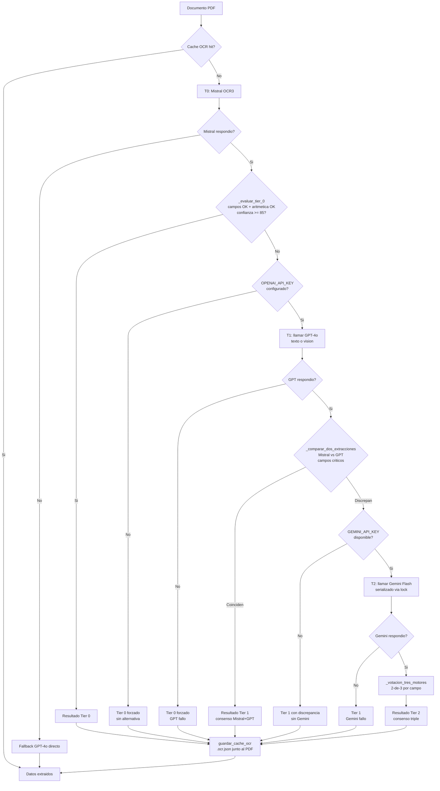

# 05 — OCR e IA: Sistema SmartOCR

> **Estado:** COMPLETADO
> **Actualizado:** 2026-03-03 (sesión 50 — arquitectura SmartOCR)
> **Fuentes:** `sfce/core/smart_ocr.py`, `sfce/core/smart_parser.py`, `sfce/core/pdf_analyzer.py`, `sfce/core/auditor_asientos.py`, `sfce/core/cache_ocr.py`, `sfce/core/worker_ocr_gate0.py`, `sfce/phases/intake.py`, `sfce/phases/cross_validation.py`

---

## Arquitectura SmartOCR (desde sesión 50)

La arquitectura de tiers manual fue **reemplazada** por SmartOCR: un sistema de routers inteligentes que elige el motor más barato posible, con caché integrado.

### Componentes

| Módulo | Archivo | Rol |
|--------|---------|-----|
| `PDFAnalyzer` | `sfce/core/pdf_analyzer.py` | Analiza el PDF sin APIs: extrae texto con pdfplumber, detecta imágenes, calcula ratio texto real, detecta CIF |
| `SmartOCR` | `sfce/core/smart_ocr.py` | Router OCR: elige motor según PDFProfile. Fachada `SmartOCR.extraer()` = OCR + parseo + caché |
| `SmartParser` | `sfce/core/smart_parser.py` | Router parseo: texto→JSON con motor más barato disponible |
| `AuditorAsientos` | `sfce/core/auditor_asientos.py` | Auditoría multi-modelo en paralelo con votación 2-de-3 |

### Cascade OCR (SmartOCR.extraer_texto)

```
pdfplumber (gratis) → EasyOCR local (gratis) → PaddleOCR local (gratis) → Mistral OCR3 (pago)
```

- **pdfplumber**: siempre primero. Si extrae texto de calidad (>= ratio 0.7 o tipo BAN/IMP/NOM) → fin.
- **EasyOCR**: para PDFs escaneados. Lee imágenes con `fitz`, OCR en español+inglés.
- **PaddleOCR**: fallback si EasyOCR da <10 palabras. Mejor para texto girado/espejado.
- **Mistral OCR3**: último recurso. Solo si motores locales fallan.

### Cascade Parseo (SmartParser.parsear)

```
template regex ($0) → Gemini Flash free ($0) → GPT-4o-mini ($0.0003/llamada) → GPT-4o ($0.005/llamada)
```

- **template**: para BAN e IMP (estructura fija conocida).
- **Gemini Flash**: gratis hasta 1500 req/día, para texto con ≥15 palabras.
- **GPT-4o-mini**: texto corto o si Gemini falla.
- **GPT-4o**: último recurso (no debería activarse normalmente).

### Fachada principal: SmartOCR.extraer()

```python
datos = SmartOCR.extraer(ruta_pdf, tipo_doc="FV")
# → dict con campos JSON estructurados, o None si todo falla
# Consulta caché automáticamente antes de llamar a ninguna API
```

Reemplaza todas las llamadas directas a `extraer_factura_mistral()`, `extraer_factura_gpt()`, `extraer_factura_gemini()`.

### Puntos de integración

| Archivo | Antes | Después |
|---------|-------|---------|
| `sfce/phases/intake.py` | Cascade manual 105 líneas | `_extraer_datos_ocr()` → `SmartOCR.extraer()` |
| `sfce/core/worker_ocr_gate0.py` | `_ejecutar_ocr_tiers()` cascade T0→T1→T2 | `SmartOCR.extraer()` |
| `sfce/phases/cross_validation.py` | `auditar_asiento_gemini()` solo Gemini | `_auditar_asiento()` → `AuditorAsientos.auditar_sync()` |
| `sfce/conectores/correo/extractor_enriquecimiento.py` | `gpt-4o` | `gpt-4o-mini` |

### AuditorAsientos — Votación multi-modelo

```python
# Ejecuta Gemini + Haiku + GPT-4o-mini en paralelo (asyncio.gather)
resultado = AuditorAsientos().auditar_sync(asiento)
# resultado.nivel: AUTO_APROBADO | APROBADO | REVISION_HUMANA | BLOQUEADO
# resultado.confianza: 0.0–1.0
# resultado.votos: {"gemini": True, "haiku": False, "gpt_mini": True}
```

Regla de votación: 3/3 → AUTO_APROBADO; 2/3 → APROBADO; 1/3 → REVISION_HUMANA; 0/3 → BLOQUEADO.

### Ahorro de costes estimado

| Caso | Antes | Después |
|------|-------|---------|
| FV digital (texto extractable) | ~$0.010 | ~$0.000 |
| FV escaneada simple | ~$0.030 | ~$0.000 |
| FV escaneada compleja | ~$0.060 | ~$0.005 |
| Pipeline mensual ~500 docs | $15–40/mes | $0.50–3/mes |

---

## Motores OCR disponibles (referencia)

| Motor | Variable API | Coste relativo | Limites conocidos |
|-------|-------------|----------------|-------------------|
| pdfplumber | — | $0 | Solo PDFs con texto embebido |
| EasyOCR | — | $0 | Descarga modelos ~200MB |
| PaddleOCR | — | $0 | Descarga modelos ~300MB |
| Mistral OCR3 | `MISTRAL_API_KEY` | $0.002/pág | Último recurso |
| GPT-4o-mini | `OPENAI_API_KEY` | $0.0003/llamada | Para parseo |
| Gemini Flash | `GEMINI_API_KEY` | $0 | 1500 req/día free tier |

---

## Campos criticos por tipo de documento

`_evaluar_tier_0()` usa la tabla `_CAMPOS_CRITICOS` para saber que campos son obligatorios segun el tipo:

| Tipo | Campos criticos |
|------|----------------|
| FC (factura cliente) | `emisor_cif`, `fecha`, `total`, `base_imponible` |
| FV (factura proveedor) | `receptor_cif`, `fecha`, `total`, `base_imponible` |
| NC (nota de credito) | `emisor_cif`, `fecha`, `total` |
| ANT / REC | `emisor_cif`, `fecha`, `total` |
| NOM (nomina) | `empleado_nombre`, `fecha`, `bruto`, `neto` |
| SUM (suministros) | `emisor_nombre`, `fecha`, `total` |
| BAN (bancario) | `fecha`, `importe` |
| RLC / IMP | `fecha`, `total` / `fecha`, `importe` |

---

## Condiciones de escalada de tier

### T0 — Solo Mistral (aceptado si los 3 checks pasan)

`_evaluar_tier_0()` verifica en orden:

1. **Campos criticos presentes**: ningun campo de `_CAMPOS_CRITICOS[tipo_doc]` puede ser `None`, `""` o `0`.
2. **Aritmetica coherente**: `ejecutar_checks_aritmeticos()` no devuelve errores (base + IVA = total, etc.).
3. **Confianza global >= 85**: `DocumentoConfianza.confianza_global()` calcula una puntuacion 0-100 a partir de campos presentes, coherencia interna y calidad del texto extraido.

Si los 3 checks pasan: `{"aceptado": True}` — el documento queda en Tier 0, sin llamar a GPT.

### T1 — Mistral + GPT (escala cuando T0 falla)

Si `_evaluar_tier_0()` devuelve `aceptado=False` y hay cliente GPT disponible:

1. Se llama a GPT-4o (modo texto si hay texto extraible, modo vision con imagen base64 si el PDF es solo imagen).
2. Se compara campo a campo con `_comparar_dos_extracciones()`:
   - Campos numericos: tolerancia absoluta 0.02 euros.
   - Campos texto: comparacion exacta normalizada (strip + uppercase).
3. Si Mistral y GPT **coinciden** en todos los campos criticos: `ocr_tier = 1`, resultado aprobado.

### T2 — Votacion triple Mistral + GPT + Gemini (escala cuando T1 discrepa)

Si Mistral y GPT discrepan en algun campo critico y Gemini esta disponible:

1. Se llama a Gemini Flash, serializado via `_gemini_lock` (threading.Lock) para respetar el limite de 5 req/min.
2. Se ejecuta `_votacion_tres_motores()` con los 3 resultados.
3. El resultado consenso se marca como `ocr_tier = 2`.

Si Gemini falla o no esta disponible: el documento se queda en T1 con aviso de discrepancia en el log.

---

## Funcion `_evaluar_tier_0()`

```python
def _evaluar_tier_0(datos_mistral: dict, tipo_doc: str,
                    doc_confianza: DocumentoConfianza,
                    umbral: int = 85) -> dict:
```

**Que evalua** (en orden, cortocircuito al primer fallo):

1. Campos criticos del tipo de documento: recorre `_CAMPOS_CRITICOS[tipo_doc]` y acumula faltantes.
2. Aritmetica: delega en `ejecutar_checks_aritmeticos()`. Si hay algun error, falla inmediatamente.
3. Confianza: llama a `doc_confianza.confianza_global()` y compara con el umbral (defecto 85).

**Que devuelve:**

```python
# Aceptado
{"aceptado": True, "motivo": "Tier 0: campos OK, aritmetica OK, confianza OK"}

# Rechazado por campos faltantes
{"aceptado": False, "motivo": "Campos criticos faltantes: emisor_cif, fecha"}

# Rechazado por aritmetica
{"aceptado": False, "motivo": "Errores aritmeticos: base + IVA != total"}

# Rechazado por confianza baja
{"aceptado": False, "motivo": "Confianza 72% < umbral 85%"}
```

---

## Funcion `_votacion_tres_motores()`

```python
def _votacion_tres_motores(ext_mistral: dict, ext_gpt: dict,
                            ext_gemini: dict, tipo_doc: str) -> dict:
```

Aplica votacion **2-de-3** campo a campo sobre los campos criticos del tipo de documento.

**Algoritmo por campo:**

- Campos numericos (`total`, `base_imponible`, `iva_importe`, etc.): si dos de los tres valores difieren en <=0.02 entre si, el campo ganador es el valor del primer par que coincide.
- Campos texto (`emisor_cif`, `fecha`, `numero_factura`, etc.): comparacion exacta tras `strip().upper()`. El par que coincide primero gana.

**Base del resultado**: se parte de una copia de `ext_mistral`. Solo se sobreescriben los campos donde hay mayoria. Si ningun par coincide en un campo critico (los 3 discrepan completamente), el campo conserva el valor de Mistral (comportamiento por defecto de la copia base).

**Empate (3 valores distintos):** ninguno de los 6 pares posibles coincide, el campo queda con el valor de Mistral. No hay criterio de desempate adicional: la logica asume que en un empate real (raro) Mistral es preferible por ser el motor primario.

**Confianza resultante:** no hay puntuacion de confianza calculada en `_votacion_tres_motores()` propiamente. El `ocr_tier = 2` actua como indicador de que se necesito arbitraje triple; las fases posteriores pueden tratar T2 con mas cautela.

---

## Cache OCR (`sfce/core/cache_ocr.py`)

### Mecanismo

Junto a cada PDF se guarda un archivo `.ocr.json` (mismo directorio, mismo nombre base):

```
inbox/factura-2025-001.pdf
inbox/factura-2025-001.ocr.json   <- cache
```

El JSON tiene el formato:

```json
{
  "hash_sha256": "<64 chars hex>",
  "timestamp": "2026-03-01T14:32:00",
  "motor_ocr": "mistral",
  "tier_ocr": 0,
  "datos": { "emisor_cif": "...", "total": 1210.50, ... }
}
```

### Invalidacion por SHA256

La clave de invalidacion es el hash SHA256 del PDF (calculado en bloques de 4 MB para PDFs grandes). Si el contenido del PDF cambia aunque sea 1 byte, el hash difiere y el cache se ignora automaticamente.

### Funciones principales

| Funcion | Descripcion |
|---------|-------------|
| `obtener_cache_ocr(ruta_pdf)` | Devuelve datos OCR si el cache es valido, `None` si no existe o hash no coincide |
| `guardar_cache_ocr(ruta_pdf, datos)` | Guarda el JSON junto al PDF, sobrescribe si ya existe |
| `invalidar_cache_ocr(ruta_pdf)` | Elimina el `.ocr.json`. Util tras correccion manual |
| `estadisticas_cache(directorio)` | Analiza hits/misses/invalidos en un directorio |

### Integracion en `_procesar_un_pdf()`

```
INICIO de _procesar_un_pdf()
  └── obtener_cache_ocr() → hit?
        SI → retornar datos directamente (0 llamadas API)
        NO → continuar con extraccion OCR...

FIN de _procesar_un_pdf()
  └── guardar_cache_ocr() con datos + tier + motor
```

**Beneficio economico:** primera ejecucion paga las APIs. Todas las siguientes ejecuciones sobre el mismo PDF son gratuitas mientras el archivo no cambie. Con batches de 200+ facturas, el ahorro en re-procesamiento es significativo.

---

## Workers paralelos

```python
ejecutar_intake(..., max_workers=5)
```

- Defecto: 5 workers (`ThreadPoolExecutor`).
- El paralelismo se activa solo si `not interactivo` y `max_workers > 1` y hay mas de 1 PDF.
- En modo interactivo (descubrimiento de entidades nuevas): secuencial forzado.

**Problema conocido con T1:** con 5 workers y GPT-4o activo, el consumo de tokens se acerca rapidamente al limite de 30K TPM de la tier gratuita. El resultado: muchos documentos quedan degradados en T0 (GPT retorna error de rate limit y se marca `ocr_tier=0` forzado).

**Soluciones:**

1. Reducir workers a 2-3: `--workers 2` si el pipeline lo expone como parametro.
2. Para batches grandes (>50 PDFs): usar solo Mistral sin GPT (no configurar `OPENAI_API_KEY`).
3. Para Gemini free tier (20 req/dia): reservar T2 para documentos de alto valor; con batches grandes se agota el cupo diario rapidamente.

---

## Estructura de datos OCR

Campos que devuelven los motores OCR tras la extraccion:

| Campo | Tipo | Descripcion |
|-------|------|-------------|
| `emisor_nombre` | str | Nombre o razon social del emisor |
| `emisor_cif` | str | CIF/NIF del emisor |
| `receptor_nombre` | str | Nombre del receptor |
| `receptor_cif` | str | CIF/NIF del receptor |
| `numero_factura` | str | Numero de factura (serie + numero) |
| `fecha` | str | Fecha de emision (formato variable segun motor) |
| `base_imponible` | float | Base imponible en euros |
| `iva_pct` | float | Porcentaje de IVA aplicado |
| `iva_importe` | float | Importe de IVA en euros |
| `total` | float | Total factura (base + IVA) |
| `lineas` | list[dict] | Lineas de detalle (descripcion, cantidad, precio) |
| `divisa` | str | Codigo ISO de divisa (EUR por defecto) |

Campos adicionales para tipos especificos: `empleado_nombre`, `bruto`, `neto` (NOM); `importe` (BAN, IMP); `banco_nombre` (BAN).

El documento final incluye metadatos internos prefijados con `_`: `_ocr_tier`, `_ocr_tier_motivo`, `_motores_usados`.

---

## Diagrama: Escalada T0 -> T1 -> T2



---

## Worker OCR Gate 0 (`sfce/core/worker_ocr_gate0.py`)

Daemon async que procesa la cola `ColaProcesamiento` en background. Se integra en el lifespan de FastAPI.

### Responsabilidades por ciclo

1. Obtiene hasta `_LIMITE_POR_CICLO = 10` documentos en estado `PENDIENTE`.
2. Por cada documento: ejecuta OCR en cascada (Tier 0 → 1 → 2), verifica coherencia fiscal, calcula score Gate 0 con 5 factores y decide destino.
3. Cada `_CICLOS_RECOVERY = 10` ciclos (aproximadamente cada 5 minutos con `intervalo=30s`) ejecuta recovery de documentos bloqueados.

### Flujo de un documento

```
ColaProcesamiento (PENDIENTE)
  → marcar PROCESANDO + registrar worker_inicio
  → _ejecutar_ocr_tiers(): Tier 0 Mistral → Tier 1 GPT → Tier 2 Gemini
  → verificar_coherencia_fiscal(datos_ocr)
  → calcular_score(confianza_ocr, trust_level, coherencia)
  → decidir_destino(score, trust, coherencia)
  → _finalizar_doc(): estado=PROCESADO, decision, score_final, coherencia_score, datos_ocr_json
```

Si se produce una excepcion en cualquier paso, el documento se resetea a `PENDIENTE` para retry automatico.

### Decisiones posibles

| Decision | Descripcion |
|----------|-------------|
| `AUTO_PUBLICADO` | Score alto, trust alta, coherencia OK |
| `COLA_REVISION` | Score medio o coherencia con alertas |
| `COLA_ADMIN` | Requiere supervision manual |
| `CUARENTENA` | OCR fallo totalmente o score muy bajo |

### Confianza OCR inferida

Si el motor OCR no devuelve `_confianza` ni `confianza_ocr`, la funcion `_confianza_desde_ocr()` la infiere contando cuantos campos clave estan presentes (`emisor_cif`, `total`, `base_imponible`, `fecha_factura`): `presentes / 4`.

### Arranque

```python
# En lifespan de FastAPI
asyncio.create_task(loop_worker_ocr(sesion_factory, intervalo=30))
```

El worker se detiene limpiamente al recibir `CancelledError` (shutdown de FastAPI).

**Tests:** 7 (`tests/test_worker_ocr_gate0.py`)

---

## Recovery de bloqueados (`sfce/core/recovery_bloqueados.py`)

Modulo independiente invocado periodicamente por el Worker OCR Gate 0.

### Problema que resuelve

Si el worker crashea o es interrumpido mientras un documento esta en estado `PROCESANDO`, ese documento queda bloqueado indefinidamente (nadie lo pone de vuelta a `PENDIENTE`). Sin recovery, esos documentos nunca se procesan.

### Algoritmo

```
Buscar en ColaProcesamiento:
  estado == "PROCESANDO"
  AND worker_inicio < (ahora - 1 hora)

Para cada doc bloqueado:
  SI reintentos >= MAX_REINTENTOS (3):
    → estado = "PROCESADO", decision = "CUARENTENA"  (definitivo)
  SINO:
    → estado = "PENDIENTE", worker_inicio = None, reintentos += 1
```

### Constantes

| Constante | Valor | Descripcion |
|-----------|-------|-------------|
| `TIMEOUT_PROCESANDO` | 1 hora | Tiempo en PROCESANDO antes de considerar bloqueado |
| `MAX_REINTENTOS` | 3 | Intentos maximos antes de CUARENTENA definitiva |

### Resultado devuelto

```python
{
    "bloqueados": 2,   # total detectados
    "resetados": 1,    # enviados de vuelta a PENDIENTE
    "cuarentena": 1    # enviados a CUARENTENA definitiva
}
```

### Invocacion desde el worker

```python
# En loop_worker_ocr(), cada _CICLOS_RECOVERY ciclos:
with sesion_factory() as sesion:
    resultado = recovery_documentos_bloqueados(sesion)
if resultado.get("resetados", 0) > 0:
    logger.info(f"Recovery: {resultado}")
```

**Tests:** 6 (`tests/test_recovery_bloqueados.py`)

---

## OCR Especializado — Formularios fiscales

Parsers de texto plano para documentos estructurados que no son facturas. Reciben texto ya extraido (por pdfplumber u otro motor) y aplican expresiones regulares para campos conocidos.

### Parser Modelo 036/037 (`sfce/core/ocr_036.py`)

Extrae datos de alta censal de la AEAT (formularios 036 y 037).

**Dataclass de resultado:**

```python
@dataclass
class DatosAlta036:
    nif: str = ""                    # NIF persona fisica o CIF sociedad
    nombre: str = ""                 # Apellidos + nombre o razon social
    domicilio_fiscal: str = ""       # Domicilio fiscal completo
    fecha_inicio_actividad: str = "" # Formato dd/mm/aaaa
    regimen_iva: str = ""            # "general", "simplificado", etc. (lowercase)
    epigrafe_iae: str = ""           # Codigo numerico epigrafe IAE
    es_sociedad: bool = False        # True si NIF empieza por letra (CIF)
    tipo_cliente: str = ""           # "autonomo" | "sociedad" | "desconocido"
    raw_text: str = ""               # Texto original para debug
```

**Logica de deteccion autonomo/sociedad:**

- Busca primero patron CIF sociedad (`[A-Z][0-9]{8}`). Si encuentra → `es_sociedad=True`, `tipo_cliente="sociedad"`.
- Si no, busca NIF persona fisica (`[0-9]{8}[A-Z]`). Si encuentra → `tipo_cliente="autonomo"`.
- Si ninguno → `tipo_cliente="desconocido"`.

**Campos extraidos por regex:**

| Campo | Patron buscado en texto |
|-------|-------------------------|
| `nombre` | `Apellidos y nombre`, `Razon social`, `Nombre` |
| `domicilio_fiscal` | `Domicilio fiscal`, `Domicilio social` |
| `fecha_inicio_actividad` | `Fecha inicio actividad` + formato `dd/mm/aaaa` |
| `regimen_iva` | `Regimen del IVA`, `Regimen IVA` |
| `epigrafe_iae` | `Epigrafe IAE`, `IAE` + digitos |

**Uso:**

```python
from sfce.core.ocr_036 import parsear_modelo_036

texto = extraer_texto_pdf("alta_censal.pdf")   # pdfplumber u otro motor
datos = parsear_modelo_036(texto)
print(datos.nif, datos.tipo_cliente, datos.regimen_iva)
```

### Parser escrituras de constitucion (`sfce/core/ocr_escritura.py`)

Extrae datos de escrituras notariales de constitucion de sociedades.

**Dataclass de resultado:**

```python
@dataclass
class DatosEscritura:
    cif: str = ""                    # CIF de la sociedad (formato [A-Z][0-9]{8})
    denominacion: str = ""           # Denominacion social completa
    capital_social: str = ""         # Capital social en texto (con unidad)
    objeto_social: str = ""          # Objeto social
    administradores: List[str] = []  # Lista de nombres de administradores
    domicilio_social: str = ""       # Domicilio social completo
    raw_text: str = ""               # Texto original para debug
```

**Logica de extraccion de CIF:**

1. Busca primero con prefijo explicito: `C.I.F.`, `NIF/CIF`, `NIF` seguido de `[A-Z][0-9]{8}`.
2. Si no encuentra con prefijo, busca CIF bare (`[A-Z][0-9]{8}`) en cualquier lugar del texto.

**Campos extraidos por regex:**

| Campo | Patron buscado en texto |
|-------|-------------------------|
| `denominacion` | `DENOMINACION SOCIAL`, `RAZON SOCIAL`, `Denominacion` |
| `capital_social` | `CAPITAL SOCIAL` |
| `objeto_social` | `OBJETO SOCIAL` |
| `domicilio_social` | `DOMICILIO SOCIAL` |
| `administradores` | `ADMINISTRADOR...: <nombre>, DNI` (captura todos con `finditer`) |

**Uso:**

```python
from sfce.core.ocr_escritura import parsear_escritura

texto = extraer_texto_pdf("escritura_constitucion.pdf")
datos = parsear_escritura(texto)
print(datos.cif, datos.denominacion, datos.administradores)
```

---

## Cache OCR — Referencia detallada (`sfce/core/cache_ocr.py`)

La seccion anterior del diagrama describe el flujo a alto nivel. Esta seccion documenta las funciones y casos de uso operativos.

### API publica

| Funcion | Signatura | Descripcion |
|---------|-----------|-------------|
| `obtener_cache_ocr` | `(ruta_pdf: str) -> dict \| None` | Devuelve datos OCR cacheados si validos, `None` si miss o invalido |
| `guardar_cache_ocr` | `(ruta_pdf: str, datos_ocr: dict) -> str` | Guarda `.ocr.json` junto al PDF, retorna ruta del JSON |
| `invalidar_cache_ocr` | `(ruta_pdf: str) -> bool` | Elimina `.ocr.json`. `True` si existia, `False` si no |
| `estadisticas_cache` | `(ruta_directorio: str) -> dict` | Audita directorio: total, hits, misses, invalidos, ratio_hits |
| `calcular_hash_archivo` | `(ruta_pdf: str) -> str` | SHA256 en hex (64 chars). Lee en bloques de 4 MB |

### Estructura del archivo `.ocr.json`

```json
{
  "hash_sha256": "a3f9c2...",
  "timestamp": "2026-03-01T14:32:00",
  "motor_ocr": "mistral",
  "tier_ocr": 0,
  "datos": {
    "emisor_cif": "B12345678",
    "total": 1210.50,
    "...": "..."
  }
}
```

### Casos de invalidacion automatica

El cache se ignora automaticamente (sin necesidad de borrar el archivo) si:

- El PDF ha cambiado desde que se genero el cache (hash SHA256 difiere).
- El `.ocr.json` esta corrupto o es JSON invalido.
- El `.ocr.json` no contiene el campo `hash_sha256`.
- El PDF ya no existe en disco al intentar recalcular el hash.

Para invalidacion manual (tras correccion de datos OCR):

```python
from sfce.core.cache_ocr import invalidar_cache_ocr
invalidar_cache_ocr("inbox/factura-2025-001.pdf")
```

### Estadisticas de un directorio

```python
from sfce.core.cache_ocr import estadisticas_cache
stats = estadisticas_cache("clientes/chiringuito-sol-arena/inbox/2025/")
# {"total_pdfs": 45, "hits": 38, "misses": 5, "invalidos": 2, "ratio_hits": 0.844}
```

Util para auditar el estado del cache antes de re-ejecutar el pipeline sobre un lote grande.
