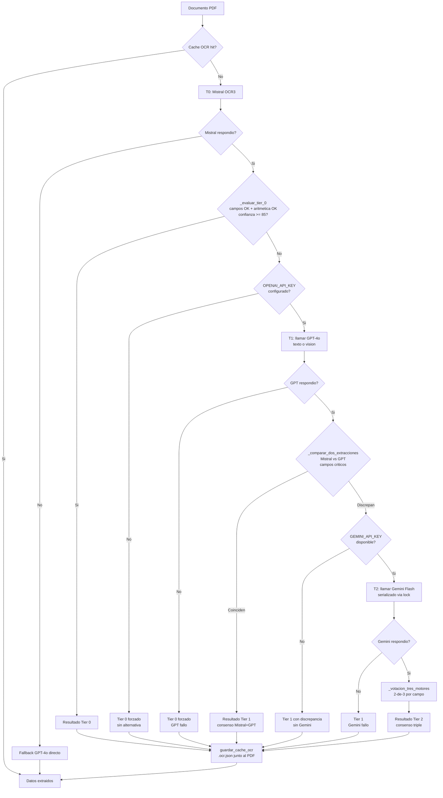

# 05 — OCR e IA: Sistema de Tiers

> **Estado:** COMPLETADO
> **Actualizado:** 2026-03-01
> **Fuentes:** `sfce/phases/intake.py`, `sfce/phases/ocr_consensus.py`, `sfce/core/cache_ocr.py`

---

## Motores OCR disponibles

| Motor | Variable API | Tier | Coste relativo | Limites conocidos |
|-------|-------------|------|----------------|-------------------|
| Mistral OCR3 | `MISTRAL_API_KEY` | T0 | Bajo | — |
| GPT-4o | `OPENAI_API_KEY` | T1 | Medio | 30K TPM (satura con 5 workers) |
| Gemini Flash | `GEMINI_API_KEY` | T2 | Bajo | 5 req/min, 20 req/dia (free tier) |

El motor primario lo determina `ejecutar_intake()`: si `MISTRAL_API_KEY` esta en el entorno, motor primario = `"mistral"`. Si no, fallback a `"openai"`. Gemini se activa solo si `_GEMINI_DISPONIBLE` (import condicional) y `GEMINI_API_KEY` presente.

---

## Campos criticos por tipo de documento

`_evaluar_tier_0()` usa la tabla `_CAMPOS_CRITICOS` para saber que campos son obligatorios segun el tipo:

| Tipo | Campos criticos |
|------|----------------|
| FC (factura cliente) | `emisor_cif`, `fecha`, `total`, `base_imponible` |
| FV (factura proveedor) | `receptor_cif`, `fecha`, `total`, `base_imponible` |
| NC (nota de credito) | `emisor_cif`, `fecha`, `total` |
| ANT / REC | `emisor_cif`, `fecha`, `total` |
| NOM (nomina) | `empleado_nombre`, `fecha`, `bruto`, `neto` |
| SUM (suministros) | `emisor_nombre`, `fecha`, `total` |
| BAN (bancario) | `fecha`, `importe` |
| RLC / IMP | `fecha`, `total` / `fecha`, `importe` |

---

## Condiciones de escalada de tier

### T0 — Solo Mistral (aceptado si los 3 checks pasan)

`_evaluar_tier_0()` verifica en orden:

1. **Campos criticos presentes**: ningun campo de `_CAMPOS_CRITICOS[tipo_doc]` puede ser `None`, `""` o `0`.
2. **Aritmetica coherente**: `ejecutar_checks_aritmeticos()` no devuelve errores (base + IVA = total, etc.).
3. **Confianza global >= 85**: `DocumentoConfianza.confianza_global()` calcula una puntuacion 0-100 a partir de campos presentes, coherencia interna y calidad del texto extraido.

Si los 3 checks pasan: `{"aceptado": True}` — el documento queda en Tier 0, sin llamar a GPT.

### T1 — Mistral + GPT (escala cuando T0 falla)

Si `_evaluar_tier_0()` devuelve `aceptado=False` y hay cliente GPT disponible:

1. Se llama a GPT-4o (modo texto si hay texto extraible, modo vision con imagen base64 si el PDF es solo imagen).
2. Se compara campo a campo con `_comparar_dos_extracciones()`:
   - Campos numericos: tolerancia absoluta 0.02 euros.
   - Campos texto: comparacion exacta normalizada (strip + uppercase).
3. Si Mistral y GPT **coinciden** en todos los campos criticos: `ocr_tier = 1`, resultado aprobado.

### T2 — Votacion triple Mistral + GPT + Gemini (escala cuando T1 discrepa)

Si Mistral y GPT discrepan en algun campo critico y Gemini esta disponible:

1. Se llama a Gemini Flash, serializado via `_gemini_lock` (threading.Lock) para respetar el limite de 5 req/min.
2. Se ejecuta `_votacion_tres_motores()` con los 3 resultados.
3. El resultado consenso se marca como `ocr_tier = 2`.

Si Gemini falla o no esta disponible: el documento se queda en T1 con aviso de discrepancia en el log.

---

## Funcion `_evaluar_tier_0()`

```python
def _evaluar_tier_0(datos_mistral: dict, tipo_doc: str,
                    doc_confianza: DocumentoConfianza,
                    umbral: int = 85) -> dict:
```

**Que evalua** (en orden, cortocircuito al primer fallo):

1. Campos criticos del tipo de documento: recorre `_CAMPOS_CRITICOS[tipo_doc]` y acumula faltantes.
2. Aritmetica: delega en `ejecutar_checks_aritmeticos()`. Si hay algun error, falla inmediatamente.
3. Confianza: llama a `doc_confianza.confianza_global()` y compara con el umbral (defecto 85).

**Que devuelve:**

```python
# Aceptado
{"aceptado": True, "motivo": "Tier 0: campos OK, aritmetica OK, confianza OK"}

# Rechazado por campos faltantes
{"aceptado": False, "motivo": "Campos criticos faltantes: emisor_cif, fecha"}

# Rechazado por aritmetica
{"aceptado": False, "motivo": "Errores aritmeticos: base + IVA != total"}

# Rechazado por confianza baja
{"aceptado": False, "motivo": "Confianza 72% < umbral 85%"}
```

---

## Funcion `_votacion_tres_motores()`

```python
def _votacion_tres_motores(ext_mistral: dict, ext_gpt: dict,
                            ext_gemini: dict, tipo_doc: str) -> dict:
```

Aplica votacion **2-de-3** campo a campo sobre los campos criticos del tipo de documento.

**Algoritmo por campo:**

- Campos numericos (`total`, `base_imponible`, `iva_importe`, etc.): si dos de los tres valores difieren en <=0.02 entre si, el campo ganador es el valor del primer par que coincide.
- Campos texto (`emisor_cif`, `fecha`, `numero_factura`, etc.): comparacion exacta tras `strip().upper()`. El par que coincide primero gana.

**Base del resultado**: se parte de una copia de `ext_mistral`. Solo se sobreescriben los campos donde hay mayoria. Si ningun par coincide en un campo critico (los 3 discrepan completamente), el campo conserva el valor de Mistral (comportamiento por defecto de la copia base).

**Empate (3 valores distintos):** ninguno de los 6 pares posibles coincide, el campo queda con el valor de Mistral. No hay criterio de desempate adicional: la logica asume que en un empate real (raro) Mistral es preferible por ser el motor primario.

**Confianza resultante:** no hay puntuacion de confianza calculada en `_votacion_tres_motores()` propiamente. El `ocr_tier = 2` actua como indicador de que se necesito arbitraje triple; las fases posteriores pueden tratar T2 con mas cautela.

---

## Cache OCR (`sfce/core/cache_ocr.py`)

### Mecanismo

Junto a cada PDF se guarda un archivo `.ocr.json` (mismo directorio, mismo nombre base):

```
inbox/factura-2025-001.pdf
inbox/factura-2025-001.ocr.json   <- cache
```

El JSON tiene el formato:

```json
{
  "hash_sha256": "<64 chars hex>",
  "timestamp": "2026-03-01T14:32:00",
  "motor_ocr": "mistral",
  "tier_ocr": 0,
  "datos": { "emisor_cif": "...", "total": 1210.50, ... }
}
```

### Invalidacion por SHA256

La clave de invalidacion es el hash SHA256 del PDF (calculado en bloques de 4 MB para PDFs grandes). Si el contenido del PDF cambia aunque sea 1 byte, el hash difiere y el cache se ignora automaticamente.

### Funciones principales

| Funcion | Descripcion |
|---------|-------------|
| `obtener_cache_ocr(ruta_pdf)` | Devuelve datos OCR si el cache es valido, `None` si no existe o hash no coincide |
| `guardar_cache_ocr(ruta_pdf, datos)` | Guarda el JSON junto al PDF, sobrescribe si ya existe |
| `invalidar_cache_ocr(ruta_pdf)` | Elimina el `.ocr.json`. Util tras correccion manual |
| `estadisticas_cache(directorio)` | Analiza hits/misses/invalidos en un directorio |

### Integracion en `_procesar_un_pdf()`

```
INICIO de _procesar_un_pdf()
  └── obtener_cache_ocr() → hit?
        SI → retornar datos directamente (0 llamadas API)
        NO → continuar con extraccion OCR...

FIN de _procesar_un_pdf()
  └── guardar_cache_ocr() con datos + tier + motor
```

**Beneficio economico:** primera ejecucion paga las APIs. Todas las siguientes ejecuciones sobre el mismo PDF son gratuitas mientras el archivo no cambie. Con batches de 200+ facturas, el ahorro en re-procesamiento es significativo.

---

## Workers paralelos

```python
ejecutar_intake(..., max_workers=5)
```

- Defecto: 5 workers (`ThreadPoolExecutor`).
- El paralelismo se activa solo si `not interactivo` y `max_workers > 1` y hay mas de 1 PDF.
- En modo interactivo (descubrimiento de entidades nuevas): secuencial forzado.

**Problema conocido con T1:** con 5 workers y GPT-4o activo, el consumo de tokens se acerca rapidamente al limite de 30K TPM de la tier gratuita. El resultado: muchos documentos quedan degradados en T0 (GPT retorna error de rate limit y se marca `ocr_tier=0` forzado).

**Soluciones:**

1. Reducir workers a 2-3: `--workers 2` si el pipeline lo expone como parametro.
2. Para batches grandes (>50 PDFs): usar solo Mistral sin GPT (no configurar `OPENAI_API_KEY`).
3. Para Gemini free tier (20 req/dia): reservar T2 para documentos de alto valor; con batches grandes se agota el cupo diario rapidamente.

---

## Estructura de datos OCR

Campos que devuelven los motores OCR tras la extraccion:

| Campo | Tipo | Descripcion |
|-------|------|-------------|
| `emisor_nombre` | str | Nombre o razon social del emisor |
| `emisor_cif` | str | CIF/NIF del emisor |
| `receptor_nombre` | str | Nombre del receptor |
| `receptor_cif` | str | CIF/NIF del receptor |
| `numero_factura` | str | Numero de factura (serie + numero) |
| `fecha` | str | Fecha de emision (formato variable segun motor) |
| `base_imponible` | float | Base imponible en euros |
| `iva_pct` | float | Porcentaje de IVA aplicado |
| `iva_importe` | float | Importe de IVA en euros |
| `total` | float | Total factura (base + IVA) |
| `lineas` | list[dict] | Lineas de detalle (descripcion, cantidad, precio) |
| `divisa` | str | Codigo ISO de divisa (EUR por defecto) |

Campos adicionales para tipos especificos: `empleado_nombre`, `bruto`, `neto` (NOM); `importe` (BAN, IMP); `banco_nombre` (BAN).

El documento final incluye metadatos internos prefijados con `_`: `_ocr_tier`, `_ocr_tier_motivo`, `_motores_usados`.

---

## Diagrama: Escalada T0 -> T1 -> T2


