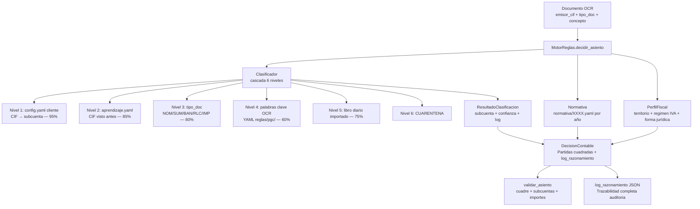

# 06 — Motor de Reglas Contables

> **Estado:** COMPLETADO
> **Actualizado:** 2026-03-01
> **Fuentes:** `sfce/core/motor_reglas.py`, `sfce/core/perfil_fiscal.py`, `sfce/core/clasificador.py`, `sfce/normativa/vigente.py`, `sfce/core/decision.py`, `sfce/core/reglas_pgc.py`

---

## Qué es el Motor de Reglas

El Motor de Reglas Contables es el cerebro del sistema SFCE. A partir de los datos extraídos por OCR de un documento, determina:

- **Qué subcuenta de gasto** usar (6280000000 para suministros, 6400000000 para nóminas, etc.)
- **Qué impuesto** aplicar (IVA21, IVA0, IGIC, exento...)
- **Si hay retención** IRPF y a qué porcentaje
- **Si aplica ISP** (inversión del sujeto pasivo, para intracomunitarios)
- **Qué subcuenta de contrapartida** usar (proveedor, acreedor, banco...)
- **Si el documento va a cuarentena** por falta de confianza

Todo queda registrado en un `log_razonamiento` que explica paso a paso qué regla aplicó y por qué.

---

## Jerarquía de resolución

El clasificador interno aplica una **cascada de 6 niveles** en orden descendente de prioridad. Cuando un nivel resuelve la clasificación, los niveles inferiores no se consultan.

| Nivel | Nombre | Fuente de datos | Archivo Python | Confianza | Descripción |
|-------|--------|-----------------|----------------|-----------|-------------|
| 1 | Regla cliente | CIF en `config.yaml` | `sfce/core/clasificador.py` | 95% | El cliente tiene mapeado explícitamente este CIF a una subcuenta |
| 2 | Aprendizaje previo | `aprendizaje.yaml` (runtime) | `sfce/core/aprendizaje.py` | 85% | El sistema vio antes este CIF y aprendió su subcuenta correcta |
| 3 | Tipo de documento | Tipo doc (`NOM`, `SUM`...) | `sfce/core/clasificador.py` | 80% | El tipo documental ya determina la subcuenta base |
| 4 | Palabras clave OCR | `reglas/pgc/palabras_clave_subcuentas.yaml` | `sfce/core/clasificador.py` | 60% | El concepto/descripción del documento contiene palabras clave |
| 5 | Libro diario importado | Datos importados históricamente | `sfce/core/clasificador.py` | 75% | Coincidencia con asientos históricos del cliente |
| 6 | Cuarentena | — | — | 0% | No se pudo clasificar, requiere revisión manual |

**Umbral de cuarentena:** confianza < 70% → el documento va automáticamente a cuarentena. La `DecisionContable` marca `cuarentena=True` con el motivo.

El nivel 2 (aprendizaje) tiene prioridad sobre el tipo de documento porque lo que el sistema ha aprendido de ese cliente concreto es información más específica que una regla genérica. La regla del cliente (nivel 1) tiene la máxima prioridad porque es configuración explícita del gestor.

---

## `PerfilFiscal` — características fiscales de la empresa

`sfce/core/perfil_fiscal.py`

Clase dataclass que encapsula todas las características fiscales de un cliente. El `MotorReglas` la consulta para ajustar la decisión contable al contexto real de la empresa.

### Formas jurídicas soportadas

| Código | Descripción |
|--------|-------------|
| `autonomo` | Persona física en actividad económica (IRPF, modelo 100/130) |
| `sl` | Sociedad Limitada (IS, depósito cuentas en RM) |
| `slu` | Sociedad Limitada Unipersonal (igual que SL, socio único) |
| `sa` | Sociedad Anónima (IS, depósito cuentas en RM) |
| `sll` | Sociedad Laboral Limitada (IS, régimen especial SS) |
| `cb` | Comunidad de Bienes (atribución rentas, tributación en socios) |
| `scp` | Sociedad Civil con objeto mercantil (IS desde 2016) |
| `cooperativa` | Cooperativa (IS, régimen especial) |
| `asociacion` | Asociación sin ánimo de lucro (exención IS condicionada) |
| `comunidad_propietarios` | Comunidad de propietarios (sin actividad económica habitual) |
| `fundacion` | Fundación (IS, régimen especial entidades sin fines lucrativos) |

El campo `tipo_persona` se **deriva automáticamente** en `__post_init__` desde la forma jurídica: las formas en `_JURIDICAS` son personas jurídicas, el resto personas físicas.

### Regímenes IVA

| Código | Descripción |
|--------|-------------|
| `general` | Régimen general: IVA repercutido y soportado deducible |
| `simplificado` | Módulos IVA: cuotas fijas trimestrales, sin deducción real |
| `recargo_equivalencia` | Comerciantes minoristas: IVA + recargo, sin deducción |
| `modulos` | Estimación objetiva IRPF, compatible con IVA simplificado |
| `intracomunitario` | Operaciones con UE: IVA0 en factura + autorepercusión 472/477 |
| `exento` | Exento de IVA (educación, sanidad, servicios financieros...) |

### Territorios

| Código | Impuesto | Tipos base |
|--------|----------|-----------|
| `peninsula` | IVA | 21% / 10% / 4% |
| `canarias` | IGIC | 7% / 3% / 0% |
| `ceuta_melilla` | IPSI | Variable según municipio |
| `navarra` | IVA (convenio Navarra) | Mismos tipos que península |
| `pais_vasco` | IVA (concierto vasco) | Mismos tipos que península |

El campo `impuesto_indirecto` se deriva automáticamente del territorio mediante el mapa `_TERRITORIO_IMPUESTO`. La `Normativa` consulta el YAML del año correspondiente para obtener los tipos exactos.

### Otros campos relevantes del perfil

- `prorrata` / `pct_prorrata`: para empresas con actividad mixta (exenta + gravada)
- `operador_intracomunitario`: activa el ISP en facturas de proveedores UE
- `sii_obligatorio`: grandes empresas con SII (presentación mensual en lugar de trimestral)
- `deposita_cuentas`: SL/SA/SLL que depositan cuentas anuales en el Registro Mercantil
- `plan_contable`: `pgc_pymes` (por defecto) o `pgc_general` para grandes empresas

---

## `Clasificador` — cascada de clasificación

`sfce/core/clasificador.py`

El `Clasificador` es el primer módulo que ejecuta el `MotorReglas`. Su responsabilidad es determinar **qué subcuenta de gasto** usar.

**Input:**
```python
documento = {
    "emisor_cif": "B12345678",
    "tipo_doc": "FV",         # FC/FV/SUM/NOM/BAN/RLC/IMP/NC
    "concepto": "Suministro electricidad enero 2025",
    "base_imponible": 450.00,
    ...
}
```

**Output:** `ResultadoClasificacion`

```python
@dataclass
class ResultadoClasificacion:
    subcuenta: str          # ej: "6280000000"
    confianza: int          # 0-100
    origen: str             # "config_cliente" | "aprendizaje" | "tipo_doc" | ...
    cuarentena: bool
    motivo_cuarentena: Optional[str]
    log: list               # trazabilidad paso a paso
    codimpuesto: Optional[str]
    regimen: Optional[str]
```

**Mapa tipo_doc → subcuenta por defecto** (nivel 3 de la cascada):

| tipo_doc | Subcuenta | Descripción PGC |
|----------|-----------|-----------------|
| `NOM` | `6400000000` | Sueldos y salarios |
| `SUM` | `6280000000` | Suministros (luz, agua, teléfono...) |
| `BAN` | `6260000000` | Servicios bancarios |
| `RLC` | `6420000000` | Seguridad Social a cargo empresa |
| `IMP` | `6310000000` | Tributos |

Las facturas de proveedor genéricas (`FV`) sin coincidencia en niveles 1-2-3 pasan al nivel 4 (palabras clave OCR) cargadas desde `reglas/pgc/palabras_clave_subcuentas.yaml`.

---

## `DecisionContable` y `Partida`

`sfce/core/decision.py`

Una vez que el `Clasificador` devuelve la subcuenta, el `MotorReglas` construye la `DecisionContable` con todos los parámetros fiscales y genera las **partidas contables cuadradas**.

### Estructura de `Partida`

```python
@dataclass
class Partida:
    subcuenta: str   # 10 dígitos, ej: "6280000000"
    debe: float      # importe en el debe (0.0 si va al haber)
    haber: float     # importe en el haber (0.0 si va al debe)
    concepto: str    # texto descriptivo
```

### Estructura de `DecisionContable`

```python
@dataclass
class DecisionContable:
    subcuenta_gasto: str          # cuenta de gasto (6xx)
    subcuenta_contrapartida: str  # proveedor/acreedor (400x)
    codimpuesto: str              # "IVA21" | "IVA10" | "IVA0" | "IVA4"
    tipo_iva: float               # valor numérico: 21.0, 10.0, 0.0...
    confianza: int                # 0-100
    origen_decision: str          # nivel que resolvió
    recargo_equiv: Optional[float]     # % recargo equivalencia si aplica
    retencion_pct: Optional[float]     # % retención IRPF si aplica
    pct_iva_deducible: float           # 100.0 por defecto, < 100 con prorrata
    isp: bool                          # inversión sujeto pasivo
    isp_tipo_iva: Optional[float]      # tipo IVA para autorepercusión ISP
    regimen: str                       # "general" | "intracomunitario" | ...
    cuarentena: bool
    motivo_cuarentena: Optional[str]
    log_razonamiento: list             # trazabilidad completa
    partidas: list[Partida]
```

**Cuarentena automática:** si `confianza < 70` en `__post_init__`, la decisión se marca automáticamente como cuarentena sin que el llamador tenga que verificarlo.

### Generación de partidas (`generar_partidas`)

El método `generar_partidas(base: float)` genera las partidas siempre cuadradas (debe = haber). Soporta todos los casos:

1. **Caso base** (IVA general): gasto + IVA soportado 4720 + contrapartida proveedor 400x
2. **IVA parcialmente deducible** (prorrata): IVA no deducible se suma al gasto
3. **ISP intracomunitario**: IVA0 en proveedor + 4720 debe + 4770 haber (autorepercusión)
4. **Recargo equivalencia**: añade partida 4720100000 (recargo)
5. **Retención IRPF**: añade partida 4751000000 en haber, reduce el pago al proveedor

---

## `MotorReglas` — orquestador principal

`sfce/core/motor_reglas.py`

Clase que integra `Clasificador`, `Normativa` y `PerfilFiscal` para producir la decisión final.

### Inicialización

```python
motor = MotorReglas(
    config=config_cliente,          # ConfigCliente con config.yaml cargado
    normativa=Normativa(),          # opcional, se crea por defecto
    aprendizaje=aprendizaje_dict,   # opcional, dict del aprendizaje.yaml
)
```

### Método principal: `decidir_asiento`

```python
decision = motor.decidir_asiento(
    documento=documento_ocr,   # dict con datos extraídos del PDF
    fecha=date(2025, 1, 15),   # para consultar normativa del año correcto
)
```

**Flujo interno:**

1. Ejecuta `clasificador.clasificar(documento)` → obtiene subcuenta y confianza
2. Busca el proveedor por CIF en `config.yaml` → obtiene `codimpuesto`, `regimen`, `retencion`
3. Consulta la `Normativa` para validar el tipo IVA según fecha y territorio
4. Aplica reglas especiales por `tipo_doc` (NOM/BAN/RLC → IVA0 forzado)
5. Aplica ISP si el régimen es `intracomunitario`
6. Resuelve la subcuenta de contrapartida (proveedor 400x o acreedor 410x)
7. Construye y devuelve la `DecisionContable` con `log_razonamiento` completo

### `log_razonamiento` — trazabilidad de la decisión

El campo `log_razonamiento` de la `DecisionContable` es una lista de strings que documenta cada paso:

```json
[
  "Nivel 1: CIF B12345678 encontrado en config.yaml → subcuenta 6280000001 (Iberdrola)",
  "Proveedor B12345678: codimpuesto=IVA21, regimen=general",
  "Tipo IVA resuelto: 21.0% (codimpuesto=IVA21)",
  "Contrapartida: 4000000042"
]
```

**Por qué es valioso el log:** cuando un asiento contable es incorrecto, el log permite ver exactamente qué regla aplicó el motor en cada nivel. Sin él, depurar por qué se eligió la subcuenta 6230 en lugar de 6280 requeriría inspeccionar el código. Con el log, la respuesta está en el JSON del documento procesado.

El log se serializa en `to_dict()` y se puede guardar en la base de datos junto al documento para auditoría posterior.

### Otros métodos

- **`validar_asiento(decision)`**: verifica cuadre debe=haber, subcuentas de 10 dígitos, importes positivos. Devuelve lista de errores (vacía = OK).
- **`aprender(documento, subcuenta, confianza)`**: registra una resolución correcta en el diccionario de aprendizaje para que futuros documentos del mismo proveedor se clasifiquen directamente (nivel 2 de la cascada).

---

## `Normativa` — fuente única de verdad fiscal

`sfce/normativa/vigente.py`

La `Normativa` carga YAMLs versionados por año (`2025.yaml`, `2026.yaml`...) y expone métodos de consulta por fecha y territorio.

### Consultas disponibles

```python
normativa = Normativa()
fecha = date(2025, 3, 15)

normativa.iva_general(fecha, "peninsula")      # → 21.0
normativa.iva_reducido(fecha, "peninsula")     # → 10.0
normativa.iva_superreducido(fecha, "peninsula") # → 4.0
normativa.iva_general(fecha, "canarias")       # → 7.0 (IGIC)
normativa.tipo_is("general", fecha)            # → 25.0
normativa.retencion_profesional(nuevo=False, fecha=fecha)  # → 15.0
normativa.smi_mensual(fecha)                   # → 1134.0
normativa.tabla_amortizacion("vehiculos", fecha)  # → coef. máx./mín.
```

### Añadir un nuevo año de normativa

1. Crear `sfce/normativa/2027.yaml` copiando el año anterior como base
2. Actualizar los tipos que hayan cambiado (IVA, IS, SMI, retenciones...)
3. La `Normativa` lo carga automáticamente para fechas del año 2027

Si no existe el YAML del año pedido, usa el más reciente disponible (fallback seguro para ejercicios futuros parcialmente configurados).

**Por qué es importante versionar:** los tipos impositivos cambian por ley. En 2023 se eliminó el IVA superreducido del 4% para ciertos alimentos y se introdujo el IVA 0% temporal. Sin normativa versionada, un documento de 2022 procesado hoy aplicaría los tipos actuales, produciendo asientos incorrectos. Con la normativa versionada por año, el motor consulta siempre los tipos vigentes en la **fecha del documento**, no en la fecha de procesamiento.

---

## `reglas_pgc.py` — utilidades PGC

`sfce/core/reglas_pgc.py`

Módulo de funciones utilitarias que complementan al motor:

| Función | Descripción |
|---------|-------------|
| `cargar_subcuentas()` | Devuelve mapa subcuenta → descripción PGC |
| `cargar_coherencia()` | Reglas de coherencia subcuenta/lado (ej: 4720 siempre al debe) |
| `cargar_suplidos()` | Lista de patrones de texto que identifican suplidos aduaneros |
| `cargar_retenciones()` | Mapa tipo servicio → % retención IRPF estándar |
| `detectar_regimen_por_cif(cif)` | Infiere régimen IVA desde el CIF (NIF-IVA intracomunitario, etc.) |
| `validar_coherencia_cif_iva(cif, iva_pct)` | Avisa si el IVA aplicado no coincide con el tipo de CIF |
| `validar_subcuenta_lado(subcuenta, debe, haber)` | Valida que la subcuenta esté al lado correcto del asiento |
| `detectar_suplido_en_linea(descripcion)` | Detecta suplidos aduaneros en una línea de factura |
| `validar_tipo_iva(iva_porcentaje)` | Valida que el % IVA sea uno de los tipos legales |
| `validar_tipo_irpf(irpf_porcentaje)` | Valida que el % retención IRPF sea legal |

---

## Ejemplo práctico — factura de electricidad

Factura de Iberdrola, empresa: SL en península, régimen general IVA.

**Input:**
```python
documento = {
    "emisor_cif": "A95260769",    # Iberdrola
    "tipo_doc": "FV",
    "concepto": "Suministro eléctrico enero 2025 — Potencia + Energía",
    "base_imponible": 380.00,
    "iva_porcentaje": 21.0,
}
```

**Cascada de resolución:**

| Nivel | Resultado |
|-------|-----------|
| 1 — Regla cliente | CIF A95260769 mapeado en `config.yaml` a subcuenta `6280000042` (Iberdrola oficina principal). Confianza: 95%. |
| 2 — Aprendizaje | No consultado (nivel 1 resolvió) |
| 3 — Tipo doc | No consultado |
| 4 — Palabras clave | No consultado |

**Consulta normativa:**
- Fecha: 2025-01-15 → carga `normativa/2025.yaml`
- Territorio: `peninsula` → IVA general 21%
- Tipo doc `FV` → no fuerza IVA0 (solo NOM/BAN/RLC)

**Consulta proveedor en config.yaml:**
- `codimpuesto: IVA21`, `regimen: general`, sin retención

**Resultado `DecisionContable`:**
```
subcuenta_gasto:        6280000042   (Iberdrola - config cliente)
subcuenta_contrapartida: 4000000031  (Iberdrola en 400x)
codimpuesto:            IVA21
tipo_iva:               21.0
confianza:              95
origen_decision:        config_cliente
cuarentena:             False
```

**Partidas generadas** (`generar_partidas(380.00)`):

| Subcuenta | Debe | Haber | Concepto |
|-----------|------|-------|---------|
| 6280000042 | 380,00 | — | Base imponible |
| 4720000000 | 79,80 | — | IVA soportado 21% |
| 4000000031 | — | 459,80 | Contrapartida |
| **Total** | **459,80** | **459,80** | Cuadrado |

**log_razonamiento:**
```
"Nivel 1 (config_cliente): CIF A95260769 → subcuenta 6280000042, confianza 95"
"Proveedor A95260769: codimpuesto=IVA21, regimen=general"
"Tipo IVA resuelto: 21.0% (codimpuesto=IVA21)"
"Contrapartida: 4000000031"
```

---

## Diagrama — flujo de resolución



---

## Relación con el Pipeline

El `MotorReglas` se instancia una vez por cliente en la fase de **Registro** del pipeline (`sfce/phases/registration.py`). Cada documento procesado genera su propia `DecisionContable`, que el pipeline usa para:

1. Crear la factura en FacturaScripts via API REST
2. Crear o corregir el asiento contable en la base de datos local (dual backend)
3. Registrar el documento en la tabla `documentos` con el resultado OCR y la decisión

Los documentos con `cuarentena=True` no se registran en FacturaScripts y se mueven al directorio `cuarentena/` para revisión manual del gestor.
