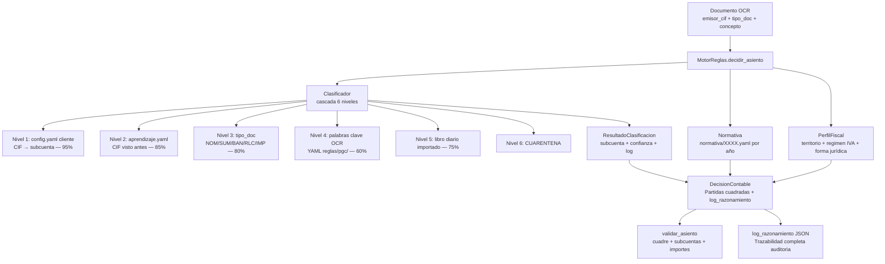

# 06 — Motor de Reglas Contables

> **Estado:** COMPLETADO
> **Actualizado:** 2026-03-01
> **Fuentes:** `sfce/core/motor_reglas.py`, `sfce/core/perfil_fiscal.py`, `sfce/core/clasificador.py`, `sfce/normativa/vigente.py`, `sfce/core/decision.py`, `sfce/core/reglas_pgc.py`, `sfce/core/clasificador_fiscal.py`, `reglas/categorias_gasto.yaml`, `sfce/normativa/2025.yaml`

---

## Qué es el Motor de Reglas

El Motor de Reglas Contables es el cerebro del sistema SFCE. A partir de los datos extraídos por OCR de un documento, determina:

- **Qué subcuenta de gasto** usar (6280000000 para suministros, 6400000000 para nóminas, etc.)
- **Qué impuesto** aplicar (IVA21, IVA0, IGIC, exento...)
- **Si hay retención** IRPF y a qué porcentaje
- **Si aplica ISP** (inversión del sujeto pasivo, para intracomunitarios)
- **Qué subcuenta de contrapartida** usar (proveedor, acreedor, banco...)
- **Si el documento va a cuarentena** por falta de confianza

Todo queda registrado en un `log_razonamiento` que explica paso a paso qué regla aplicó y por qué.

---

## Jerarquía de resolución

El clasificador interno aplica una **cascada de 6 niveles** en orden descendente de prioridad. Cuando un nivel resuelve la clasificación, los niveles inferiores no se consultan.

| Nivel | Nombre | Fuente de datos | Archivo Python | Confianza | Descripción |
|-------|--------|-----------------|----------------|-----------|-------------|
| 1 | Regla cliente | CIF en `config.yaml` | `sfce/core/clasificador.py` | 95% | El cliente tiene mapeado explícitamente este CIF a una subcuenta |
| 2 | Aprendizaje previo | `aprendizaje.yaml` (runtime) | `sfce/core/aprendizaje.py` | 85% | El sistema vio antes este CIF y aprendió su subcuenta correcta |
| 3 | Tipo de documento | Tipo doc (`NOM`, `SUM`...) | `sfce/core/clasificador.py` | 80% | El tipo documental ya determina la subcuenta base |
| 4 | Palabras clave OCR | `reglas/pgc/palabras_clave_subcuentas.yaml` | `sfce/core/clasificador.py` | 60% | El concepto/descripción del documento contiene palabras clave |
| 5 | Libro diario importado | Datos importados históricamente | `sfce/core/clasificador.py` | 75% | Coincidencia con asientos históricos del cliente |
| 6 | Cuarentena | — | — | 0% | No se pudo clasificar, requiere revisión manual |

**Umbral de cuarentena:** confianza < 70% → el documento va automáticamente a cuarentena. La `DecisionContable` marca `cuarentena=True` con el motivo.

El nivel 2 (aprendizaje) tiene prioridad sobre el tipo de documento porque lo que el sistema ha aprendido de ese cliente concreto es información más específica que una regla genérica. La regla del cliente (nivel 1) tiene la máxima prioridad porque es configuración explícita del gestor.

---

## `PerfilFiscal` — características fiscales de la empresa

`sfce/core/perfil_fiscal.py`

Clase dataclass que encapsula todas las características fiscales de un cliente. El `MotorReglas` la consulta para ajustar la decisión contable al contexto real de la empresa.

### Formas jurídicas soportadas

| Código | Descripción |
|--------|-------------|
| `autonomo` | Persona física en actividad económica (IRPF, modelo 100/130) |
| `sl` | Sociedad Limitada (IS, depósito cuentas en RM) |
| `slu` | Sociedad Limitada Unipersonal (igual que SL, socio único) |
| `sa` | Sociedad Anónima (IS, depósito cuentas en RM) |
| `sll` | Sociedad Laboral Limitada (IS, régimen especial SS) |
| `cb` | Comunidad de Bienes (atribución rentas, tributación en socios) |
| `scp` | Sociedad Civil con objeto mercantil (IS desde 2016) |
| `cooperativa` | Cooperativa (IS, régimen especial) |
| `asociacion` | Asociación sin ánimo de lucro (exención IS condicionada) |
| `comunidad_propietarios` | Comunidad de propietarios (sin actividad económica habitual) |
| `fundacion` | Fundación (IS, régimen especial entidades sin fines lucrativos) |

El campo `tipo_persona` se **deriva automáticamente** en `__post_init__` desde la forma jurídica: las formas en `_JURIDICAS` son personas jurídicas, el resto personas físicas.

### Regímenes IVA

| Código | Descripción |
|--------|-------------|
| `general` | Régimen general: IVA repercutido y soportado deducible |
| `simplificado` | Módulos IVA: cuotas fijas trimestrales, sin deducción real |
| `recargo_equivalencia` | Comerciantes minoristas: IVA + recargo, sin deducción |
| `modulos` | Estimación objetiva IRPF, compatible con IVA simplificado |
| `intracomunitario` | Operaciones con UE: IVA0 en factura + autorepercusión 472/477 |
| `exento` | Exento de IVA (educación, sanidad, servicios financieros...) |

### Territorios

| Código | Impuesto | Tipos base |
|--------|----------|-----------|
| `peninsula` | IVA | 21% / 10% / 4% |
| `canarias` | IGIC | 7% / 3% / 0% |
| `ceuta_melilla` | IPSI | Variable según municipio |
| `navarra` | IVA (convenio Navarra) | Mismos tipos que península |
| `pais_vasco` | IVA (concierto vasco) | Mismos tipos que península |

El campo `impuesto_indirecto` se deriva automáticamente del territorio mediante el mapa `_TERRITORIO_IMPUESTO`. La `Normativa` consulta el YAML del año correspondiente para obtener los tipos exactos.

### Otros campos relevantes del perfil

- `prorrata` / `pct_prorrata`: para empresas con actividad mixta (exenta + gravada)
- `operador_intracomunitario`: activa el ISP en facturas de proveedores UE
- `sii_obligatorio`: grandes empresas con SII (presentación mensual en lugar de trimestral)
- `deposita_cuentas`: SL/SA/SLL que depositan cuentas anuales en el Registro Mercantil
- `plan_contable`: `pgc_pymes` (por defecto) o `pgc_general` para grandes empresas

---

## `Clasificador` — cascada de clasificación

`sfce/core/clasificador.py`

El `Clasificador` es el primer módulo que ejecuta el `MotorReglas`. Su responsabilidad es determinar **qué subcuenta de gasto** usar.

**Input:**
```python
documento = {
    "emisor_cif": "B12345678",
    "tipo_doc": "FV",         # FC/FV/SUM/NOM/BAN/RLC/IMP/NC
    "concepto": "Suministro electricidad enero 2025",
    "base_imponible": 450.00,
    ...
}
```

**Output:** `ResultadoClasificacion`

```python
@dataclass
class ResultadoClasificacion:
    subcuenta: str          # ej: "6280000000"
    confianza: int          # 0-100
    origen: str             # "config_cliente" | "aprendizaje" | "tipo_doc" | ...
    cuarentena: bool
    motivo_cuarentena: Optional[str]
    log: list               # trazabilidad paso a paso
    codimpuesto: Optional[str]
    regimen: Optional[str]
```

**Mapa tipo_doc → subcuenta por defecto** (nivel 3 de la cascada):

| tipo_doc | Subcuenta | Descripción PGC |
|----------|-----------|-----------------|
| `NOM` | `6400000000` | Sueldos y salarios |
| `SUM` | `6280000000` | Suministros (luz, agua, teléfono...) |
| `BAN` | `6260000000` | Servicios bancarios |
| `RLC` | `6420000000` | Seguridad Social a cargo empresa |
| `IMP` | `6310000000` | Tributos |

Las facturas de proveedor genéricas (`FV`) sin coincidencia en niveles 1-2-3 pasan al nivel 4 (palabras clave OCR) cargadas desde `reglas/pgc/palabras_clave_subcuentas.yaml`.

---

## `DecisionContable` y `Partida`

`sfce/core/decision.py`

Una vez que el `Clasificador` devuelve la subcuenta, el `MotorReglas` construye la `DecisionContable` con todos los parámetros fiscales y genera las **partidas contables cuadradas**.

### Estructura de `Partida`

```python
@dataclass
class Partida:
    subcuenta: str   # 10 dígitos, ej: "6280000000"
    debe: float      # importe en el debe (0.0 si va al haber)
    haber: float     # importe en el haber (0.0 si va al debe)
    concepto: str    # texto descriptivo
```

### Estructura de `DecisionContable`

```python
@dataclass
class DecisionContable:
    subcuenta_gasto: str          # cuenta de gasto (6xx)
    subcuenta_contrapartida: str  # proveedor/acreedor (400x)
    codimpuesto: str              # "IVA21" | "IVA10" | "IVA0" | "IVA4"
    tipo_iva: float               # valor numérico: 21.0, 10.0, 0.0...
    confianza: int                # 0-100
    origen_decision: str          # nivel que resolvió
    recargo_equiv: Optional[float]     # % recargo equivalencia si aplica
    retencion_pct: Optional[float]     # % retención IRPF si aplica
    pct_iva_deducible: float           # 100.0 por defecto, < 100 con prorrata
    isp: bool                          # inversión sujeto pasivo
    isp_tipo_iva: Optional[float]      # tipo IVA para autorepercusión ISP
    regimen: str                       # "general" | "intracomunitario" | ...
    cuarentena: bool
    motivo_cuarentena: Optional[str]
    log_razonamiento: list             # trazabilidad completa
    partidas: list[Partida]
```

**Cuarentena automática:** si `confianza < 70` en `__post_init__`, la decisión se marca automáticamente como cuarentena sin que el llamador tenga que verificarlo.

### Generación de partidas (`generar_partidas`)

El método `generar_partidas(base: float)` genera las partidas siempre cuadradas (debe = haber). Soporta todos los casos:

1. **Caso base** (IVA general): gasto + IVA soportado 4720 + contrapartida proveedor 400x
2. **IVA parcialmente deducible** (prorrata): IVA no deducible se suma al gasto
3. **ISP intracomunitario**: IVA0 en proveedor + 4720 debe + 4770 haber (autorepercusión)
4. **Recargo equivalencia**: añade partida 4720100000 (recargo)
5. **Retención IRPF**: añade partida 4751000000 en haber, reduce el pago al proveedor

---

## `MotorReglas` — orquestador principal

`sfce/core/motor_reglas.py`

Clase que integra `Clasificador`, `Normativa` y `PerfilFiscal` para producir la decisión final.

### Inicialización

```python
motor = MotorReglas(
    config=config_cliente,          # ConfigCliente con config.yaml cargado
    normativa=Normativa(),          # opcional, se crea por defecto
    aprendizaje=aprendizaje_dict,   # opcional, dict del aprendizaje.yaml
)
```

### Método principal: `decidir_asiento`

```python
decision = motor.decidir_asiento(
    documento=documento_ocr,   # dict con datos extraídos del PDF
    fecha=date(2025, 1, 15),   # para consultar normativa del año correcto
)
```

**Flujo interno:**

1. Ejecuta `clasificador.clasificar(documento)` → obtiene subcuenta y confianza
2. Busca el proveedor por CIF en `config.yaml` → obtiene `codimpuesto`, `regimen`, `retencion`
3. Consulta la `Normativa` para validar el tipo IVA según fecha y territorio
4. Aplica reglas especiales por `tipo_doc` (NOM/BAN/RLC → IVA0 forzado)
5. Aplica ISP si el régimen es `intracomunitario`
6. Resuelve la subcuenta de contrapartida (proveedor 400x o acreedor 410x)
7. Construye y devuelve la `DecisionContable` con `log_razonamiento` completo

### `log_razonamiento` — trazabilidad de la decisión

El campo `log_razonamiento` de la `DecisionContable` es una lista de strings que documenta cada paso:

```json
[
  "Nivel 1: CIF B12345678 encontrado en config.yaml → subcuenta 6280000001 (Iberdrola)",
  "Proveedor B12345678: codimpuesto=IVA21, regimen=general",
  "Tipo IVA resuelto: 21.0% (codimpuesto=IVA21)",
  "Contrapartida: 4000000042"
]
```

**Por qué es valioso el log:** cuando un asiento contable es incorrecto, el log permite ver exactamente qué regla aplicó el motor en cada nivel. Sin él, depurar por qué se eligió la subcuenta 6230 en lugar de 6280 requeriría inspeccionar el código. Con el log, la respuesta está en el JSON del documento procesado.

El log se serializa en `to_dict()` y se puede guardar en la base de datos junto al documento para auditoría posterior.

### Otros métodos

- **`validar_asiento(decision)`**: verifica cuadre debe=haber, subcuentas de 10 dígitos, importes positivos. Devuelve lista de errores (vacía = OK).
- **`aprender(documento, subcuenta, confianza)`**: registra una resolución correcta en el diccionario de aprendizaje para que futuros documentos del mismo proveedor se clasifiquen directamente (nivel 2 de la cascada).

---

## `Normativa` — fuente única de verdad fiscal

`sfce/normativa/vigente.py`

La `Normativa` carga YAMLs versionados por año (`2025.yaml`, `2026.yaml`...) y expone métodos de consulta por fecha y territorio.

### Consultas disponibles

```python
normativa = Normativa()
fecha = date(2025, 3, 15)

normativa.iva_general(fecha, "peninsula")      # → 21.0
normativa.iva_reducido(fecha, "peninsula")     # → 10.0
normativa.iva_superreducido(fecha, "peninsula") # → 4.0
normativa.iva_general(fecha, "canarias")       # → 7.0 (IGIC)
normativa.tipo_is("general", fecha)            # → 25.0
normativa.retencion_profesional(nuevo=False, fecha=fecha)  # → 15.0
normativa.smi_mensual(fecha)                   # → 1134.0
normativa.tabla_amortizacion("vehiculos", fecha)  # → coef. máx./mín.
```

### Añadir un nuevo año de normativa

1. Crear `sfce/normativa/2027.yaml` copiando el año anterior como base
2. Actualizar los tipos que hayan cambiado (IVA, IS, SMI, retenciones...)
3. La `Normativa` lo carga automáticamente para fechas del año 2027

Si no existe el YAML del año pedido, usa el más reciente disponible (fallback seguro para ejercicios futuros parcialmente configurados).

**Por qué es importante versionar:** los tipos impositivos cambian por ley. En 2023 se eliminó el IVA superreducido del 4% para ciertos alimentos y se introdujo el IVA 0% temporal. Sin normativa versionada, un documento de 2022 procesado hoy aplicaría los tipos actuales, produciendo asientos incorrectos. Con la normativa versionada por año, el motor consulta siempre los tipos vigentes en la **fecha del documento**, no en la fecha de procesamiento.

---

## `reglas_pgc.py` — utilidades PGC

`sfce/core/reglas_pgc.py`

Módulo de funciones utilitarias que complementan al motor:

| Función | Descripción |
|---------|-------------|
| `cargar_subcuentas()` | Devuelve mapa subcuenta → descripción PGC |
| `cargar_coherencia()` | Reglas de coherencia subcuenta/lado (ej: 4720 siempre al debe) |
| `cargar_suplidos()` | Lista de patrones de texto que identifican suplidos aduaneros |
| `cargar_retenciones()` | Mapa tipo servicio → % retención IRPF estándar |
| `detectar_regimen_por_cif(cif)` | Infiere régimen IVA desde el CIF (NIF-IVA intracomunitario, etc.) |
| `validar_coherencia_cif_iva(cif, iva_pct)` | Avisa si el IVA aplicado no coincide con el tipo de CIF |
| `validar_subcuenta_lado(subcuenta, debe, haber)` | Valida que la subcuenta esté al lado correcto del asiento |
| `detectar_suplido_en_linea(descripcion)` | Detecta suplidos aduaneros en una línea de factura |
| `validar_tipo_iva(iva_porcentaje)` | Valida que el % IVA sea uno de los tipos legales |
| `validar_tipo_irpf(irpf_porcentaje)` | Valida que el % retención IRPF sea legal |

---

## Ejemplo práctico — factura de electricidad

Factura de Iberdrola, empresa: SL en península, régimen general IVA.

**Input:**
```python
documento = {
    "emisor_cif": "A95260769",    # Iberdrola
    "tipo_doc": "FV",
    "concepto": "Suministro eléctrico enero 2025 — Potencia + Energía",
    "base_imponible": 380.00,
    "iva_porcentaje": 21.0,
}
```

**Cascada de resolución:**

| Nivel | Resultado |
|-------|-----------|
| 1 — Regla cliente | CIF A95260769 mapeado en `config.yaml` a subcuenta `6280000042` (Iberdrola oficina principal). Confianza: 95%. |
| 2 — Aprendizaje | No consultado (nivel 1 resolvió) |
| 3 — Tipo doc | No consultado |
| 4 — Palabras clave | No consultado |

**Consulta normativa:**
- Fecha: 2025-01-15 → carga `normativa/2025.yaml`
- Territorio: `peninsula` → IVA general 21%
- Tipo doc `FV` → no fuerza IVA0 (solo NOM/BAN/RLC)

**Consulta proveedor en config.yaml:**
- `codimpuesto: IVA21`, `regimen: general`, sin retención

**Resultado `DecisionContable`:**
```
subcuenta_gasto:        6280000042   (Iberdrola - config cliente)
subcuenta_contrapartida: 4000000031  (Iberdrola en 400x)
codimpuesto:            IVA21
tipo_iva:               21.0
confianza:              95
origen_decision:        config_cliente
cuarentena:             False
```

**Partidas generadas** (`generar_partidas(380.00)`):

| Subcuenta | Debe | Haber | Concepto |
|-----------|------|-------|---------|
| 6280000042 | 380,00 | — | Base imponible |
| 4720000000 | 79,80 | — | IVA soportado 21% |
| 4000000031 | — | 459,80 | Contrapartida |
| **Total** | **459,80** | **459,80** | Cuadrado |

**log_razonamiento:**
```
"Nivel 1 (config_cliente): CIF A95260769 → subcuenta 6280000042, confianza 95"
"Proveedor A95260769: codimpuesto=IVA21, regimen=general"
"Tipo IVA resuelto: 21.0% (codimpuesto=IVA21)"
"Contrapartida: 4000000031"
```

---

## Diagrama — flujo de resolución



---

## Relación con el Pipeline

El `MotorReglas` se instancia una vez por cliente en la fase de **Registro** del pipeline (`sfce/phases/registration.py`). Cada documento procesado genera su propia `DecisionContable`, que el pipeline usa para:

1. Crear la factura en FacturaScripts via API REST
2. Crear o corregir el asiento contable en la base de datos local (dual backend)
3. Registrar el documento en la tabla `documentos` con el resultado OCR y la decisión

Los documentos con `cuarentena=True` no se registran en FacturaScripts y se mueven al directorio `cuarentena/` para revisión manual del gestor.

---

## MCF — Motor de Clasificación Fiscal

`sfce/core/clasificador_fiscal.py` + `reglas/categorias_gasto.yaml`

El MCF es una capa adicional sobre el Motor de Reglas. Mientras el `Clasificador` resuelve la subcuenta de gasto desde el `config.yaml` del cliente (nivel 1) o del aprendizaje (nivel 2), el MCF entra en juego cuando esos niveles no tienen datos: **deduce automáticamente el tratamiento fiscal completo a partir del CIF del proveedor, su nombre y las líneas de la factura OCR**, sin necesidad de configuración previa.

### Para qué sirve

- Proveedores que aparecen por primera vez y no están en `config.yaml`
- Wizard interactivo que pregunta únicamente lo que no puede deducirse del OCR
- Generación del campo `operaciones_extra` para que `correction.py` aplique handlers posteriores
- Marcado de bienes de inversión para detectar amortizaciones

### `ClasificacionFiscal` — resultado

```python
@dataclass
class ClasificacionFiscal:
    # Identificación
    categoria: str           # clave en categorias_gasto.yaml
    descripcion: str
    confianza: float         # 0.0–1.0

    # Origen del proveedor
    pais: str                # ESP | DEU | FRA | DESCONOCIDO | etc.
    regimen: str             # general | intracomunitario | extracomunitario
    tipo_persona: str        # fisica | juridica | desconocida

    # IVA
    iva_codimpuesto: str     # IVA0 | IVA4 | IVA10 | IVA21
    iva_tasa: int
    iva_deducible_pct: Optional[int]   # None si requiere pregunta wizard
    exento_art20: bool

    # IRPF
    irpf_pct: Optional[int]
    irpf_condicion: Optional[str]

    # Contabilidad
    subcuenta: Optional[str]
    operaciones_extra: list[str]       # handlers de correction.py
    flag_bien_inversion: bool

    # Wizard
    preguntas_pendientes: list[str]    # campos ambiguos que requieren respuesta

    # Trazabilidad
    razonamiento: str
    base_legal: str
```

### Flujo interno de `ClasificadorFiscal.clasificar()`

```
cif + nombre + datos_ocr
        |
        v
1. Detectar país/régimen desde prefijo CIF (coherencia_fiscal.yaml)
2. Inferir tipo_persona desde formato NIF (A/B=juridica, resto=fisica)
3. Extraer textos de líneas OCR
4. Si divisa != EUR → forzar régimen extracomunitario
5. Si keywords suplidos aduaneros → categoria = suplidos_aduaneros (90%)
6. Si régimen == intracomunitario → categoria = intracomunitario (95%)
7. Si régimen == extracomunitario y pais conocido → categoria = extracomunitario (90%)
8. En otro caso → detectar_categoria() por keywords (score de votos)
   - Si persona física española sin categoría → servicios_profesionales_autonomo (65%)
9. Cargar datos de la categoría detectada
10. Calcular confianza global = pais*0.4 + categoria*0.6
11. Preguntas pendientes: wizard pregunta solo lo ambiguo
        |
        v
ClasificacionFiscal
```

### Preguntas del wizard (solo 3 tipos)

| Pregunta | Categorías afectadas | Por qué es ambiguo |
|----------|---------------------|-------------------|
| `tipo_vehiculo` | combustible, peajes, reparaciones, renting, compra vehículo | Turismo=50% IVA deducible, comercial=100% (art.95.Tres.2 LIVA) |
| `inicio_actividad_autonomo` | servicios profesionales autónomos | Nuevo autónomo: 7%, consolidado: 15% IRPF |
| `pct_afectacion` | local mixto (vivienda + despacho) | % de uso profesional determina el IVA deducible |

El wizard nunca pregunta país, tipo IVA ni régimen intracomunitario: se deducen del CIF.

### `aplicar_respuestas()` — actualizar clasificación tras el wizard

```python
clasificacion_final = mcf.aplicar_respuestas(
    clasificacion=clasificacion_previa,
    respuestas={"tipo_vehiculo": "turismo"}
)
# → iva_deducible_pct = 50, operaciones_extra = ["iva_turismo_50"]
```

---

### `categorias_gasto.yaml` — base de conocimiento fiscal

`reglas/categorias_gasto.yaml` — versión `2025-01` — **50 categorías**, 1022 líneas

Base legal: LIVA 37/1992, LIRPF 35/2006, LIS 27/2014.

#### Campos de cada categoría

| Campo | Tipo | Descripción |
|-------|------|-------------|
| `descripcion` | string | Texto legible de la categoría |
| `subcuenta` | string | Código PGC 10 dígitos (null para operaciones especiales) |
| `iva_codimpuesto` | enum | `IVA0` / `IVA4` / `IVA5` / `IVA10` / `IVA21` |
| `iva_tasa` | int | Porcentaje numérico correspondiente |
| `iva_deducible_pct` | int\|null | `0` / `50` / `100` / `null` (null = requiere pregunta) |
| `exento_art20` | bool | True si exento sin derecho a deducción (art.20 LIVA) |
| `irpf_pct` | int\|null | Porcentaje retención IRPF; null si no aplica |
| `irpf_condicion` | string\|null | Condición que activa la retención |
| `operaciones_extra` | list | Handlers de `correction.py` a ejecutar tras el registro |
| `preguntas` | list | Campos que el wizard debe preguntar al operador |
| `subcategoria_por_respuesta` | dict | Tratamiento alternativo según respuesta wizard |
| `keywords_proveedor` | list | Palabras clave en nombre del proveedor (peso 2) |
| `keywords_lineas` | list | Palabras clave en líneas de la factura (peso 1) |
| `base_legal` | string | Artículo legal de referencia |
| `notas` | string | Aclaraciones para el operador o auditor |
| `flag_bien_inversion` | bool | True si requiere amortización |
| `umbral_bien_inversion` | int | Importe mínimo para activar inmovilizado |
| `tipo_doc_asociado` | string | Tipo doc del pipeline que corresponde a esta categoría |
| `condicion_activacion` | string | Para operaciones especiales: condición que las activa |

#### Grupos y categorías (50 en total)

| Grupo | Categorías | Subcuenta base | Notas clave |
|-------|-----------|---------------|-------------|
| **GRUPO 1: Compras y mercancías** (600-609) | `compras_mercancias_general`, `compras_alimentacion_general`, `compras_alimentacion_basica`, `compras_bebidas_alcoholicas` | 6000000000 | Alimentación general IVA10; básicos IVA4; bebidas alcohólicas/refrescos IVA21 |
| **GRUPO 2: Suministros** (628-629) | `suministros_electricidad`, `suministros_gas`, `suministros_agua`, `suministros_telefono`, `suministros_combustible` | 6280000000 / 6290000000 | Agua IVA10; gas IVA21 desde 2025; combustible pregunta tipo_vehiculo |
| **GRUPO 3: Arrendamientos** (621) | `arrendamiento_local`, `arrendamiento_vivienda`, `renting_leasing` | 6210000000 | Vivienda exento art.20; local retención 19% si arrendador persona física |
| **GRUPO 4: Servicios profesionales** (622-623) | `servicios_profesionales_autonomo`, `servicios_asesoria_gestoria`, `servicios_notaria`, `servicios_registro`, `servicios_informatica_empresa`, `servicios_limpieza`, `servicios_publicidad` | 6230000000 / 6220000000 / 6270000000 | Autónomo retención 7%/15%; registro exento; SaaS extranjero ISP |
| **GRUPO 5: Transporte** (624) | `transporte_mercancias`, `correos_exento`, `transporte_viajeros`, `peajes_autopista` | 6240000000 / 6290000000 | Correos S.A. exento art.20.1; viajeros IVA10; peajes pregunta tipo_vehiculo |
| **GRUPO 6: Seguros** (625) | `seguros` | 6250000000 | Exento art.20.16. Sin 472 |
| **GRUPO 7: Servicios bancarios** (626, 662) | `comisiones_bancarias`, `intereses_prestamos` | 6260000000 / 6620000000 | Exento art.20.18; Stripe/PayPal depende de establecimiento permanente |
| **GRUPO 8: Reparaciones** (622) | `reparacion_vehiculos`, `reparacion_inmuebles` | 6220000000 | Vehículo pregunta tipo_vehiculo; inmuebles rehabilitación posible ISP |
| **GRUPO 9: Hostelería** | `hosteleria_restauracion` | 6290000000 | IVA10; deducible con correlación actividad; IS: límite 1% cifra negocios |
| **GRUPO 10: Material y bienes de inversión** | `material_oficina`, `equipos_informaticos`, `maquinaria_equipos`, `mobiliario`, `vehiculo_empresa` | 6290000000 / 2130000000 / 2160000000 / 2170000000 / 2240000000 | Equipos >300€ → inmovilizado; amortización AEAT; vehículo pregunta tipo |
| **GRUPO 11: Tributos y tasas** (631, 679) | `tributos_tasas`, `sanciones_multas` | 6310000000 / 6790000000 | Sin IVA; multas no deducibles IS (art.15.c LIS) |
| **GRUPO 12: Gastos de personal** (640, 642) | `nominas`, `seguridad_social` | 6400000000 / 6420000000 | Sin IVA; tipo_doc NOM/RLC |
| **GRUPO 13: Peluquería y bienestar** | `peluqueria_estetica` | 6290000000 | IVA10 (art.91.Uno.2.j LIVA) |
| **GRUPO 14: Sanidad y educación** (exentos) | `servicios_sanitarios`, `servicios_educacion` | 6290000000 | Exento art.20; formación no reglada IVA21 |
| **GRUPO 15: Construcción y materiales** | `materiales_construccion`, `alquiler_maquinaria`, `gastos_representacion`, `packaging_envases`, `productos_limpieza_higiene` | 6010000000 / 6210000000 / 6290000000 / 6020000000 | Obras rehabilitación posible ISP; representación límite IS |
| **GRUPO 16: Operaciones especiales** | `intracomunitario`, `extracomunitario`, `suplidos_aduaneros`, `inversion_sujeto_pasivo` | null / 4709000000 | Autorepercusión 472/477; suplidos → 4709; ISP art.84.Uno.2 LIVA |

#### Ejemplo de categoría completa

```yaml
suministros_combustible:
  descripcion: "Combustible: gasolina, gasoil, GLP para vehículo de empresa"
  subcuenta: "6280000000"
  iva_codimpuesto: IVA21
  iva_tasa: 21
  iva_deducible_pct: null          # requiere pregunta wizard
  exento_art20: false
  irpf_pct: null
  operaciones_extra: []
  preguntas: [tipo_vehiculo]
  subcategoria_por_respuesta:
    turismo:
      iva_deducible_pct: 50
      operaciones_extra: [iva_turismo_50]
      notas: "Art.95.Tres.2 LIVA: vehículo turismo → 50% IVA deducible."
    comercial:
      iva_deducible_pct: 100
      notas: "Vehículo comercial/industrial → 100% IVA deducible."
  keywords_proveedor: [repsol, bp, cepsa, galp, shell, ...]
  keywords_lineas: [litros, gasolina, gasoil, diesel, ...]
  base_legal: "Art.95.Tres.2 LIVA"
  notas: "Preguntar tipo de vehículo para determinar deducibilidad."
```

#### Ejemplo de categoría exenta

```yaml
seguros:
  descripcion: "Seguros: multirriesgo, vehículo, vida, responsabilidad civil..."
  subcuenta: "6250000000"
  iva_codimpuesto: IVA0
  iva_tasa: 0
  iva_deducible_pct: 0
  exento_art20: true               # exento sin derecho a deducción
  irpf_pct: null
  operaciones_extra: []
  base_legal: "Art.20.Uno.16 LIVA"
  notas: "No hay cuenta 472. La prima es el gasto bruto."
```

#### Ejemplo de operación especial (ISP intracomunitario)

```yaml
intracomunitario:
  descripcion: "Adquisición intracomunitaria de bienes/servicios (proveedor UE sin ESP)"
  subcuenta: null
  iva_codimpuesto: IVA0
  iva_tasa: 0
  iva_deducible_pct: 100
  exento_art20: false
  operaciones_extra: [crear_partidas_477_472]
  condicion_activacion: "pais_ue == true AND pais != ESP"
  base_legal: "Art.13-18 LIVA, Art.84.Uno.2 LIVA"
  notas: "DEBE 472 / HABER 477 por el mismo importe."
```

#### Operaciones extra disponibles (handlers de `correction.py`)

| Handler | Descripción |
|---------|-------------|
| `iva_turismo_50` | Reclasifica 50% del IVA soportado de 4720 → 6280 (art.95.Tres.2) |
| `crear_partidas_477_472` | Crea autorepercusión ISP: DEBE 4720 / HABER 4770 |
| `crear_partidas_477_472_isp` | ISP en obras construcción/rehabilitación |
| `reclasificar_600_a_4709` | Mueve importe de cuenta 600 a 4709 (suplidos aduaneros) |

---

## Normativa multi-territorio

`sfce/normativa/2025.yaml` — 284 líneas, vigente ejercicio 2025

El YAML de normativa cubre **5 territorios** con sus propios tipos impositivos. La `Normativa` lo carga por año y expone consultas por territorio y tipo de empresa.

### Territorios y tipos IVA/IGIC/IPSI

| Territorio | Impuesto | General | Reducido | Superreducido | Especiales |
|------------|----------|---------|----------|---------------|-----------|
| `peninsula` | IVA | 21% | 10% | 4% | — |
| `canarias` | IGIC | 7% | 3% | 0% | 9.5% / 15% / 20% |
| `ceuta_melilla` | IPSI | — | — | — | 0.5% / 1% / 2% / 4% / 8% / 10% |
| `navarra` | IVA | 21% | 10% | 4% | — |
| `pais_vasco` | IVA | 21% | 10% | 4% | — |

Canarias tiene IGIC con tipos incrementados (9.5%, 15%, 20%) para productos de lujo y tabaco. Ceuta y Melilla usan el IPSI con 6 tipos variables según municipio.

### Recargo de equivalencia (península, Navarra, País Vasco)

| IVA base | Recargo equivalencia |
|----------|---------------------|
| 21% | 5,2% |
| 10% | 1,4% |
| 4% | 0,5% |

### Impuesto de Sociedades por territorio y tamaño

| Territorio | General | PYME | Micro | Nuevas empresas | Cooperativas | Entidades sin lucro | Especial |
|------------|---------|------|-------|-----------------|--------------|--------------------|----|
| `peninsula` | 25% | 23% | 23% | 15% | 20% | 10% | — |
| `canarias` | 25% | 23% | 23% | — | — | — | ZEC: 4% |
| `ceuta_melilla` | 25% | 23% | — | — | — | — | Bonificación 50% |
| `navarra` | 28% | 25% | 20% | — | 20% | — | — |
| `pais_vasco` | 24% | 24% | 20% | — | 20% | — | — |

Navarra (28%) y País Vasco (24%) tienen tipos IS propios por el régimen foral. La ZEC (Zona Especial Canaria) aplica 4% a empresas con actividad económica real en Canarias.

### Tablas de retención IRPF progresivas por territorio

#### Península, Canarias, Ceuta/Melilla (tabla estatal)

| Base hasta | Tipo marginal |
|-----------|--------------|
| 12.450 € | 19% |
| 20.200 € | 24% |
| 35.200 € | 30% |
| 60.000 € | 37% |
| 300.000 € | 45% |
| Sin límite | 47% |

#### Navarra (tabla foral)

| Base hasta | Tipo marginal |
|-----------|--------------|
| 4.070 € | 13% |
| 8.450 € | 22% |
| 14.550 € | 25% |
| 22.100 € | 28% |
| 32.600 € | 35,4% |
| 43.700 € | 39,6% |
| 63.700 € | 42% |
| 83.700 € | 44,5% |
| 154.000 € | 47% |
| 300.000 € | 49% |
| 500.000 € | 52% |
| Sin límite | 53% |

#### País Vasco (tabla foral)

| Base hasta | Tipo marginal |
|-----------|--------------|
| 17.360 € | 23% |
| 32.060 € | 28% |
| 46.660 € | 35% |
| 71.260 € | 40% |
| 101.660 € | 45% |
| 177.660 € | 49% |
| Sin límite | 53% |

### Retenciones profesionales (todos los territorios)

| Tipo | Porcentaje |
|------|-----------|
| Profesional consolidado (>2 años) | 15% |
| Profesional nuevo (año inicio y 2 siguientes) | 7% |
| Pago fraccionado modelo 130 | 20% |

### Seguridad Social (común a todos los territorios)

| Concepto | Valor 2025 |
|---------|-----------|
| SMI mensual | 1.134,00 € |
| SMI anual (14 pagas) | 15.876,00 € |
| Base mínima cotización | 1.134,00 € |
| Base máxima cotización | 4.720,50 € |
| Contingencias comunes empresa | 23,60% |
| Contingencias comunes trabajador | 4,70% |
| Desempleo empresa | 5,50% |
| Desempleo trabajador | 1,55% |
| FOGASA | 0,20% |
| Formación profesional empresa | 0,60% |
| Formación profesional trabajador | 0,10% |
| Mecanismo Equidad Intergeneracional | 0,67% |

### Umbrales fiscales relevantes

| Concepto | Importe |
|---------|---------|
| Modelo 347 (operaciones con terceros) | 3.005,06 € |
| Modelo 349 (intracomunitario) | 0 € (toda operación) |
| Gran empresa (SII mensual) | 6.010.121,04 € |
| Obligación de auditar — activo | 2.850.000 € |
| Obligación de auditar — cifra negocios | 5.700.000 € |
| Obligación de auditar — empleados | 50 |
| Micropyme | 1.000.000 € |

### Plazos de presentación de modelos

| Periodicidad | Período | Desde | Hasta |
|-------------|---------|-------|-------|
| Trimestral | T1 | 1 abril | 20 abril |
| Trimestral | T2 | 1 julio | 20 julio |
| Trimestral | T3 | 1 octubre | 20 octubre |
| Trimestral | T4 | 1 enero | 30 enero |
| Anual | Modelo 390 | 1 enero | 30 enero |
| Anual | Modelo 347 | 1 febrero | 28 febrero |
| Anual | Modelo 190 | 1 enero | 31 enero |
| Anual | Modelo 200 (IS) | 1 julio | 25 julio |
| Anual | Modelo 100 (IRPF) | 3 abril | 30 junio |

### Tablas de amortización (PGC simplificadas)

| Tipo de bien | % máx. lineal | Período máx. (años) |
|-------------|--------------|---------------------|
| Vehículos | 16% | 14 |
| Mobiliario | 10% | 20 |
| Equipos informáticos | 25% | 8 |
| Maquinaria | 12% | 18 |
| Edificios comerciales | 2% | 68 |
| Edificios industriales | 3% | 68 |
| Instalaciones | 10% | 20 |
| Utillaje | 25% | 8 |
| Moldes y matrices | 33% | 6 |
| Elementos transporte interno | 10% | 14 |
| Aplicaciones informáticas | 33% | 6 |

### Estructura del YAML de normativa

```yaml
# sfce/normativa/2025.yaml

peninsula:
  iva:
    general: 21
    reducido: 10
    superreducido: 4
    recargo_equivalencia:
      general: 5.2
      reducido: 1.4
      superreducido: 0.5
  impuesto_sociedades:
    general: 25
    pymes: 23
    micro: 23
    cooperativas: 20
    entidades_sin_lucro: 10
    nuevas_empresas: 15
  irpf:
    retencion_profesional: 15
    retencion_profesional_nuevo: 7
    pago_fraccionado_130: 20
    tablas_retencion:
      - base_hasta: 12450
        tipo: 19
      # ...

canarias:
  igic:
    general: 7
    reducido: 3
    tipo_cero: 0
    incrementado_1: 9.5
    incrementado_2: 15
    especial: 20
  # ...

seguridad_social:
  smi_mensual: 1134.00
  # ...

umbrales:
  modelo_347: 3005.06
  # ...

plazos_presentacion:
  trimestral: { T1: {desde: "04-01", hasta: "04-20"}, ... }
  anual: { modelo_390: {...}, ... }

amortizacion:
  tablas:
    - tipo_bien: vehiculos
      pct_maximo_lineal: 16
      periodo_maximo_anos: 14
    # ...
```
