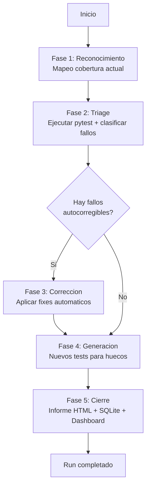

# 09 — Motor de Testeo Autonomo

> **Estado:** COMPLETADO
> **Actualizado:** 2026-03-01
> **Fuentes:** `scripts/motor_testeo.py`, `docs/plans/2026-03-01-motor-testeo-design.md`

---

## Proposito y diferencia con Motor de Aprendizaje

El proyecto SFCE tiene dos motores que a primera vista parecen similares pero operan en momentos completamente distintos del ciclo de vida:

**Motor de Aprendizaje** (`sfce/core/aprendizaje.py`)
- Actua en tiempo de **PRODUCCION**
- Se dispara durante el procesamiento de cada documento real
- Aprende de resoluciones exitosas y actualiza `reglas/aprendizaje.yaml`
- Su objetivo es mejorar la tasa de exito del pipeline en produccion

**Motor de Testeo** (`scripts/motor_testeo.py`)
- Actua en tiempo de **DESARROLLO y QA**
- Se invoca manualmente o via CI antes de integrar cambios
- Detecta regresiones, mide cobertura y genera nuevos tests
- Su objetivo es garantizar que el codigo existente no se rompa al evolucionar

**Cuando usarlo:**
- Antes de hacer un PR que toca la logica de reglas contables
- Tras cambios en el motor de reglas (`sfce/core/motor_reglas.py`)
- Al anadir un nuevo tipo de documento (IMP, RLC, etc.)
- La semana previa a cada temporada de IVA (enero, abril, julio, octubre)

---

## Las 5 fases del ciclo autonomo

| Fase | Nombre | Input | Output | Tiempo aprox |
|------|--------|-------|--------|--------------|
| 1 | Reconocimiento | Codebase | Mapa de cobertura, modulos sin tests | 30s |
| 2 | Triage | Resultados pytest | Lista priorizada de fallos | 15s |
| 3 | Correccion | Fallos conocidos | Fixes automaticos aplicados | variable |
| 4 | Generacion | Huecos de cobertura | Nuevos tests generados | variable |
| 5 | Cierre | Todo lo anterior | Informe HTML + metricas | 10s |

### Fase 1 — Reconocimiento

- Escanea todos los archivos de test bajo `tests/`
- Ejecuta `pytest --collect-only` para mapear tests existentes sin ejecutarlos
- Cruza los modulos Python del proyecto con los tests encontrados
- Identifica modulos sin tests correspondientes (cobertura 0%)
- Metricas que genera: cobertura por modulo, tests por linea de codigo, ratio modulos cubiertos/totales

El resultado queda registrado en la tabla `cobertura_modulo` de `data/motor_testeo.db`.

### Fase 2 — Triage

- Ejecuta `pytest -x --tb=short --json-report` para capturar fallos de forma parseable
- Clasifica cada fallo en una de cuatro categorias:
  - **regresion**: el test existia y pasaba en una sesion anterior
  - **nuevo**: el test nunca habia pasado (puede ser intencional en TDD)
  - **flaky**: falla de forma intermitente (se detecta comparando sesiones recientes)
  - **bloqueante**: impide que otros tests se ejecuten (ej: error de importacion en conftest)
- Prioriza: bloqueante > regresion > nuevo > flaky
- La deteccion de regresiones funciona consultando `resultados_test` de sesiones anteriores:

```python
fallos_previos = {
    r["test_id"]
    for r in conn.execute(
        "SELECT DISTINCT test_id FROM resultados_test "
        "WHERE estado='failed' AND sesion_id < ?",
        (sesion_id,),
    ).fetchall()
}
es_regresion = 1 if (estado == "failed" and node_id in fallos_previos) else 0
```

### Fase 3 — Correccion

Tipos de fallos que el motor puede arreglar **automaticamente**:

| Tipo de fallo | Accion automatica |
|---------------|-------------------|
| Import error — modulo movido | Actualiza el path de import en el archivo de test |
| Import error — modulo renombrado | Aplica rename si hay mapeo conocido en `data/renames.json` |
| Assertion error por cambio de formato de respuesta | Actualiza expected value si el patron es conocido |
| Fixture faltante declarada en conftest | Declara el fixture con implementacion minima |

Lo que el motor **NO puede arreglar automaticamente**:
- Logica incorrecta (el test falla por un bug real en el codigo)
- Tests que necesitan mocks nuevos para dependencias externas
- Cambios de interfaz de funciones (firma, tipos de retorno)

Cada fix aplicado se registra en la tabla `fixes_aplicados` con `exitoso=1/0` para auditoria.

### Fase 4 — Generacion

Para cada modulo con cobertura insuficiente (por debajo del umbral configurado, por defecto 80%), el motor genera tests basicos siguiendo tres patrones:

1. **Happy path**: entrada valida con parametros tipicos → resultado esperado
2. **Edge cases**: valores nulos, listas vacias, strings vacios, numeros limite
3. **Error path**: entradas invalidas → verificar que se lanza la excepcion correcta

El motor usa plantillas diferentes segun el tipo de modulo:
- **API endpoint**: fixtures de client, token, payload JSON; assert status_code y estructura respuesta
- **Funcion pura**: parametrize con varios inputs/expected; sin mocks
- **Clase con BD**: fixture de sesion SQLite in-memory con StaticPool; rollback en teardown

Los tests generados se guardan en `tests/generados/` y se registran en `tests_generados`.

### Fase 5 — Cierre

- Consulta la sesion actual vs la sesion anterior en SQLite
- Calcula deltas: tests +/-, cobertura +/-%
- Genera `data/reportes/YYYY-MM-DD_HH-MM-SS_sesion_N.html`
- Hace POST a `/api/salud/sesiones` del dashboard SFCE con el payload completo

El informe HTML incluye:
- KPIs: tests totales / pasados / fallidos / cobertura / fixes / tests generados
- Tabla de fallos con traceback colapsable y columna "Regresion"
- Tabla de cobertura por modulo, con verde (>=80%) y rojo (<80%)

---

## Persistencia

La base de datos es SQLite local, creada automaticamente en `data/motor_testeo.db`.

### Esquema completo

```sql
-- Una fila por ejecucion del motor
CREATE TABLE sesiones (
    id INTEGER PRIMARY KEY AUTOINCREMENT,
    fecha TEXT NOT NULL,
    rama_git TEXT,          -- rama git al momento del run
    commit_hash TEXT,       -- commit hash corto (7 chars)
    tests_total INTEGER DEFAULT 0,
    tests_pass INTEGER DEFAULT 0,
    tests_fail INTEGER DEFAULT 0,
    cobertura_pct REAL DEFAULT 0.0,
    duracion_seg REAL DEFAULT 0.0,
    estado TEXT DEFAULT 'en_progreso'  -- en_progreso | completada
);

-- Un fila por test ejecutado
CREATE TABLE resultados_test (
    id INTEGER PRIMARY KEY AUTOINCREMENT,
    sesion_id INTEGER NOT NULL,
    test_id TEXT NOT NULL,     -- nodeid pytest: tests/foo.py::test_bar
    nombre TEXT NOT NULL,
    modulo TEXT,               -- modulo Python inferido del nodeid
    estado TEXT NOT NULL,      -- passed | failed | skipped
    error_msg TEXT,            -- longrepr de pytest si fallo
    duracion_ms REAL DEFAULT 0.0,
    es_nuevo_fallo INTEGER DEFAULT 0,
    es_regresion INTEGER DEFAULT 0,
    FOREIGN KEY (sesion_id) REFERENCES sesiones(id)
);

-- Fixes que el motor aplico en esta sesion
CREATE TABLE fixes_aplicados (
    id INTEGER PRIMARY KEY AUTOINCREMENT,
    sesion_id INTEGER NOT NULL,
    test_id TEXT NOT NULL,
    archivo TEXT NOT NULL,
    descripcion_fix TEXT,
    intentos INTEGER DEFAULT 1,
    exitoso INTEGER DEFAULT 1,
    FOREIGN KEY (sesion_id) REFERENCES sesiones(id)
);

-- Tests nuevos generados en esta sesion
CREATE TABLE tests_generados (
    id INTEGER PRIMARY KEY AUTOINCREMENT,
    sesion_id INTEGER NOT NULL,
    archivo_test TEXT NOT NULL,
    modulo_cubierto TEXT,
    motivo TEXT,
    lineas_codigo INTEGER DEFAULT 0,
    FOREIGN KEY (sesion_id) REFERENCES sesiones(id)
);

-- Cobertura por modulo para esta sesion
CREATE TABLE cobertura_modulo (
    id INTEGER PRIMARY KEY AUTOINCREMENT,
    sesion_id INTEGER NOT NULL,
    modulo TEXT NOT NULL,
    pct_cobertura REAL DEFAULT 0.0,
    lineas_cubiertas INTEGER DEFAULT 0,
    lineas_totales INTEGER DEFAULT 0,
    FOREIGN KEY (sesion_id) REFERENCES sesiones(id)
);
```

La comparacion entre sesiones permite ver la evolucion historica de la cobertura a nivel de modulo.

---

## Ejecucion

El motor funciona via subcomandos CLI. Cada fase se puede invocar independientemente o encadenar en un script shell:

```bash
# Flujo completo (tipico en CI)
cd c:/Users/carli/PROYECTOS/CONTABILIDAD

# Fase 1: iniciar sesion + mapear cobertura
SESION=$(python scripts/motor_testeo.py --init-sesion)

# Fase 2: ejecutar pytest con JSON report + registrar resultados
pytest --json-report --json-report-file=data/reporte.json
python scripts/motor_testeo.py --registrar-resultados \
    --sesion-id $SESION --reporte-json data/reporte.json

# Cobertura (opcional pero recomendado)
pytest --cov=sfce --cov-report=json:data/cobertura.json
python scripts/motor_testeo.py --registrar-cobertura \
    --sesion-id $SESION --cobertura-json data/cobertura.json

# Fase 5: finalizar + generar informe HTML
python scripts/motor_testeo.py --finalizar-sesion --sesion-id $SESION
python scripts/motor_testeo.py --generar-reporte \
    --sesion-id $SESION --reportes-dir data/reportes

# Publicar al dashboard SFCE (requiere API corriendo)
python scripts/motor_testeo.py --push-dashboard \
    --sesion-id $SESION \
    --api-url http://localhost:8000 \
    --token $SFCE_JWT_TOKEN
```

Para usar una BD alternativa (ej: en tests del propio motor):

```bash
python scripts/motor_testeo.py --db /tmp/test_motor.db --init-sesion
```

---

## Integracion con pytest

El motor usa `subprocess.run(['pytest', ...])` internamente para ejecutar los tests. El contrato con pytest es:

- Requiere el plugin `pytest-json-report` para parsear resultados (`pip install pytest-json-report`)
- Requiere `pytest-cov` para cobertura (`pip install pytest-cov`)
- El campo `nodeid` de pytest es la clave primaria de cada test (ej: `tests/test_intake.py::TestIntake::test_fc_basica`)
- El campo `outcome` toma valores: `passed`, `failed`, `skipped`
- El `longrepr` del bloque `call` contiene el traceback completo en caso de fallo

No requiere plugins adicionales ni configuracion especial en `pytest.ini`. Funciona con la configuracion existente del proyecto.

---

## Diagrama — Ciclo 5 fases



---

## Tablas del dashboard relacionadas

El endpoint `/api/salud/sesiones` del dashboard SFCE recibe el payload de cierre y lo almacena para mostrar KPIs historicos. Los campos que aparecen en el dashboard:

| Campo | Donde se muestra |
|-------|-----------------|
| `tests_pass` / `tests_fail` | Grafico de barras por sesion |
| `cobertura_pct` | Linea de tendencia |
| `rama_git` + `commit_hash` | Tabla de historial |
| `fallos[].modulo` | Heatmap de modulos con mas fallos |
