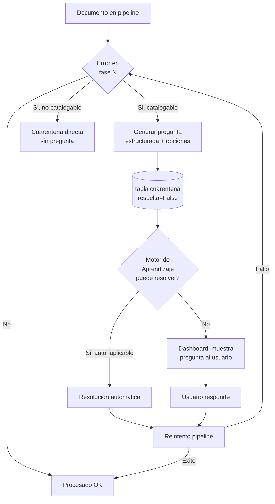

# 10 — Sistema de Cuarentena

> **Estado:** COMPLETADO
> **Actualizado:** 2026-03-01
> **Fuentes:** `sfce/db/modelos.py` (Cuarentena), `sfce/phases/correction.py`, `sfce/phases/registration.py`

---

## Que es (y que NO es)

La cuarentena de SFCE **no** es simplemente una carpeta donde caen los PDFs que no se pudieron procesar. Es un sistema Q&A estructurado con tres caracteristicas clave:

1. El sistema **genera una pregunta especifica** con opciones sugeridas, no un mensaje de error generico
2. La pregunta puede ser respondida por un **humano via dashboard** o por el **Motor de Aprendizaje** si ya ha visto un caso similar
3. Tras responder, el documento **se reintenta automaticamente** en el pipeline — no es un callejon sin salida

Comparacion:

| Sistema simple | Sistema SFCE |
|----------------|--------------|
| "ERROR: factura rechazada" | "CIF B12345678 no encontrado. ¿Es ACME SUMINISTROS S.L.? ¿O es proveedor nuevo?" |
| PDF en carpeta `rechazados/` | PDF en `cuarentena/` + fila en BD con opciones sugeridas |
| Requiere intervension manual libre | Opciones estructuradas con niveles de confianza |
| Sin aprendizaje | Motor aprende de cada resolucion |

---

## Tabla `Cuarentena` — campos completos

Modelo SQLAlchemy en `sfce/db/modelos.py`:

```python
class Cuarentena(Base):
    """Documento en cuarentena con pregunta estructurada."""
    __tablename__ = "cuarentena"

    id = Column(Integer, primary_key=True)
    documento_id = Column(Integer, ForeignKey("documentos.id"), nullable=False)
    empresa_id = Column(Integer, ForeignKey("empresas.id"), nullable=False)
    tipo_pregunta = Column(String(30), nullable=False)
    pregunta = Column(Text, nullable=False)
    opciones = Column(JSON)
    respuesta = Column(Text)
    resuelta = Column(Boolean, default=False)
    fecha_creacion = Column(DateTime, default=datetime.now)
    fecha_resolucion = Column(DateTime)

    documento = relationship("Documento")
```

| Campo | Tipo | Descripcion |
|-------|------|-------------|
| `id` | Integer | PK autoincremental |
| `documento_id` | Integer FK | Documento que genero la cuarentena |
| `empresa_id` | Integer FK | Empresa propietaria del documento |
| `tipo_pregunta` | String(30) | Categoria: subcuenta / iva / entidad / duplicado / importe / otro |
| `pregunta` | Text | Texto de la pregunta generada automaticamente |
| `opciones` | JSON | Lista de opciones: `[{valor, descripcion, confianza}]` |
| `respuesta` | Text | Respuesta seleccionada (null mientras esta pendiente) |
| `resuelta` | Boolean | False hasta que se resuelve y se reintenta |
| `fecha_creacion` | DateTime | Cuando se creo la entrada de cuarentena |
| `fecha_resolucion` | DateTime | Cuando se marco como resuelta (null si pendiente) |

El campo `estado` del documento padre (tabla `documentos`) pasa a `"cuarentena"` cuando se crea esta entrada.

---

## Tipos de pregunta

### `subcuenta` — subcuenta de gasto indeterminada

**Que lo genera:** el motor de reglas no puede determinar la subcuenta contable para una linea de gasto. El nombre del concepto no coincide con ningun patron en `reglas/subcuentas.yaml`.

**Ejemplo de pregunta:**
> "¿A que subcuenta corresponde el gasto 'Consultoria estrategica' de GESTOR RIVAS S.L.?"

**Ejemplo de opciones:**
```json
[
  {"valor": "621000000000", "descripcion": "Personal externo (621)", "confianza": 0.45},
  {"valor": "622000000000", "descripcion": "Trabajos externos (622)", "confianza": 0.38},
  {"valor": "623000000000", "descripcion": "Servicios profesionales (623)", "confianza": 0.17}
]
```

---

### `iva` — IVA declarado incongruente

**Que lo genera:** el OCR lee un IVA declarado en la factura que no coincide con `base_imponible * tasa_iva`. La diferencia supera el umbral de tolerancia (por defecto 2%).

**Ejemplo de pregunta:**
> "El IVA declarado en la factura (210.00 EUR) no coincide con base x 21% (189.00 EUR). ¿Cual es el valor correcto?"

**Ejemplo de opciones:**
```json
[
  {"valor": "210.00", "descripcion": "Usar IVA declarado en factura (210.00)", "confianza": 0.60},
  {"valor": "189.00", "descripcion": "Calcular segun base x 21% (189.00)", "confianza": 0.40}
]
```

---

### `entidad` — proveedor o cliente no encontrado

**Que lo genera:** el pipeline busca la entidad por CIF (exacto) y por nombre (fuzzy, score >80%) en `config.yaml` y en FacturaScripts, y no encuentra ninguna coincidencia.

**Ejemplo de pregunta:**
> "CIF B12345678 no encontrado. ¿Es 'ACME SUMINISTROS S.L.' un proveedor nuevo o corresponde a uno ya registrado?"

**Ejemplo de opciones:**
```json
[
  {"valor": "nuevo", "descripcion": "Crear como proveedor nuevo: ACME SUMINISTROS S.L.", "confianza": 0.55},
  {"valor": "ACMESUMI", "descripcion": "Es el proveedor existente ACME (codproveedor: ACMESUMI)", "confianza": 0.30},
  {"valor": "cuarentena", "descripcion": "Mantener en cuarentena para revision manual", "confianza": null}
]
```

---

### `duplicado` — documento ya procesado

**Que lo genera:** el hash SHA256 del PDF ya existe en la tabla `documentos`, o los campos (proveedor + fecha + importe total) coinciden al 100% con un documento ya registrado.

**Ejemplo de pregunta:**
> "Este documento parece duplicado de FACTURA-2025-0042 (misma fecha 15/03/2025, mismo proveedor REPSOL, mismo importe 847.32 EUR). ¿Registrar igualmente o descartar?"

**Ejemplo de opciones:**
```json
[
  {"valor": "descartar", "descripcion": "Descartar — es un duplicado exacto", "confianza": 0.85},
  {"valor": "registrar", "descripcion": "Registrar igualmente — es un documento distinto", "confianza": 0.15}
]
```

---

### `importe` — suma de lineas no cuadra con total

**Que lo genera:** `sum(lineas[].importe)` difiere del `total` declarado en la factura mas alla de la tolerancia de redondeo (0.02 EUR).

**Ejemplo de pregunta:**
> "La suma de lineas (1.456,00 EUR) no coincide con el total declarado (1.500,00 EUR). Diferencia: 44,00 EUR. ¿Que valor usar como base imponible?"

**Ejemplo de opciones:**
```json
[
  {"valor": "1456.00", "descripcion": "Usar suma de lineas (1.456,00)", "confianza": 0.50},
  {"valor": "1500.00", "descripcion": "Usar total declarado (1.500,00)", "confianza": 0.50}
]
```

---

### `otro` — caso no catalogado

Para errores que el motor no puede clasificar en ninguna de las categorias anteriores. La pregunta es mas libre y las opciones pueden estar vacias o ser genericas.

---

## Flujo completo

```
Documento recibido en pipeline
         |
         v
   Error en fase N
         |
         +-- ¿Error catalogable por tipo? --NO--> Cuarentena directa sin pregunta
         |
        YES
         |
         v
Generar pregunta estructurada + opciones con confianza
         |
         v
Insertar en tabla `cuarentena` (resuelta=False)
Mover PDF de inbox/ → cuarentena/
Marcar documento.estado = "cuarentena"
         |
         v
Motor de Aprendizaje evalua: ¿patron conocido con confianza >90%?
         |
         +-- SI --> Respuesta automatica → resuelta=True → Reintento pipeline
         |
        NO
         |
         v
Dashboard muestra pregunta pendiente al usuario
         |
         v
Usuario selecciona opcion o escribe respuesta libre
Cuarentena.respuesta = valor elegido
Cuarentena.resuelta = True
Cuarentena.fecha_resolucion = now()
         |
         v
Pipeline reintenta el documento con la respuesta aplicada
         |
         +-- EXITO --> documento.estado = "registrado"
         |
         +-- NUEVO FALLO --> nueva entrada en cuarentena (tipo puede ser diferente)
```

---

## Carpeta fisica

Los PDFs se mueven fisicamente cuando entran en cuarentena. La ruta es relativa al directorio del cliente:

```
clientes/<slug-cliente>/cuarentena/
```

Por ejemplo, para Elena Navarro:
```
clientes/elena-navarro/cuarentena/FACTURA_REPSOL_2025-03.pdf
```

El estado en la BD (`cuarentena.resuelta`) es independiente del archivo fisico. El archivo puede moverse o eliminarse sin que eso cambie el registro en BD.

**Para reintentar manualmente todos los documentos en cuarentena:**

```bash
# Restaurar PDFs al inbox y volver a ejecutar pipeline
mv clientes/elena-navarro/cuarentena/*.pdf clientes/elena-navarro/inbox/
export $(grep -v '^#' .env | xargs)
python scripts/pipeline.py --cliente elena-navarro --ejercicio 2025 --no-interactivo
```

---

## Resolucion automatica por Motor de Aprendizaje

El Motor de Aprendizaje puede resolver una entrada de cuarentena sin intervencion humana cuando se cumplen estas condiciones:

**Cuando puede resolver sin humano:**
- El mismo proveedor/tipo ya fue preguntado antes y el usuario dio una respuesta → aplicar la misma respuesta automaticamente
- La estrategia `buscar_entidad_fuzzy` en `reglas/aprendizaje.yaml` tiene `tasa_acierto >= 0.90` y `auto_aplicable: true`
- El tipo de pregunta es `subcuenta` o `entidad` (los mas repetitivos y aprendibles)

**Cuando siempre requiere humano:**
- `tipo_pregunta = "duplicado"`: el riesgo de registrar un duplicado real es alto
- `tipo_pregunta = "importe"` con diferencia > umbral configurado (por defecto 50 EUR)
- Primera vez que aparece ese proveedor — nunca hubo resolucion previa que aprender

El registro de aprendizaje actualiza el campo `opciones[0].confianza` en futuras preguntas del mismo tipo para el mismo proveedor, haciendo que la sugerencia correcta aparezca primera con mayor confianza.

---

## Dashboard

**URL:** `/empresa/:id/documentos` — tab "Cuarentena"

La pagina muestra:
- Contador de documentos pendientes / resueltos hoy
- Tabla ordenada por `fecha_creacion` (mas antiguo primero)
- Para cada entrada: tipo de pregunta, texto de la pregunta, opciones como botones de seleccion
- Campo de texto libre para respuestas que no encajan en las opciones

Al seleccionar una opcion y confirmar:
1. `PATCH /api/cuarentena/:id` con `{respuesta, resuelta: true}`
2. El backend dispara el reintento del pipeline en background
3. La fila desaparece del tab "Pendientes" y aparece en "Resueltos hoy"

---

## Diagrama — Ciclo de vida



---

## Relacion con el campo `motivo_cuarentena` en `documentos`

La tabla `documentos` tiene un campo `motivo_cuarentena` (Text) que es un resumen libre del motivo de entrada. Este campo es distinto de la pregunta estructurada de la tabla `cuarentena`:

- `documentos.motivo_cuarentena`: string legible para humanos, sin estructura. Ej: "CIF no encontrado tras 3 intentos fuzzy"
- `cuarentena.pregunta`: pregunta dirigida al usuario con contexto especifico. Ej: "CIF B12345678 no encontrado. ¿Es 'ACME SUMINISTROS S.L.'?"

Ambos coexisten: `motivo_cuarentena` sirve para filtrar/buscar en la tabla de documentos, mientras que `cuarentena.pregunta` sirve para la interaccion con el usuario.
