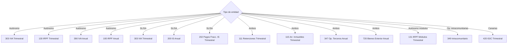

# 15 — Modelos Fiscales

> **Estado:** ✅ COMPLETADO
> **Actualizado:** 2026-03-02
> **Fuentes:** `sfce/modelos_fiscales/`, `sfce/core/servicio_fiscal.py`

---

## Los 28 modelos disponibles

| Modelo | Nombre completo | Tipo | Periodicidad | Aplica a |
|--------|----------------|------|--------------|----------|
| **036** | Declaración censal (alta/modificación/baja) | Censal | Alta o cambio | Autónomo y SL |
| **037** | Declaración censal simplificada | Censal | Alta o cambio | Solo autónomos simples |
| **100** | IRPF — Datos actividad económica (Renta) | IRPF | Anual | Autónomo |
| **111** | Retenciones trabajo y actividades profesionales | IRPF | Trimestral | Autónomo y SL |
| **115** | Retenciones arrendamientos de inmuebles | IRPF | Trimestral | Autónomo y SL |
| **123** | Retenciones capital mobiliario | IRPF | Trimestral | Autónomo y SL |
| **130** | Pago fraccionado IRPF — estimación directa | IRPF | Trimestral | Autónomo |
| **131** | Pago fraccionado IRPF — módulos | IRPF | Trimestral | Autónomo (módulos) |
| **180** | Resumen anual retenciones arrendamientos | IRPF | Anual | Autónomo y SL |
| **184** | Entidades en régimen de atribución de rentas | Informativo | Anual | Sociedades civiles / CB |
| **190** | Resumen anual retenciones trabajo y actividades | IRPF | Anual | Autónomo y SL |
| **193** | Resumen anual capital mobiliario | IRPF | Anual | Autónomo y SL |
| **200** | Impuesto sobre Sociedades | IS | Anual | SL y SA |
| **202** | Pagos fraccionados IS | IS | Trimestral | SL y SA |
| **210** | IRNR — No residentes sin establecimiento permanente | IRNR | Variable | Pagadores a no residentes |
| **211** | IRNR — Ganancias patrimoniales inmuebles | IRNR | Por operación | Compradores de inmueble a no residente |
| **216** | Retenciones a no residentes | IRNR | Trimestral | Autónomo y SL |
| **220** | IS — Grupos de sociedades | IS | Anual | Grupos fiscales |
| **296** | Resumen anual retenciones no residentes | IRNR | Anual | Autónomo y SL |
| **303** | Autoliquidación IVA | IVA | Trimestral | Autónomo y SL |
| **340** | Libros registro IVA (SII — Suministro Inmediato Información) | IVA | Mensual | Grandes empresas (SII) |
| **345** | Planes de pensiones — declaración informativa | Informativo | Anual | Entidades gestoras |
| **347** | Operaciones con terceros superiores a 3.005,06 € | Informativo | Anual | Autónomo y SL |
| **349** | Operaciones intracomunitarias | IVA | Trimestral o mensual | Autónomo y SL con op. intra. |
| **360** | Devolución IVA soportado en otro Estado miembro | IVA | Anual | Autónomo y SL |
| **390** | Resumen anual IVA | IVA | Anual | Autónomo y SL |
| **420** | IGIC — Canarias | IGIC | Trimestral | Autónomo y SL en Canarias |
| **720** | Bienes y derechos en el extranjero | Informativo | Anual | Personas con bienes ext. >50.000 € |

Los archivos YAML de diseño de cada modelo se encuentran en `sfce/modelos_fiscales/disenos/<numero>.yaml`.

---

## `MotorBOE` — Formato posicional para presentación telemática AEAT

**Archivo:** `sfce/modelos_fiscales/motor_boe.py`

El motor genera ficheros de texto en formato posicional fijo según las especificaciones BOE de la AEAT. Cada modelo tiene una longitud de registro fija (por ejemplo, 500 caracteres para el 303) y cada campo ocupa una posición exacta dentro de esa línea.

### Función `_formatear_campo()`

Aplica las reglas de formato según el tipo de campo:

| Tipo de campo (`TipoCampo`) | Regla de padding | Uso |
|----------------------------|-----------------|-----|
| `ALFANUMERICO` | `ljust` — rellena espacios a la derecha. Texto en mayúsculas | NIF, nombre, periodo, texto libre |
| `NUMERICO` | `rjust` — rellena ceros a la izquierda (`zfill`) | Números de casilla enteros, tipos impositivos |
| `NUMERICO_SIGNO` | Signo `N` (negativo) o espacio (positivo) + número con ceros a la izquierda. Incluye decimales multiplicados | Importes económicos (bases, cuotas) |
| `FECHA` | `zfill` a la longitud del campo | Fechas en formato `AAAAMMDD` |
| `TELEFONO` | `zfill` a la longitud del campo | Número de teléfono |

**Detalle de `NUMERICO_SIGNO`** (importes con decimales):

```
num = float(valor)
signo = "N" si negativo, " " si positivo
entero = abs(num) * 10^decimales  (ejemplo: 1234.56 € con 2 decimales → 123456)
resultado = signo + str(entero).zfill(longitud - 1)
```

### Encoding del fichero final

**Siempre latin-1.** El método `guardar()` de `GeneradorModelos` escribe:

```python
ruta.write_text(resultado.contenido, encoding="latin-1")
```

Esto es obligatorio por las especificaciones de la AEAT para presentación telemática.

### Estructura de una línea de registro (ejemplo Modelo 303)

```
Pos 1    : tipo_registro = "1" (fijo)
Pos 2-4  : modelo = "303" (fijo)
Pos 5-8  : ejercicio = "2025" (fuente: ejercicio)
Pos 9-17 : nif_declarante (9 chars, alfanumérico)
Pos 18-57: apellidos_nombre (40 chars, alfanumérico)
Pos 58-59: periodo ("1T", "2T", etc.)
Pos 60-73: casilla_01 — base imponible tipo general (numerico_signo, 2 decimales)
...
Pos 495-500: relleno (espacios)
```

La longitud total del registro 303 es 500 caracteres.

### Truco crítico en `actualizar_disenos.py`: `_inferir_tipo()`

Al parsear los tipos de campo desde el YAML o desde scripts de actualización, `_inferir_tipo()` **debe hacer exact match primero** antes de hacer substring match. Sin esto:

- `"N"` (numérico) matchea como substring de `"NS"` (numérico con signo) y de `"FECHA"`
- `"A"` (alfanumérico) matchea como substring de `"ALFANUMERICO"` antes de llegar al tipo correcto

Patrón correcto:
```python
# Primero exact match (dict lookup)
_TIPOS = {"N": TipoCampo.NUMERICO, "A": TipoCampo.ALFANUMERICO, ...}
if tipo in _TIPOS:
    return _TIPOS[tipo]
# Solo después, substring match
```

---

## `GeneradorPDF` — PDF visual del modelo

**Archivo:** `sfce/modelos_fiscales/generador_pdf.py`

Genera un PDF presentable del modelo para que el cliente pueda revisarlo o guardarlo. No es el fichero BOE (ese es texto plano), sino un documento legible con casillas, importes y datos de la empresa.

### Flujo de generación (doble estrategia)

```
generar(modelo, casillas, empresa, ejercicio, periodo)
    |
    ├─ ¿Existe plantillas_pdf/<modelo>.pdf Y pypdf disponible?
    │       SI → _rellenar_pdf_formulario()
    │               Lee el PDF oficial AEAT (formulario interactivo)
    │               Rellena campos con PdfWriter.update_page_form_field_values()
    │               Devuelve bytes del PDF rellenado
    │
    └─ NO (fallback) → _generar_html_pdf()
                        _renderizar_html() con Jinja2
                        Plantilla: sfce/modelos_fiscales/plantillas_html/base_modelo.html
                        weasyprint.HTML(string=html).write_pdf()
                        Devuelve bytes del PDF generado desde HTML
```

### Cuándo falla el PDF primario (pypdf)

- El PDF oficial AEAT no tiene campos de formulario interactivos (algunos modelos son solo imagen escaneada)
- El archivo `plantillas_pdf/<modelo>.pdf` no existe (la mayoría de modelos solo tienen YAML, no PDF)
- `pypdf` no está instalado en el entorno

En cualquiera de estos casos, el `except Exception: pass` captura el error silenciosamente y continúa con el fallback HTML.

### Plantilla HTML

- Ubicación: `sfce/modelos_fiscales/plantillas_html/base_modelo.html`
- Motor: Jinja2 con autoescape HTML activado
- Variables disponibles en la plantilla: `modelo`, `nombre_modelo`, `ejercicio`, `periodo`, `periodo_nombre`, `empresa`, `secciones`, `fecha_generacion`
- Las casillas se agrupan en secciones mediante `_agrupar_casillas_en_secciones()`
- Las casillas de resultado se marcan como `destacada=True` para resaltarlas visualmente

### Plantilla HTML de emergencia

Si Jinja2 no está disponible, `_html_emergencia()` genera HTML mínimo inline sin dependencias externas. Solo muestra tabla con casillas numéricas.

### Formato de importes en PDF

Los importes se formatean al estilo europeo con `_formatear_importe()`:
```
1234567.89 → "1.234.567,89"
```

---

## `CalculadorModelos` — Cálculo automático de casillas

**Archivo:** `sfce/core/calculador_modelos.py`

Calcula los valores de las casillas de cada modelo a partir de datos contables. Tres categorías:

| Categoría | Modelos | Descripción |
|-----------|---------|-------------|
| **Automático** | 303, 390, 111, 130, 347, 115, 180, 123, 193, 131, 202, 349, 420, 210, 216, **190** | Se calculan directamente desde los datos de entrada |
| **Semi-automático** | 200 | Borrador con campos editables (ajustes IS) |
| **Asistido** | 100 | Devuelve informe de rendimientos; el contribuyente completa en RentaWEB |

### Modelo 190 — `calcular_190()`

```python
calc = CalculadorModelos(Normativa())
resultado = calc.calcular_190(perceptores, ejercicio=2025)
# resultado: {modelo, ejercicio, num_registros, casilla_16, casilla_17, casilla_18, casilla_19, declarados, tipo}
```

| Casilla | Campo | Descripción |
|---------|-------|-------------|
| 16 | `percepcion_dineraria` | Total percepciones dinerarias (nóminas + honorarios) |
| 17 | `percepcion_especie_valor` | Total percepciones en especie (retribución en especie) |
| 18 | `retencion_dineraria` | Total retenciones e ingresos a cuenta |
| 19 | `ingreso_cuenta_especie` | Total ingresos a cuenta sobre percepciones en especie |

Cada perceptor en la lista `declarados` lleva: `nif`, `nombre`, `clave_percepcion` (A=trabajo, E=profesional), `subclave`, `percepcion_dineraria`, `retencion_dineraria`, `porcentaje_retencion`, `ejercicio_devengo`, `naturaleza` (F=persona física).

---

## `ExtractorPerceptores190` — Extracción desde BD

**Archivo:** `sfce/core/extractor_190.py`

Lee documentos procesados de la BD y construye la lista de perceptores para el Modelo 190.

### Fuentes de datos

| Tipo doc | Clave percepción | Campos OCR buscados |
|----------|-----------------|---------------------|
| `NOM` | A (trabajo) | `nif_trabajador`/`nif`/`dni`, `bruto`/`salario_bruto`, `retencion_irpf`/`retencion` |
| `FV` con `retencion_pct > 0` | E (profesional) | `nif_emisor`/`cif_emisor`, `base_imponible`/`base`, `retencion_importe`/`retencion` |

### Método `extraer(documentos, empresa_id, ejercicio)`

```python
extractor = ExtractorPerceptores190()
resultado = extractor.extraer(docs, empresa_id=1, ejercicio=2025)
# resultado: {empresa_id, ejercicio, completos, incompletos, puede_generar, total_percepciones, total_retenciones}
```

- Agrupa por NIF (suma percepción y retención del ejercicio)
- Perceptor **incompleto** si falta NIF o `percepcion_dineraria <= 0`
- `puede_generar = len(incompletos) == 0`
- FV sin retención (`retencion_pct=0` y `retencion_importe=0`) se excluyen

---

## Endpoints API — Modelo 190

Añadidos a `sfce/api/rutas/modelos.py` con prefix `/api/modelos`:

| Método | Ruta | Descripción |
|--------|------|-------------|
| `GET` | `/190/{empresa_id}/{ejercicio}/perceptores` | Extrae perceptores desde BD |
| `PUT` | `/190/{empresa_id}/{ejercicio}/perceptores/{nif}` | Corrige perceptor incompleto (client-side, no persiste en BD) |
| `POST` | `/190/{empresa_id}/{ejercicio}/generar` | Genera fichero BOE `.txt`. Requiere todos completos (400 si hay incompletos) |

### Dashboard `/empresa/:id/modelo-190`

**Archivo:** `dashboard/src/features/fiscal/modelo-190-page.tsx`

Flujo en dos fases:
1. **Revisión**: tabla con perceptores, filas incompletas resaltadas en rojo, edición inline NIF/percepción/retención
2. **Generación**: botón "Generar fichero 190" activo solo cuando todos completos, descarga `.txt` BOE

---

## `ValidadorModelo` — Validación pre-generación

**Archivo:** `sfce/modelos_fiscales/validador.py`

Valida la coherencia aritmética de las casillas antes de generar el fichero BOE.

### Qué valida

Las reglas se definen en el YAML de diseño de cada modelo, en la sección `validaciones`. Ejemplo del Modelo 303:

```yaml
validaciones:
  - regla: "casilla_27 == casilla_03 + casilla_06 + casilla_09 + casilla_12 + casilla_15 + casilla_77 + casilla_26"
    nivel: error
    mensaje: "Total cuotas devengadas (casilla 27) no cuadra con la suma de cuotas por tipo"

  - regla: "casilla_45 == casilla_27 - casilla_37"
    nivel: error
    mensaje: "Diferencia (casilla 45) no es igual a casilla_27 menos casilla_37"
```

Las reglas se evalúan con `eval()` restringido a builtins seguros: `abs`, `round`, `min`, `max`. Las referencias `casilla_XX` se reemplazan por sus valores numéricos antes de evaluar.

Niveles:
- `error`: bloquea la generación (`valido=False`)
- `advertencia`: se informa pero no bloquea

### Qué no valida

- Reglas de negocio complejas de la AEAT (por ejemplo, si el saldo a devolver supera el umbral para solicitar devolución inmediata)
- Validaciones que requieren datos externos (IRPF de ejercicios anteriores, consultas al censo)
- Coherencia entre modelos distintos

Las validaciones AEAT complejas solo se detectan al presentar telemáticamente.

---

## `CargadorDisenos` — Lectura de YAML de diseño

**Archivo:** `sfce/modelos_fiscales/cargador.py`

### Directorio de diseños

`sfce/modelos_fiscales/disenos/<numero>.yaml` — uno por modelo.

### Estructura del YAML

```yaml
modelo: "303"
version: "2025"
tipo_formato: posicional
longitud_registro: 500

registros:
  - tipo: cabecera
    repetible: false
    campos:
      - nombre: nif_declarante
        posicion: [9, 17]        # [inicio, fin] 1-indexed
        tipo: alfanumerico
        fuente: "nif_declarante" # cómo se obtiene el valor
        descripcion: "NIF del declarante"

      - nombre: casilla_01
        posicion: [60, 73]
        tipo: numerico_signo
        fuente: "casillas.01"    # lee de casillas["01"]
        decimales: 2

      - nombre: tipo_registro
        posicion: [1, 1]
        tipo: numerico
        valor_fijo: "1"          # valor constante, no depende de datos

validaciones:
  - regla: "casilla_27 == casilla_03 + casilla_06"
    nivel: error
    mensaje: "Total cuotas devengadas no cuadra"
```

### Fuentes de valor disponibles (`fuente`)

| Valor de `fuente` | Origen del dato |
|-------------------|----------------|
| `ejercicio` | Parámetro `ejercicio` de la llamada |
| `periodo` | Parámetro `periodo` de la llamada |
| `nif_declarante` | `empresa["nif"]` |
| `nombre_declarante` | `empresa["nombre_fiscal"]` o `empresa["nombre"]` |
| `casillas.<clave>` | `casillas["<clave>"]` |
| `empresa.<campo>` | `empresa["<campo>"]` |
| `declarado.<campo>` | Para modelos con registros repetibles (347, 190) |

Si una fuente no encuentra valor, devuelve `0` para numéricos o cadena vacía para alfanuméricos.

### Registros repetibles

Los modelos informativos con declarados (347 operaciones con terceros, 190 retenciones anuales, 349 intracomunitario) tienen `repetible: true`. El motor genera una línea por cada elemento de la lista `declarados` pasada al método `generar()`.

---

## `GeneradorModelos` — Fachada principal

**Archivo:** `sfce/modelos_fiscales/generador.py`

Orquesta CargadorDisenos + MotorBOE + ValidadorModelo. Es la clase de entrada para uso externo.

```python
gen = GeneradorModelos()

# Validar antes de generar
resultado_validacion = gen.validar("303", casillas)
if not resultado_validacion.valido:
    print(resultado_validacion.errores)

# Generar fichero BOE
resultado = gen.generar("303", "2025", "1T", casillas, empresa)

# Guardar en disco (encoding latin-1 automático)
ruta = gen.guardar(resultado, Path("output/"))

# Listar modelos con YAML disponible
modelos = gen.modelos_disponibles()  # ["036", "037", "100", ...]
```

---

## `ServicioFiscal` — Flujo completo de generación y persistencia

El `ServicioFiscal` (`sfce/core/servicio_fiscal.py`) es el orquestador que combina todo:

```
calcular_modelo(empresa, modelo, ejercicio, periodo)
    │
    ├─ calcular casillas desde datos BD (asientos, facturas)
    ├─ validar con ValidadorModelo
    ├─ generar BOE con GeneradorModelos
    ├─ generar PDF con GeneradorPDF
    └─ persistir en BD (try/except — no crítico)
```

### Tabla `modelos_fiscales_generados`

| Campo | Descripción |
|-------|-------------|
| `id` | PK |
| `empresa_id` | FK empresa |
| `modelo` | Código ("303", "390", etc.) |
| `ejercicio` | Año fiscal |
| `periodo` | Trimestre o "0A" para anual |
| `estado` | `generado` (creado) o `presentado` (enviado a AEAT) |
| `ruta_boe` | Path al fichero .303, .390, etc. en disco |
| `ruta_pdf` | Path al PDF visual |
| `fecha_generacion` | Timestamp |

**Persistencia no crítica:** el bloque de guardado en BD está envuelto en `try/except` global. Un error de BD no interrumpe la generación del fichero BOE — el gestor puede descargarlo aunque la BD falle.

---

## Golden files para tests de regresión

Los golden files son la salida esperada del MotorBOE para inputs conocidos. Sirven para detectar regresiones al modificar el motor de formateo.

**Ubicación:** `tests/test_modelos_fiscales/golden/`

**Regenerar todos los golden files:**

```bash
UPDATE_GOLDEN=1 pytest test_golden.py::TestGoldenFiles::test_regenerar_golden
```

**Ejecutar tests de regresión:**

```bash
pytest tests/test_modelos_fiscales/test_golden.py
```

Si el output del motor cambia sin actualizar los golden files, los tests fallan — esto es el comportamiento esperado.

---

## Diagrama: modelos por tipo de entidad


