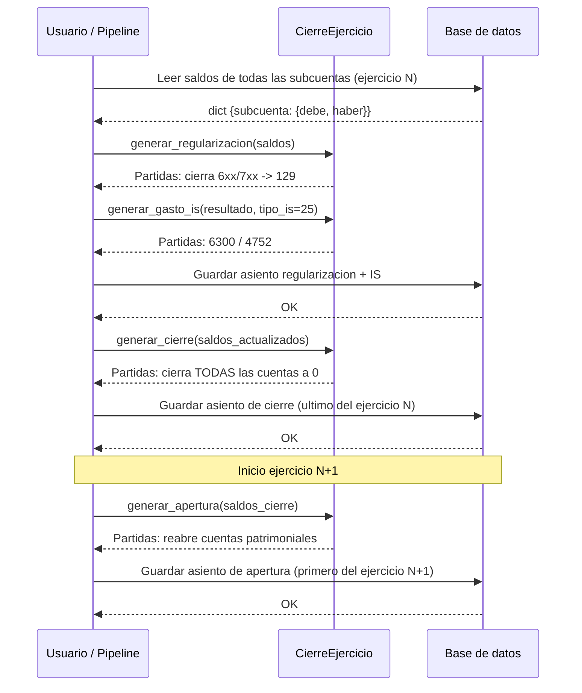

# Activos Fijos, Operaciones Periodicas y Cierre de Ejercicio

> **Estado:** ✅ COMPLETADO
> **Actualizado:** 2026-03-01
> **Fuentes principales:** `sfce/db/modelos.py`, `sfce/core/operaciones_periodicas.py`, `sfce/core/cierre_ejercicio.py`, `sfce/core/recurrentes.py`

---

## 1. Activos Fijos (tabla `activos_fijos`)

### Modelo SQLAlchemy

Definido en `sfce/db/modelos.py`, clase `ActivoFijo`:

```python
class ActivoFijo(Base):
    __tablename__ = "activos_fijos"

    id                   = Column(Integer, primary_key=True)
    empresa_id           = Column(Integer, ForeignKey("empresas.id"), nullable=False)
    descripcion          = Column(String(200), nullable=False)
    tipo_bien            = Column(String(50))
    subcuenta_activo     = Column(String(10), nullable=False)   # 21x
    subcuenta_amortizacion = Column(String(10))                 # 281x
    valor_adquisicion    = Column(Numeric(12, 2), nullable=False)
    valor_residual       = Column(Numeric(12, 2), default=Decimal("0"))
    fecha_adquisicion    = Column(Date, nullable=False)
    fecha_baja           = Column(Date)
    pct_amortizacion     = Column(Numeric(5, 2), nullable=False)  # porcentaje anual
    amortizacion_acumulada = Column(Numeric(12, 2), default=Decimal("0"))
    activo               = Column(Boolean, default=True)
```

### Descripcion de campos

| Campo | Tipo | Descripcion |
|-------|------|-------------|
| `tipo_bien` | String(50) | Categoria del activo: `vehiculos`, `mobiliario`, `equipos_informaticos`, etc. |
| `subcuenta_activo` | String(10) | Subcuenta PGC del activo (grupo 21x) |
| `subcuenta_amortizacion` | String(10) | Subcuenta amortizacion acumulada (grupo 281x). Si es null, se deriva automaticamente |
| `valor_adquisicion` | Decimal | Importe de compra sin IVA |
| `valor_residual` | Decimal | Valor estimado al final de la vida util (default 0) |
| `fecha_adquisicion` | Date | Fecha de alta del activo |
| `fecha_baja` | Date | Fecha de baja o enajenacion (null si sigue en uso) |
| `pct_amortizacion` | Decimal(5,2) | Porcentaje anual de amortizacion lineal |
| `amortizacion_acumulada` | Decimal | Suma de cuotas registradas hasta la fecha |
| `activo` | Boolean | False indica que el bien ha sido dado de baja |

### Tipos de bien y subcuentas tipicas

| Tipo bien | Subcuenta activo (21x) | Subcuenta amort. (281x) | % amort. tipico |
|-----------|------------------------|-------------------------|-----------------|
| Terrenos y solares | 2100000000 | — (no se amortizan) | 0% |
| Construcciones / inmuebles | 2110000000 | 2811000000 | 2-3% |
| Instalaciones tecnicas | 2210000000 | 2811000000 | 10-15% |
| Maquinaria | 2230000000 | 2813000000 | 12-15% |
| Utiles y herramientas | 2250000000 | 2815000000 | 25-30% |
| Mobiliario | 2260000000 | 2816000000 | 10% |
| Equipos informaticos | 2270000000 | 2817000000 | 25-33% |
| Vehiculos | 2280000000 | 2818000000 | 16-25% |
| Otro inmovilizado | 2290000000 | 2819000000 | Segun tabla |

### Formula de amortizacion lineal

Implementada en `sfce/core/operaciones_periodicas.py`:

```python
def cuota_amortizacion_mensual(
    self,
    valor_adquisicion: float,
    valor_residual: float,
    pct_amortizacion: float,
) -> float:
    base = valor_adquisicion - valor_residual
    return round(base * pct_amortizacion / 100 / 12, 2)
```

**Formula anual equivalente:**
```
cuota_anual = (valor_adquisicion - valor_residual) * pct_amortizacion / 100
cuota_mensual = cuota_anual / 12
```

### Asiento de amortizacion mensual

Generado por `generar_asiento_amortizacion()`:

```
DEBE  6810000000  Amortizacion <tipo_bien>        <cuota>
HABER 281xxxxxxx  Amortizacion acumulada           <cuota>
```

La subcuenta de amortizacion acumulada se deriva automaticamente: si `subcuenta_activo = "2270000000"`, entonces `subcuenta_amort = "281" + "0000000"` = `"2810000000"`. El motor sustituye el prefijo `21x` → `281x` usando `"281" + subcuenta_activo[3:]`.

---

## 2. Operaciones Periodicas (tabla `operaciones_periodicas`)

### Modelo SQLAlchemy

Definido en `sfce/db/modelos.py`, clase `OperacionPeriodica`:

```python
class OperacionPeriodica(Base):
    __tablename__ = "operaciones_periodicas"

    id              = Column(Integer, primary_key=True)
    empresa_id      = Column(Integer, ForeignKey("empresas.id"), nullable=False)
    tipo            = Column(String(30), nullable=False)
    descripcion     = Column(String(200))
    periodicidad    = Column(String(20), nullable=False)
    dia_ejecucion   = Column(Integer, default=1)
    ultimo_ejecutado = Column(Date)
    parametros      = Column(JSON, default=dict)
    activa          = Column(Boolean, default=True)
```

### Campos principales

| Campo | Valores posibles | Descripcion |
|-------|-----------------|-------------|
| `tipo` | `amortizacion`, `provision_paga`, `regularizacion_iva`, `periodificacion` | Tipo de operacion a ejecutar |
| `periodicidad` | `mensual`, `trimestral`, `anual` | Con que frecuencia se ejecuta |
| `dia_ejecucion` | 1-31 | Dia del mes en que debe ejecutarse |
| `ultimo_ejecutado` | Date / null | Fecha de la ultima ejecucion (control de idempotencia) |
| `parametros` | JSON | Datos especificos de la operacion (ver detalle por tipo) |
| `activa` | Boolean | Permite suspender temporalmente sin borrar |

### Tipos de operacion y su logica

#### `amortizacion`

Genera el asiento mensual de amortizacion para cada activo fijo de la empresa.

**Partidas generadas:**
```
DEBE  6810000000  Amortizacion <tipo_bien>
HABER 281xxxxxxx  Amortizacion acumulada <tipo_bien>
```

**Parametros JSON tipicos:**
```json
{
  "activo_id": 5,
  "tipo_bien": "equipos_informaticos",
  "subcuenta_activo": "2270000000",
  "valor_adquisicion": 2400.00,
  "valor_residual": 0.00,
  "pct_amortizacion": 25.00
}
```

#### `provision_paga`

Calcula y registra la provision mensual para pagas extraordinarias.

**Logica:** Solo genera asiento si `pagas > 12`. Para 14 pagas (convenio tipico), la provision mensual es `bruto_mensual * 2 / 12`.

**Partidas generadas:**
```
DEBE  6400000000  Provision paga extra
HABER 4650000000  Remuneraciones pendientes de pago
```

**Parametros JSON tipicos:**
```json
{
  "bruto_mensual": 1800.00,
  "pagas": 14
}
```

#### `regularizacion_iva`

Cierra las cuentas 472 (IVA soportado) y 477 (IVA repercutido) al final de cada trimestre.

**Caso A — IVA a pagar (repercutido > soportado):**
```
DEBE  4770000000  Cierre IVA repercutido    <repercutido>
HABER 4720000000  Cierre IVA soportado      <soportado>
HABER 4750000000  HP acreedora por IVA      <diferencia>
```

**Caso B — IVA a compensar (soportado > repercutido):**
```
DEBE  4770000000  Cierre IVA repercutido    <repercutido>
DEBE  4700000000  HP deudora por IVA        <diferencia>
HABER 4720000000  Cierre IVA soportado      <soportado>
```

**Caso C — Con regla de prorrata (`pct_prorrata < 100`):**
El IVA no deducible se carga adicionalmente a la cuenta `6340000000` (Ajustes negativos prorrata).

#### `periodificacion`

Registra la parte no devengada de un gasto anticipado (seguros, alquileres prepagados, etc.).

**Partidas generadas:**
```
DEBE  4800000000  Gastos anticipados             <importe_periodificado>
HABER <subcuenta_gasto>  Periodificacion gasto   <importe_periodificado>
```

**Formula:** `importe_periodificado = importe_total * meses_restantes / meses_totales`

### Ejecucion de operaciones periodicas

Las operaciones periodicas no tienen un job automatico implementado actualmente. Se ejecutan de forma manual o via endpoint de la API que invoca `OperacionesPeriodicas` del modulo `sfce/core/operaciones_periodicas.py`.

El campo `ultimo_ejecutado` permite detectar si ya se ejecuto en el periodo actual para evitar dobles contabilizaciones.

---

## 3. Recurrentes — Deteccion de patrones (`recurrentes.py`)

El modulo `sfce/core/recurrentes.py` implementa deteccion de facturas periodicas faltantes. Es completamente funcional pura (sin IO ni BD).

### `detectar_patrones_recurrentes(facturas, min_ocurrencias=3)`

Agrupa las facturas por `cif_emisor` y para cada proveedor analiza si sus facturas siguen un patron periodico.

**Criterio de recurrencia:**
- Minimo `min_ocurrencias` facturas del mismo proveedor
- Desviacion estandar de los intervalos entre facturas < `UMBRAL_DESVIACION_DIAS` (15 dias)

**Calculo de confianza:**
```python
UMBRAL_DESVIACION_DIAS = 15.0

def _calcular_confianza(desviacion: float) -> float:
    confianza = 1.0 - (desviacion / UMBRAL_DESVIACION_DIAS)
    return max(0.0, min(1.0, confianza))
```

Confianza = 1.0 con desviacion 0 (facturas siempre el mismo dia). Confianza = 0.0 con desviacion >= 15 dias.

**Estructura `PatronRecurrente`:**

```python
@dataclass
class PatronRecurrente:
    proveedor_cif:    str
    proveedor_nombre: str
    frecuencia_dias:  int    # intervalo medio redondeado
    ultima_fecha:     str    # ISO 8601
    importe_tipico:   float  # media de importes
    ocurrencias:      int
    confianza:        float  # 0.0 - 1.0
```

**Input esperado (lista de dicts):**
```python
{
    "cif_emisor":    "B12345678",
    "nombre_emisor": "Telefonica S.A.",
    "fecha":         "2025-01-15",   # ISO 8601
    "total":         120.50,         # o "importe"
}
```

### `detectar_faltantes(patrones, fecha_corte=None)`

Para cada `PatronRecurrente`, calcula la proxima fecha esperada:
```
proxima = ultima_fecha + timedelta(days=frecuencia_dias)
```

Si `proxima < fecha_corte` (hoy por defecto), la factura se considera faltante.

**Output:**
```python
{
    "proveedor_cif":     "B12345678",
    "proveedor_nombre":  "Telefonica S.A.",
    "fecha_esperada":    "2025-04-15",
    "dias_retraso":      12,
    "importe_estimado":  120.50,
    "confianza":         0.87,
}
```

### `generar_alertas_recurrentes(facturas, fecha_corte=None, min_ocurrencias=3)`

Funcion de orquestacion que llama a las dos anteriores y devuelve:
```python
{
    "patrones":       [PatronRecurrente, ...],
    "faltantes":      [dict, ...],
    "total_patrones": int,
    "total_faltantes": int,
}
```

Las alertas no se envian a ningun canal automaticamente; el resultado es consumido por la API o el dashboard para mostrarlo al usuario.

---

## 4. Cierre de Ejercicio (`cierre_ejercicio.py`)

La clase `CierreEjercicio` de `sfce/core/cierre_ejercicio.py` implementa los cuatro asientos del cierre contable. Todos los metodos reciben `saldos: dict[str, dict]` con la estructura `{subcuenta: {"debe": X, "haber": Y}}`.

### Secuencia de asientos

```
1. generar_regularizacion()   — cierra 6xx/7xx contra 129
2. generar_gasto_is()         — gasto IS: 6300 / 4752  [solo SL si beneficio > 0]
3. generar_cierre()           — cierra TODAS las cuentas a saldo 0
4. generar_apertura()         — reabre saldos patrimoniales en ejercicio nuevo
```

### Asiento 1 — Regularizacion de perdidas y ganancias

Cierra las cuentas de gastos (6xx) e ingresos (7xx) contra la cuenta 129 (Resultado del ejercicio).

**Gastos (saldo deudor → cerrar al haber):**
```
HABER 6xxxxxxxxx  Regularizacion <subcuenta>    <saldo_neto>
```

**Ingresos (saldo acreedor → cerrar al debe):**
```
DEBE  7xxxxxxxxx  Regularizacion <subcuenta>    <saldo_neto>
```

**Resultado:**
```
# Beneficio (ingresos > gastos)
HABER 1290000000  Resultado del ejercicio (beneficio)   <resultado>

# Perdida (gastos > ingresos)
DEBE  1290000000  Resultado del ejercicio (perdida)     <resultado>
```

### Asiento 2 — Impuesto de Sociedades (solo SL/SA)

```python
def generar_gasto_is(self, base_imponible: float, tipo_is: float) -> list[Partida]:
    # Si base_imponible <= 0, no genera asiento
    cuota = round(base_imponible * tipo_is / 100, 2)
    return [
        Partida("6300000000", debe=cuota,   concepto=f"Impuesto sobre Sociedades ({tipo_is}%)"),
        Partida("4752000000", haber=cuota,  concepto="HP acreedora por IS"),
    ]
```

**Partidas:**
```
DEBE  6300000000  Impuesto sobre Sociedades (25%)    <cuota_is>
HABER 4752000000  HP acreedora por IS                <cuota_is>
```

### Asiento 3 — Cierre (todas las cuentas a saldo cero)

Invierte el saldo neto de cada cuenta:
- Saldo deudor (debe > haber) → cerrar al haber
- Saldo acreedor (haber > debe) → cerrar al debe

```python
def generar_cierre(self, saldos: dict[str, dict]) -> list[Partida]:
    for subcuenta, saldo in sorted(saldos.items()):
        saldo_neto = saldo["debe"] - saldo["haber"]
        if saldo_neto > 0:
            Partida(subcuenta, haber=saldo_neto, concepto=f"Cierre ejercicio {subcuenta}")
        elif saldo_neto < 0:
            Partida(subcuenta, debe=abs(saldo_neto), concepto=f"Cierre ejercicio {subcuenta}")
```

### Asiento 4 — Apertura del ejercicio siguiente

Reabre los saldos patrimoniales exactamente igual que los tenia al cierre (primer asiento del ejercicio nuevo).

```python
def generar_apertura(self, saldos: dict[str, dict]) -> list[Partida]:
    # Recibe saldos del ejercicio anterior
    # Tenia saldo deudor -> reabre al debe
    # Tenia saldo acreedor -> reabre al haber
```

Las cuentas que se reabre tipicamente son:
- Grupo 1xx (Financiacion basica): capital, reservas, resultado pendiente
- Grupo 2xx (Activo no corriente): inmovilizado, amortizacion acumulada
- Grupo 3xx (Existencias)
- Grupo 4xx (Acreedores y deudores): clientes, proveedores, HP
- Grupo 5xx (Cuentas financieras): bancos, tesoreria

Las cuentas 6xx y 7xx NO se reabre (sus saldos son cero tras la regularizacion).

### Cuentas clave del cierre

| Cuenta | Descripcion | Papel en cierre |
|--------|-------------|-----------------|
| 6xxxxxxxxx | Gastos (grupo 6) | Se cierran al haber en regularizacion |
| 7xxxxxxxxx | Ingresos (grupo 7) | Se cierran al debe en regularizacion |
| 1290000000 | Resultado del ejercicio | Recibe el saldo de 6xx/7xx |
| 6300000000 | Impuesto sobre Sociedades | Gasto IS antes del cierre |
| 4752000000 | HP acreedora IS | Pasivo por IS pendiente de pago |
| 1000000000 | Capital social | Se reabre en apertura |
| 1120000000 | Reserva legal | Se reabre en apertura |
| 1200000000 | Remanente | Puede absorber resultado anterior |
| 1210000000 | Resultados negativos de ejercicios anteriores | Compensacion de perdidas |

### Cuando ejecutar el cierre

El cierre contable se ejecuta una unica vez al final del ejercicio fiscal (31 de diciembre para ejercicios naturales). La apertura se ejecuta como primer asiento del ejercicio siguiente (1 de enero).

No existe job automatico. El proceso se lanza manualmente desde el pipeline o via llamada directa a `CierreEjercicio`.

---

## 5. Diagrama de secuencia del cierre


