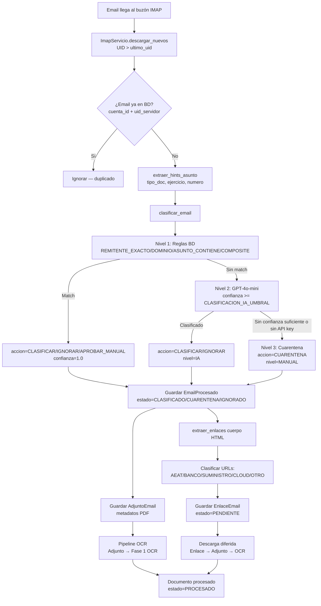

# 20 - Módulo de Correo: Ingesta y Clasificación

> **Estado:** ✅ COMPLETADO
> **Actualizado:** 2026-03-01
> **Fuentes principales:** `sfce/conectores/correo/imap_servicio.py`, `sfce/conectores/correo/ingesta_correo.py`, `sfce/conectores/correo/clasificacion/servicio_clasificacion.py`, `sfce/db/modelos.py`

---

## Visión general

El módulo de correo descarga emails de buzones IMAP, los clasifica automáticamente en dos niveles (reglas deterministas + IA), extrae adjuntos PDF para el pipeline OCR, y registra los enlaces del cuerpo HTML para descarga diferida. Es el punto de entrada "pasivo" de documentos al SFCE: en lugar de subir facturas manualmente, los proveedores las envían por correo.

---

## 1. ImapServicio (`imap_servicio.py`)

### Descarga incremental por UID

`ImapServicio` utiliza UIDs IMAP para la descarga incremental. Cada petición solicita solo los mensajes con UID mayor al último procesado (`ultimo_uid`), evitando re-descargar emails ya vistos.

```python
class ImapServicio:
    def __init__(
        self,
        servidor: str,
        puerto: int,
        ssl: bool,
        usuario: str,
        contrasena: str,
        carpeta: str = "INBOX",
    ) -> None:
```

### Método principal

```python
def descargar_nuevos(self, ultimo_uid: int = 0) -> list[dict[str, Any]]:
    """Devuelve emails con UID > ultimo_uid."""
```

El método se conecta, ejecuta `UID SEARCH {ultimo_uid+1}:*`, descarga los mensajes con `RFC822` y llama a `_parsear_email()` por cada uno. La conexión se cierra siempre en el bloque `finally`.

### Adaptador sobre imaplib

En producción se usa `_ImaplibAdapter`, que envuelve `imaplib.IMAP4` / `IMAP4_SSL` con una interfaz normalizada:

```python
class _ImaplibAdapter:
    def search(self, criterio: str) -> list[bytes]
    def fetch(self, uids: list[bytes], fmt: str = "RFC822") -> dict[bytes, dict]
    def logout(self) -> None
```

Esta abstracción permite sustituir `_conn` por un `MagicMock` en los tests sin modificar el código de producción.

### Soporte SSL

- `ssl=True`: usa `imaplib.IMAP4_SSL` (puerto 993 por defecto)
- `ssl=False`: usa `imaplib.IMAP4` (puerto 143)

---

## 2. Tabla `CuentaCorreo`

```
__tablename__ = "cuentas_correo"
```

| Campo | Tipo | Descripción |
|-------|------|-------------|
| `id` | Integer PK | Identificador |
| `empresa_id` | Integer FK(empresas) | Empresa propietaria del buzón |
| `nombre` | String(200) | Nombre descriptivo (ej: "Facturas proveedores") |
| `protocolo` | String(10) | `'imap'` o `'graph'` (Microsoft Graph/O365) |
| `servidor` | String(200) | Hostname IMAP (solo protocolo imap) |
| `puerto` | Integer | Puerto IMAP, default 993 |
| `ssl` | Boolean | Conexión cifrada, default True |
| `usuario` | String(200) | Dirección de correo / login IMAP |
| `contrasena_enc` | Text | Contraseña cifrada con Fernet (`sfce/core/cifrado.py`) |
| `oauth_token_enc` | Text | Access token OAuth2 cifrado (protocolo graph) |
| `oauth_refresh_enc` | Text | Refresh token OAuth2 cifrado (protocolo graph) |
| `oauth_expires_at` | String(50) | Fecha de expiración del access token |
| `carpeta_entrada` | String(100) | Carpeta a monitorizar, default `"INBOX"` |
| `ultimo_uid` | Integer | Último UID IMAP descargado (tracking incremental) |
| `activa` | Boolean | Si false, la cuenta no se procesa |
| `polling_intervalo_segundos` | Integer | Intervalo de polling, default 120s |

Las credenciales (`contrasena_enc`, `oauth_token_enc`, `oauth_refresh_enc`) se almacenan cifradas con cifrado simétrico Fernet. Ver tema 22 para detalles del cifrado.

---

## 3. Clasificación de emails en 3 niveles

La función `clasificar_email()` en `servicio_clasificacion.py` orquesta los tres niveles y siempre devuelve un resultado:

```python
def clasificar_email(
    remitente: str,
    asunto: str,
    cuerpo_texto: str,
    reglas: list[dict[str, Any]],
    usar_ia: bool = True,
) -> dict[str, Any]:
    # Siempre retorna:
    # {
    #   "accion": str,         # CLASIFICAR | IGNORAR | APROBAR_MANUAL | CUARENTENA
    #   "nivel": str,          # REGLA | IA | MANUAL
    #   "slug_destino": str|None,
    #   "confianza": float,    # 0.0 - 1.0
    #   "tipo_doc": str|None,  # solo cuando nivel=IA
    # }
```

### Nivel 1: Reglas deterministas (`clasificar_nivel1`)

Evalúa las reglas de la tabla `reglas_clasificacion_correo` ordenadas por `prioridad` ascendente (menor número = mayor prioridad). La primera regla que coincide gana.

Tipos de condición soportados:

| Tipo | Condición `condicion_json` | Ejemplo |
|------|---------------------------|---------|
| `REMITENTE_EXACTO` | `{"remitente": "facturas@proveedor.es"}` | Match exacto case-insensitive |
| `DOMINIO` | `{"dominio": "proveedor.es"}` | Dominio del remitente |
| `ASUNTO_CONTIENE` | `{"patron": "factura"}` | Substring en el asunto, case-insensitive |
| `COMPOSITE` | `{"condiciones": [...]}` | Todas las condiciones deben cumplirse (AND) |

Cuando hay match, devuelve `confianza=1.0` (determinista).

### Nivel 2: Clasificación IA (`clasificar_nivel2_ia`)

Se ejecuta solo si el Nivel 1 no clasificó. Requiere `OPENAI_API_KEY` en el entorno.

- **Modelo**: `gpt-4o-mini`
- **Temperatura**: 0 (máxima determinismo)
- **Input**: remitente + asunto + primeros 500 chars del cuerpo de texto
- **Categorías posibles**: `FACTURA_PROVEEDOR`, `FACTURA_CLIENTE`, `NOTIFICACION_AEAT`, `EXTRACTO_BANCARIO`, `NOMINA`, `OTRO`, `SPAM`
- **Umbral**: configurable vía `CLASIFICACION_IA_UMBRAL` (default `0.8`). Si la confianza es menor al umbral, el resultado de IA se descarta y se pasa al Nivel 3.

Respuesta del modelo: `"TIPO,0.95"` (tipo y confianza separados por coma).

Si `OPENAI_API_KEY` no está configurada o la llamada falla, la función retorna `None` sin lanzar excepción.

### Nivel 3: Cuarentena manual

Fallback cuando ninguno de los dos niveles anteriores produce resultado:

```python
return {"accion": "CUARENTENA", "nivel": "MANUAL", "slug_destino": None, "confianza": 0.0}
```

El email queda en estado `CUARENTENA` para revisión manual desde el dashboard.

---

## 4. Tabla `ReglaClasificacionCorreo`

```
__tablename__ = "reglas_clasificacion_correo"
```

| Campo | Tipo | Descripción |
|-------|------|-------------|
| `id` | Integer PK | Identificador |
| `empresa_id` | Integer FK(empresas) | null = regla global para todas las empresas |
| `tipo` | String(30) | `REMITENTE_EXACTO`, `DOMINIO`, `ASUNTO_CONTIENE`, `COMPOSITE` |
| `condicion_json` | Text | JSON con parámetros de la condición |
| `accion` | String(20) | `CLASIFICAR`, `IGNORAR`, `APROBAR_MANUAL` |
| `slug_destino` | String(100) | Identificador de inbox destino en el pipeline |
| `confianza` | Float | Confianza asignada (default 1.0 para reglas manuales) |
| `origen` | String(15) | `MANUAL` (creada por usuario) o `APRENDIZAJE` (auto-generada) |
| `activa` | Boolean | Si false, la regla se ignora |
| `prioridad` | Integer | Orden de evaluación. Menor número = mayor prioridad (default 100) |

---

## 5. Orquestador de ingesta (`ingesta_correo.py`)

La clase `IngestaCorreo` coordina el ciclo completo para una cuenta:

```python
class IngestaCorreo:
    def __init__(self, engine: Engine, directorio_adjuntos: str = "clientes") -> None:

    def procesar_cuenta(self, cuenta_id: int) -> int:
        """Retorna número de emails nuevos procesados."""
```

### Flujo interno de `procesar_cuenta()`

1. Carga la `CuentaCorreo` y verifica que esté activa
2. Lee las reglas de clasificación para `empresa_id` de la cuenta
3. Llama a `_descargar_emails_cuenta()` con `ultimo_uid` actual
4. Para cada email nuevo:
   - Verifica duplicados por `(cuenta_id, uid_servidor)` — constraint UNIQUE en BD
   - Extrae hints del asunto vía `extraer_hints_asunto()` (tipo_doc, ejercicio, número)
   - Llama a `clasificar_email()` — los hints tienen precedencia sobre la IA para `tipo_doc`
   - Determina `estado_inicial` según la acción:
     - `CLASIFICAR` → `CLASIFICADO`
     - `APROBAR_MANUAL` / `CUARENTENA` → `CUARENTENA`
     - `IGNORAR` → `IGNORADO`
   - Guarda `EmailProcesado` en BD
   - Guarda adjuntos como `AdjuntoEmail` (metadatos, sin los bytes)
   - Extrae enlaces del cuerpo HTML y guarda como `EnlaceEmail`
5. Actualiza `cuenta.ultimo_uid` al máximo UID procesado
6. Commit de la sesión

---

## 6. Extractor de enlaces (`extractor_enlaces.py`)

```python
def extraer_enlaces(cuerpo_html: str | None) -> list[dict[str, Any]]:
```

Extrae todos los `<a href>` del HTML (usa lxml si está disponible, fallback a regex). Clasifica cada URL según patrones conocidos:

| Patrón | Dominios detectados |
|--------|---------------------|
| `AEAT` | `agenciatributaria.gob.es`, `sede.agenciatributaria`, `aeat.es` |
| `BANCO` | `bbva.es`, `caixabank.es`, `santander.com`, `bancosabadell.com`, `bankinter.com`, `ingdirect.es`, `lacaixa.es` |
| `SUMINISTRO` | `iberdrola.es`, `endesa.es`, `naturgy.com`, `repsol.es`, `vodafone.es`, `movistar.es`, `orange.es` |
| `CLOUD` | `dropbox.com`, `drive.google.com`, `onedrive.live.com`, `sharepoint.com`, `wetransfer.com` |
| `OTRO` | URLs con extensiones `.pdf`, `.xlsx`, `.xls`, `.docx`, `.doc`, `.zip`, `.xml` |

Los enlaces de dominios de tracking publicitario (mailchimp, sendgrid, track., click., redes sociales) son excluidos automáticamente.

Solo se guardan enlaces de patrones conocidos o con extensión de documento.

---

## 7. Tablas de BD

### `emails_procesados`

| Campo | Tipo | Descripción |
|-------|------|-------------|
| `id` | Integer PK | Identificador |
| `cuenta_id` | Integer FK | Cuenta de correo origen |
| `uid_servidor` | String(100) | UID IMAP del servidor. Con `cuenta_id` forma constraint UNIQUE. |
| `message_id` | String(200) | Cabecera `Message-ID` del email |
| `remitente` | String(200) | Dirección del remitente |
| `asunto` | String(500) | Asunto del email |
| `fecha_email` | String(50) | Fecha del mensaje |
| `estado` | String(20) | `PENDIENTE`, `CLASIFICADO`, `CUARENTENA`, `PROCESADO`, `ERROR`, `IGNORADO` |
| `nivel_clasificacion` | String(10) | `REGLA`, `IA`, `MANUAL` |
| `empresa_destino_id` | Integer FK | Empresa destino (cuando ya está clasificado) |
| `confianza_ia` | Float | Confianza del clasificador IA (null si nivel=REGLA) |
| `procesado_at` | DateTime | Timestamp de procesamiento final |

### `adjuntos_email`

| Campo | Tipo | Descripción |
|-------|------|-------------|
| `id` | Integer PK | Identificador |
| `email_id` | Integer FK | Email al que pertenece |
| `nombre_original` | String(300) | Nombre del adjunto tal como viene en el email |
| `nombre_renombrado` | String(300) | Nombre normalizado por el renombrador |
| `ruta_archivo` | String(500) | Ruta en disco donde se guardó |
| `mime_type` | String(100) | Tipo MIME, default `application/pdf` |
| `tamano_bytes` | Integer | Tamaño del archivo |
| `documento_id` | Integer | FK lógica al documento del pipeline (cuando ya fue procesado) |
| `estado` | String(20) | `PENDIENTE`, `OCR_OK`, `OCR_ERROR`, `DUPLICADO` |

### `enlaces_email`

| Campo | Tipo | Descripción |
|-------|------|-------------|
| `id` | Integer PK | Identificador |
| `email_id` | Integer FK | Email del que se extrajo |
| `url` | Text | URL completa |
| `dominio` | String(200) | Dominio extraído de la URL |
| `patron_detectado` | String(20) | `AEAT`, `BANCO`, `SUMINISTRO`, `CLOUD`, `OTRO` |
| `estado` | String(20) | `PENDIENTE`, `DESCARGANDO`, `DESCARGADO`, `ERROR`, `IGNORADO` |
| `nombre_archivo` | String(300) | Nombre del archivo descargado (si aplica) |
| `ruta_archivo` | String(500) | Ruta del archivo descargado |
| `tamano_bytes` | Integer | Tamaño del archivo descargado |
| `adjunto_id` | Integer FK | FK al adjunto creado tras descarga |

---

## 8. Cómo añadir una cuenta nueva

Campos mínimos requeridos para crear una `CuentaCorreo`:

```python
{
    "empresa_id": 5,
    "nombre": "Facturas proveedores Elena",
    "protocolo": "imap",
    "servidor": "imap.gmail.com",
    "puerto": 993,
    "ssl": True,
    "usuario": "facturas@empresa.es",
    "contrasena_enc": cifrar("mi_contrasena"),  # usar sfce/core/cifrado.py
    "carpeta_entrada": "INBOX",
    "activa": True,
    "polling_intervalo_segundos": 120,
}
```

Para protocolo `graph` (Microsoft Graph / Office 365), `servidor` no es necesario. Se usan `oauth_token_enc`, `oauth_refresh_enc` y `oauth_expires_at` en lugar de `contrasena_enc`.

---

## 9. Diagrama de flujo



---

## 10. Worker de polling

El archivo `worker_catchall.py` contiene el worker que ejecuta `IngestaCorreo.procesar_cuenta()` en bucle para todas las cuentas activas, respetando el `polling_intervalo_segundos` configurado por cuenta. El intervalo por defecto es 120 segundos (2 minutos).
