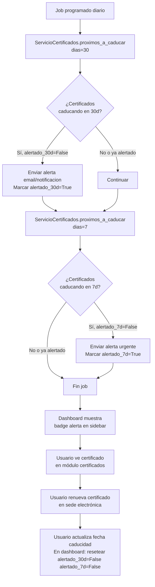
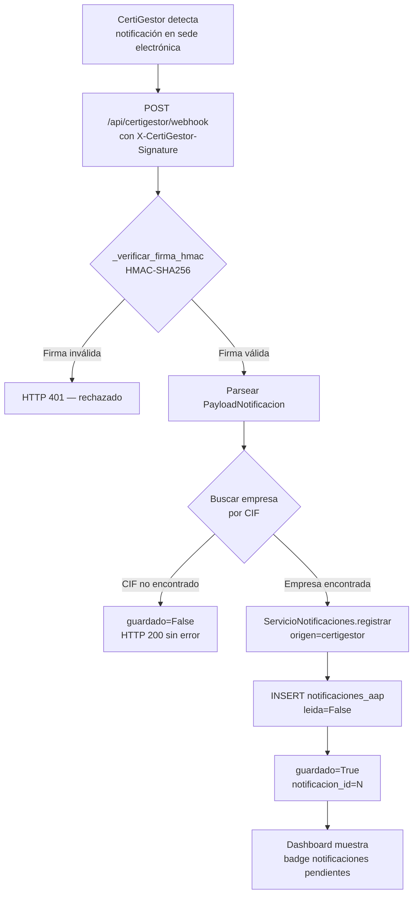

# 21 - Certificados Digitales y Notificaciones AAPP

> **Estado:** ✅ COMPLETADO
> **Actualizado:** 2026-03-01
> **Fuentes principales:** `sfce/core/certificados_aapp.py`, `sfce/api/rutas/certigestor.py`, `sfce/db/modelos.py`

---

## Visión general

El módulo gestiona dos entidades relacionadas con las Administraciones Públicas:

1. **Certificados digitales** (`certificados_aap`): registro de metadatos de certificados digitales de representación, firma y sello. Emite alertas de caducidad a 30 y 7 días.

2. **Notificaciones AAPP** (`notificaciones_aap`): registro de requerimientos, notificaciones, sanciones y embargos recibidos de organismos públicos. Se pueden ingresar manualmente o via webhook desde CertiGestor.

---

## 1. ServicioCertificados (`sfce/core/certificados_aapp.py`)

```python
class ServicioCertificados:
    def __init__(self, sesion: Session) -> None:
```

### Métodos disponibles

| Método | Firma | Descripción |
|--------|-------|-------------|
| `crear` | `(empresa_id, cif, nombre, caducidad, tipo, organismo="")` | Registra un nuevo certificado digital |
| `listar` | `(empresa_id)` | Lista todos los certificados de una empresa, ordenados por fecha de caducidad |
| `proximos_a_caducar` | `(dias=30)` | Devuelve certificados que caducan en los próximos N días |

### Alertas de caducidad

La tabla tiene dos campos booleanos de control de alertas:

- `alertado_30d`: se marca `True` cuando se envía la alerta de "caducidad en 30 días"
- `alertado_7d`: se marca `True` cuando se envía la alerta de "caducidad en 7 días"

El método `proximos_a_caducar(dias=30)` aplica el filtro:

```python
limite = date.today() + timedelta(days=dias)
query.filter(
    CertificadoAAP.caducidad <= limite,
    CertificadoAAP.caducidad >= date.today()
)
```

Para el chequeo de 7 días se llama con `proximos_a_caducar(dias=7)`. El job programado verifica ambos umbrales y marca los campos para evitar alertas duplicadas.

---

## 2. Tabla `certificados_aap`

```
__tablename__ = "certificados_aap"
```

| Campo | Tipo | Descripción |
|-------|------|-------------|
| `id` | Integer PK | Identificador |
| `empresa_id` | Integer FK(empresas) | Empresa propietaria del certificado. Con índice. |
| `cif` | String(20) | CIF/NIF del titular del certificado |
| `nombre` | String(200) | Nombre descriptivo (ej: "Certificado FNMT Representante 2025") |
| `tipo` | String(50) | Tipo de certificado: `representante`, `firma`, `sello` |
| `organismo` | String(100) | Organismo emisor o ámbito: `AEAT`, `SEDE`, `SEGURIDAD_SOCIAL` |
| `caducidad` | Date | Fecha de caducidad del certificado |
| `alertado_30d` | Boolean | `True` si ya se envió alerta de 30 días. Default False. |
| `alertado_7d` | Boolean | `True` si ya se envió alerta de 7 días. Default False. |
| `creado_en` | DateTime | Fecha de alta en el sistema |
| `actualizado_en` | DateTime | Última modificación (se actualiza automáticamente con `onupdate`) |

### Tipos de certificado

| Tipo | Descripción |
|------|-------------|
| `representante` | Certificado de representante de persona jurídica (FNMT, Camerfirma, etc.) |
| `firma` | Certificado de firma electrónica del administrador o apoderado |
| `sello` | Sello electrónico de entidad para automatización |

---

## 3. ServicioNotificaciones (`sfce/core/certificados_aapp.py`)

```python
class ServicioNotificaciones:
    def __init__(self, sesion: Session) -> None:
```

### Métodos disponibles

| Método | Firma | Descripción |
|--------|-------|-------------|
| `registrar` | `(empresa_id, organismo, asunto, tipo, fecha_limite=None, url_documento=None, origen="webhook")` | Registra una notificación AAPP. Acepta `fecha_limite` como string ISO o `date`. |
| `listar` | `(empresa_id, solo_no_leidas=False)` | Lista notificaciones ordenadas por fecha de recepción DESC |
| `marcar_leida` | `(notif_id)` | Marca una notificación como leída |
| `obtener` | `(notif_id)` | Obtiene una notificación por ID |

---

## 4. Tabla `notificaciones_aap`

```
__tablename__ = "notificaciones_aap"
```

| Campo | Tipo | Descripción |
|-------|------|-------------|
| `id` | Integer PK | Identificador |
| `empresa_id` | Integer FK(empresas) | Empresa destinataria. Con índice. |
| `organismo` | String(100) | Emisor: `AEAT`, `DGT`, `DEHU`, `JUNTA`, etc. |
| `asunto` | String(500) | Descripción del contenido de la notificación |
| `tipo` | String(50) | Tipo: `requerimiento`, `notificacion`, `sancion`, `embargo` |
| `fecha_recepcion` | DateTime | Timestamp de recepción en el sistema (default=`utcnow`) |
| `fecha_limite` | Date | Fecha límite de respuesta o pago (puede ser null) |
| `leida` | Boolean | Si el usuario ha marcado como leída. Default False. |
| `url_documento` | String(500) | URL al documento original en sede electrónica (si aplica) |
| `origen` | String(50) | Cómo llegó: `certigestor`, `manual`, `webhook` |

---

## 5. Webhook CertiGestor (`sfce/api/rutas/certigestor.py`)

CertiGestor es el módulo externo (proyecto findiur) que monitoriza las sedes electrónicas y notifica al SFCE cuando hay notificaciones nuevas para los CIF gestionados.

### Endpoint

```
POST /api/certigestor/webhook
```

No requiere autenticación JWT (es llamado por CertiGestor, no por el frontend). La seguridad se implementa mediante firma HMAC-SHA256.

### Verificación HMAC

```python
def _verificar_firma_hmac(request_body: bytes, firma_recibida: str) -> bool:
    secreto = os.getenv("CERTIGESTOR_WEBHOOK_SECRET", "")
    if not secreto:
        return False
    firma_esperada = hmac.new(secreto.encode(), request_body, hashlib.sha256).hexdigest()
    return hmac.compare_digest(firma_esperada, firma_recibida)
```

CertiGestor incluye la firma en el header `X-CertiGestor-Signature`. Si el header está ausente o la firma no coincide, se devuelve HTTP 401. El secreto compartido se configura en la variable de entorno `CERTIGESTOR_WEBHOOK_SECRET`.

### Payload de notificación

```python
class PayloadNotificacion(BaseModel):
    empresa_cif: str           # CIF de la empresa destinataria
    organismo: str             # default "DESCONOCIDO"
    tipo: str                  # requerimiento | notificacion | sancion | embargo
    descripcion: str           # texto del asunto
    fecha_limite: str | None   # fecha ISO o null
    url_documento: str | None  # enlace al documento en sede
```

### Flujo de procesamiento del webhook

1. Recibe el body en raw bytes
2. Verifica firma HMAC-SHA256 contra `CERTIGESTOR_WEBHOOK_SECRET`
3. Parsea el JSON como `PayloadNotificacion`
4. Busca la empresa en BD por `cif = payload.empresa_cif`
5. Si no existe el CIF: devuelve `{"guardado": False, "motivo": "CIF no encontrado"}` (sin error HTTP)
6. Llama a `ServicioNotificaciones.registrar()` con `origen="certigestor"`
7. Devuelve `{"guardado": True, "notificacion_id": N, "empresa_id": N}`

---

## 6. Dashboard: módulo certificados

Las alertas de caducidad aparecen en el módulo de certificados del dashboard (ruta `/empresa/:id/certificados`). El panel muestra:

- Lista de todos los certificados con semáforo visual (verde/amarillo/rojo según días para caducidad)
- Alertas destacadas: certificados con `caducidad <= hoy+30 días`
- Badge en el sidebar cuando hay certificados próximos a caducar o notificaciones no leídas

Las notificaciones AAPP se muestran en el módulo `/empresa/:id/notificaciones` con filtro por estado (leídas/no leídas) y por tipo (requerimiento/sanción/embargo).

---

## 7. Flujo completo de alerta por caducidad



---

## 8. Flujo webhook CertiGestor


