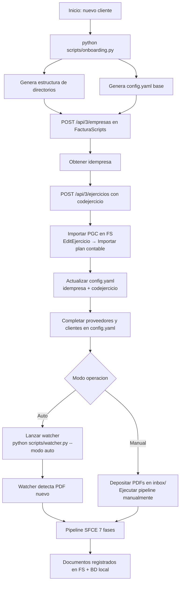

# Clientes y Configuracion

> **Estado:** COMPLETADO
> **Actualizado:** 2026-03-01
> **Fuentes principales:** `clientes/elena-navarro/config.yaml`, `sfce/core/config.py`, `sfce/core/config_desde_bd.py`, `sfce/api/rutas/admin.py`, `sfce/api/rutas/portal.py`, `sfce/api/rutas/auth_rutas.py`

---

## Clientes actuales

| idempresa | Slug | Nombre | Forma juridica | Estado | Ejercicios activos |
|-----------|------|--------|----------------|--------|--------------------|
| 1 | `pastorino-costa-del-sol` | PASTORINO COSTA DEL SOL S.L. | S.L. | Contabilidad completa | 2022, 2023, 2024 |
| 2 | `gerardo-gonzalez-callejon` | GERARDO GONZALEZ CALLEJON | Autonomo | FS configurado, carpetas creadas | 2025 |
| 3 | `EMPRESA PRUEBA` | EMPRESA PRUEBA S.L. | S.L. | Sandbox testing — pipeline 46/46 OK | 2025 |
| 4 | `chiringuito-sol-arena` | CHIRINGUITO SOL Y ARENA S.L. | S.L. | Datos inyectados: 1200 FC + 596 FV + 112 asientos | C422, C423, C424, 0004 |
| 5 | `elena-navarro` | ELENA NAVARRO PRECIADOS | Autonomo | Pipeline completado | 2025 |
| 6 | — | GESTORIA CARLOS CANETE | S.L. | Empresa default del admin superadmin | 2025 |

> Nota: el `idempresa` es el ID de empresa en FacturaScripts, no un ID interno del SFCE.
> El `codejercicio` puede diferir del ano — empresa 4 usa "0004", no "2025".
> La empresa 6 (GESTORIA CARLOS CANETE) es la empresa interna; no tiene slug de cliente ni config.yaml.

---

## Tablero de Usuarios — Jerarquia y Accesos

El SFCE implementa un sistema multiusuario con 4 niveles de rol. Los archivos clave son:
- `sfce/api/rutas/admin.py` — gestion de gestorias y usuarios (superadmin)
- `sfce/api/rutas/auth_rutas.py` — login, aceptar invitacion
- `sfce/api/rutas/portal.py` — portal cliente multi-empresa
- `sfce/api/rutas/empresas.py` — invitar cliente a empresa especifica

### Roles y accesos

| Rol | Frontend | Puede hacer |
|-----|----------|-------------|
| `superadmin` | `/admin/gestorias` | Crear/gestionar gestorias, invitar `admin_gestoria`, crear clientes directos |
| `admin_gestoria` | `/mi-gestoria` | Administrar su gestoria, invitar `asesor` y clientes de su gestoria |
| `asesor` | Dashboard completo | Gestionar empresas asignadas de su gestoria |
| `cliente` | `/portal` | Ver sus empresas asignadas (vista simplificada) |

### Campo `gestoria_id` en `Usuario`

- `admin_gestoria`, `asesor`, `cliente` de gestoria: tienen `gestoria_id` asignado
- **Clientes directos**: `gestoria_id=NULL` — creados por superadmin, no pertenecen a ninguna gestoria

---

## Flujo de invitacion

Los usuarios no se registran solos: el acceso se otorga siempre via token de invitacion.

### 1. Generar token

**Invitar a un asesor o admin_gestoria** (desde `admin.py`):

```http
POST /api/admin/gestorias/{gestoria_id}/invitar
Authorization: Bearer <jwt_superadmin_o_admin_gestoria>
Content-Type: application/json

{
  "email": "asesor@ejemplo.com",
  "nombre": "Ana Perez",
  "rol": "asesor"
}
```

Respuesta:

```json
{
  "id": 7,
  "email": "asesor@ejemplo.com",
  "invitacion_token": "<token_urlsafe_32bytes>",
  "invitacion_url": "/auth/aceptar-invitacion?token=<token>",
  "expira": "2026-03-08T12:00:00"
}
```

**Crear cliente directo** (sin gestoria, solo superadmin):

```http
POST /api/admin/clientes-directos
Authorization: Bearer <jwt_superadmin>
Content-Type: application/json

{ "email": "cliente@empresa.com", "nombre": "Carlos Lopez" }
```

### 2. Verificar token (lado cliente, antes de mostrar formulario)

El frontend llama a `GET /api/auth/aceptar-invitacion?token=xxx` para comprobar que el token existe y no ha expirado antes de mostrar el formulario de alta.

### 3. Aceptar invitacion y obtener JWT

```http
POST /api/auth/aceptar-invitacion
Content-Type: application/json

{
  "token": "<token>",
  "password": "NuevaPassword123!"
}
```

Respuesta:

```json
{
  "access_token": "<jwt>",
  "token_type": "bearer"
}
```

El endpoint (`auth_rutas.py`):
1. Busca el usuario por `invitacion_token`
2. Verifica que `invitacion_expira > ahora`
3. Hashea la password definitiva y la guarda
4. Limpia `invitacion_token` y `invitacion_expira`
5. Pone `forzar_cambio_password=False`
6. Devuelve JWT con `sub=email`, `rol`, `gestoria_id`

> El token queda inutilizado tras el canje: `invitacion_token=NULL`. No hay campo `usado` booleano; la ausencia del token es la marca de canjeado.

### 4. Logica de envio de email

`email_service.py` se llama en `try/except`. Si el SMTP no esta configurado, el envio falla silenciosamente y el token igualmente se devuelve en la respuesta de la API para uso manual/testing.

---

## Portal multi-empresa (`/portal`)

El portal es la vista simplificada para usuarios con rol `cliente`.

### Endpoint `GET /api/portal/mis-empresas`

Devuelve las empresas segun el rol:

| Rol | Que devuelve |
|-----|--------------|
| `superadmin` | Todas las empresas de la BD |
| `admin_gestoria` / `asesor` | Empresas de su gestoria (filtradas por `gestoria_id`) |
| `cliente` | Solo las empresas en su campo `empresas_asignadas` |

### Logica de redireccion en el frontend

```
GET /api/portal/mis-empresas
  → empresas.length == 0  → mensaje "sin empresas asignadas"
  → empresas.length == 1  → redirige directamente a /portal/{id}/resumen
  → empresas.length > 1   → muestra indice /portal/mis-empresas
```

### Endpoints del portal

| Endpoint | Descripcion |
|----------|-------------|
| `GET /api/portal/mis-empresas` | Lista de empresas accesibles |
| `GET /api/portal/{id}/resumen` | Resultado acumulado, facturas pendientes cobro/pago |
| `GET /api/portal/{id}/documentos` | Ultimos 50 documentos procesados |
| `GET /api/portal/{id}/calendario.ics` | Descarga iCal con vencimientos fiscales |

---

## Invitar cliente final al portal

Un asesor o admin_gestoria puede invitar al propietario de una empresa para que acceda al portal con su propio usuario.

```http
POST /api/empresas/{empresa_id}/invitar-cliente
Authorization: Bearer <jwt_asesor_o_admin_gestoria>
Content-Type: application/json

{
  "email": "propietario@suempresa.com",
  "nombre": "Juan Propietario"
}
```

Comportamiento (`empresas.py`):
1. Verifica que el solicitante tiene acceso a esa empresa
2. Crea un `Usuario` con `rol="cliente"`, `gestoria_id` heredado del invitador, `empresas_asignadas=[empresa_id]`
3. Genera token de invitacion (7 dias)
4. Intenta enviar email via `email_service.py`
5. Devuelve token en respuesta para uso manual si el email falla

Diferencia con `POST /api/admin/clientes-directos`:
- `invitar-cliente` asigna automaticamente la empresa al usuario y hereda `gestoria_id`
- `clientes-directos` crea el cliente sin empresa asignada ni gestoria (cliente huerfano para asignar despues)

---

## Estructura de `config.yaml`

Cada cliente tiene su archivo en `clientes/<slug>/config.yaml`. A continuacion se describen todos los campos con referencia al config real de elena-navarro.

### Seccion `empresa` (obligatoria)

| Campo | Tipo | Obligatorio | Descripcion |
|-------|------|-------------|-------------|
| `nombre` | string | SI | Razon social completa en mayusculas |
| `nombre_comercial` | string | NO | Nombre visible al publico |
| `cif` | string | SI | CIF/NIF de la empresa o autonomo |
| `tipo` | string | SI | Forma juridica: `sl`, `sa`, `autonomo`, `comunidad_propietarios`, `asociacion`, `comunidad_bienes`, `cooperativa`, `fundacion`, `sociedad_civil` |
| `idempresa` | int | SI | ID de empresa en FacturaScripts |
| `ejercicio_activo` | string | SI | Ano del ejercicio activo, ej: `"2025"`. Usado para rutas de archivos |
| `codejercicio` | string | NO | Codigo FS del ejercicio, puede diferir del ano. Ej: `"0005"`. Si ausente, usa `ejercicio_activo` |
| `regimen_iva` | string | NO | Regimen IVA especial: `exento_parcial`, `simplificado`, `recargo_equivalencia` |
| `prorrata` | int | NO | Porcentaje de prorrata si `regimen_iva: exento_parcial` (ej: 35) |
| `direccion` | string | NO | Direccion fiscal completa |
| `email` | string | NO | Email de contacto |
| `banco` | lista | NO | Lista de IBANs de cuentas bancarias |

### Seccion `perfil` (recomendada)

| Campo | Tipo | Descripcion |
|-------|------|-------------|
| `descripcion` | string | Descripcion breve de la actividad |
| `modelo_negocio` | string | Descripcion extendida para contexto OCR y reglas |
| `actividades` | lista | Actividades economicas con codigo IAE, descripcion, IVA y si esta exenta |
| `particularidades` | lista | Aspectos especiales a tener en cuenta (prorrata, retenciones, intracomunitario...) |
| `empleados` | bool | Si tiene trabajadores a cargo |
| `importador` / `exportador` | bool | Si realiza operaciones de comercio exterior |
| `divisas_habituales` | lista | Divisas usadas frecuentemente ademas del EUR |

### Seccion `proveedores` (obligatoria si hay FV)

Cada proveedor es una clave libre seguida de un dict con estos campos:

| Campo | Obligatorio | Descripcion |
|-------|-------------|-------------|
| `cif` | SI | CIF del proveedor (puede ser extranjero, ej: `SE556703748501`) |
| `nombre_fs` | SI | Nombre en FacturaScripts, max 50 chars, sin acentos ni caracteres especiales |
| `aliases` | SI | Lista de nombres alternativos para matching OCR (case-insensitive) |
| `pais` | SI | Codigo ISO-3166 alpha-3, ej: `ESP`, `SWE`, `DEU` |
| `divisa` | SI | Divisa de facturacion, ej: `EUR`, `USD` |
| `subcuenta` | SI | Subcuenta PGC de gasto (6xxx), ej: `"6290000000"` |
| `codimpuesto` | SI | Codigo IVA en FS: `IVA0`, `IVA4`, `IVA10`, `IVA21` |
| `regimen` | SI | Regimen fiscal: `general`, `intracomunitario`, `extracomunitario` |
| `retencion` | NO | Porcentaje de retencion IRPF (ej: 19 para alquiler) |
| `notas` | NO | Descripcion libre para contexto OCR |
| `reglas_especiales` | NO | Lista de reglas de procesado especiales (ver Motor de Reglas) |

### Seccion `clientes` (obligatoria si hay FC)

Misma estructura que `proveedores` con los campos obligatorios:
`cif`, `nombre_fs`, `aliases`, `pais`, `divisa`, `codimpuesto`, `regimen`.

Campo adicional especial:

| Campo | Descripcion |
|-------|-------------|
| `fallback_sin_cif` | `true` para el cliente comodin "CLIENTES VARIOS" (ver seccion siguiente) |

### Seccion `trabajadores` (si hay nominas)

Lista de dicts con: `dni`, `nombre`, `bruto_mensual`, `pagas` (14 por defecto), `confirmado` (bool).

### Seccion `tolerancias`

| Campo | Default | Descripcion |
|-------|---------|-------------|
| `cuadre_asiento` | 0.01 | Diferencia maxima aceptable en cuadre debe/haber (EUR) |
| `comparacion_importes` | 0.02 | Tolerancia para comparar importes OCR vs factura |
| `confianza_minima` | 85 | Score minimo (0-100) para procesar sin revision manual |

### Secciones opcionales avanzadas

| Seccion | Descripcion |
|---------|-------------|
| `tipos_cambio` | Tipos de cambio por defecto por par, ej: `USD_EUR: 0.92` |
| `perfil_fiscal` | Perfil fiscal detallado en lugar del derivado automatico desde `tipo` |

---

## `ConfigCliente` en Python

Clase en `sfce/core/config.py`. Se instancia cargando un config.yaml o se genera desde BD.

```python
from sfce.core.config import ConfigCliente
import yaml
from pathlib import Path

ruta = Path("clientes/elena-navarro/config.yaml")
data = yaml.safe_load(ruta.read_text(encoding="utf-8"))
config = ConfigCliente(data, ruta)
```

### Propiedades principales

| Propiedad | Tipo | Descripcion |
|-----------|------|-------------|
| `config.nombre` | str | Razon social |
| `config.cif` | str | CIF/NIF |
| `config.tipo` | str | Forma juridica |
| `config.idempresa` | int | ID FacturaScripts |
| `config.ejercicio` | str | Ano ejercicio activo (`ejercicio_activo`) |
| `config.codejercicio` | str | Codigo FS (cae en `ejercicio` si no definido) |
| `config.trabajadores` | list | Lista de trabajadores |
| `config.tolerancias` | dict | Tolerancias de cuadre |

### Metodos de busqueda

```python
# Buscar proveedor por CIF (normaliza: elimina espacios, puntos, guiones)
proveedor = config.buscar_proveedor_por_cif("A81948077")

# Buscar proveedor por nombre o alias (exacto, insensible a case)
proveedor = config.buscar_proveedor_por_nombre("ENDESA")

# Buscar cliente por CIF
cliente = config.buscar_cliente_por_cif("G1802214E")

# Buscar cliente por nombre o alias (incluye coincidencia parcial)
cliente = config.buscar_cliente_por_nombre("CLUB DEPORTIVO")

# Fallback para facturas sin CIF receptor
fallback = config.buscar_cliente_fallback_sin_cif()
```

Todos devuelven `None` si no se encuentra. Cuando se encuentra, el dict incluye `_nombre_corto` con la clave YAML.

---

## Fallback sin CIF (`clientes-varios`)

Para clientes particulares que no tienen NIF o no lo indican en la factura (RD 1619/2012 art. 6).

### Cuando usarlo

- Facturas simplificadas a particulares (importe <= 400 EUR IVA incluido)
- Sesiones de fisioterapia, pilates, restauracion, hosteleria, etc.
- Cualquier operacion donde el receptor no proporciona NIF

### Configuracion en config.yaml

```yaml
clientes:
  clientes-varios:
    cif: ""
    nombre_fs: "CLIENTES VARIOS"
    aliases: ["VARIOS", "CLIENTES VARIOS", "PARTICULAR", "PARTICULARES"]
    pais: ESP
    divisa: EUR
    codimpuesto: IVA21
    regimen: general
    fallback_sin_cif: true
    notas: "Clientes particulares sin NIF (RD 1619/2012 art.6)"
```

### Como funciona el fallback en `registration.py`

1. El pipeline extrae el CIF receptor del OCR
2. Si no encuentra CIF, llama a `config.buscar_cliente_fallback_sin_cif()`
3. El check de pre-validacion (CHECK 14) clasifica como simplificada si <= 400 EUR
4. Si hay fallback configurado, el check es NO-BLOQUEANTE aunque falte el CIF
5. La factura se registra en FS contra el cliente `CLIENTES VARIOS`

---

## `config_desde_bd.py` — Modo SaaS

En modo SaaS los clientes se dan de alta via web (no tienen config.yaml en disco). La funcion `generar_config_desde_bd()` en `sfce/core/config_desde_bd.py` construye un objeto `ConfigCliente` desde la tabla `empresas` de la BD, incluyendo su campo `config_extra` (JSON).

```python
from sfce.core.config_desde_bd import generar_config_desde_bd

config = generar_config_desde_bd(empresa_id=5, sesion=sesion_sqlalchemy)
# Devuelve ConfigCliente listo para usar en el pipeline
```

Diferencias respecto al YAML:
- Proveedores/clientes se cargan desde la tabla `ProveedorCliente` de la BD (no del YAML)
- `idempresa_fs` y `codejercicio_fs` se leen de columnas directas de `Empresa`; si no existen, caen en `config_extra`
- Util para pipelines lanzados desde el dashboard sin acceso al sistema de archivos

---

## Onboarding de cliente nuevo

### 1. CLI interactivo

```bash
python scripts/onboarding.py
```

El script pregunta datos de empresa, tipo, CIF, ejercicio y genera:
- Directorio `clientes/<slug>/` con subcarpetas `inbox/`, `procesado/`, `cuarentena/`, `2025/`
- `clientes/<slug>/config.yaml` con estructura base

### 2. Alta en FacturaScripts (manual o via API)

```bash
# Crear empresa
curl -X POST https://contabilidad.lemonfresh-tuc.com/api/3/empresas \
  -H "Token: iOXmrA1Bbn8RDWXLv91L" \
  -d "nombre=NUEVA EMPRESA S.L.&cifnif=B12345678"

# Crear ejercicio (codejercicio = "0006" para empresa 6)
curl -X POST https://contabilidad.lemonfresh-tuc.com/api/3/ejercicios \
  -H "Token: iOXmrA1Bbn8RDWXLv91L" \
  -d "idempresa=6&codejercicio=0006&nombre=2025"
```

### 3. Importar Plan General Contable

Navegar en FacturaScripts a `EditEjercicio?code=0006` > "Importar plan contable" > Aceptar sin subir archivo.

Esto carga el PGC general espanol: 802 cuentas + 721 subcuentas. Sin este paso, el pipeline falla al crear asientos.

### 4. Actualizar config.yaml

Agregar al config.yaml los campos `idempresa` y `codejercicio` con los valores reales asignados por FS.

### 5. Verificar proveedores y clientes habituales

Completar las secciones `proveedores` y `clientes` del config.yaml con las entidades conocidas. El pipeline puede crear entidades nuevas automaticamente en FS (`_asegurar_entidades_fs()` en registration.py), pero tenerlas en config reduce errores de matching OCR.

---

## Watcher — `scripts/watcher.py`

Vigila las carpetas `inbox/` de los clientes para detectar nuevos PDFs y disparar el pipeline automaticamente.

### Modos de operacion

| Modo | Comportamiento |
|------|----------------|
| `manual` | Detecta y reporta por consola. No procesa. Default. |
| `semi` | Detecta, pregunta confirmacion al usuario, procesa si confirma |
| `auto` | Detecta y procesa automaticamente via callback al pipeline |

### Lanzar en background

```bash
# Monitorizar todos los clientes, modo automatico
python scripts/watcher.py --modo auto --ruta clientes --intervalo 3.0 &

# Solo un cliente, modo semi-automatico
python scripts/watcher.py --modo semi --ruta clientes/elena-navarro --intervalo 5.0
```

Usa la libreria `watchdog`. Emite eventos WebSocket `watcher_nuevo_pdf` al dashboard cuando detecta un PDF nuevo (si el servidor SFCE esta corriendo).

---

## Diagrama — Flujo onboarding cliente nuevo


