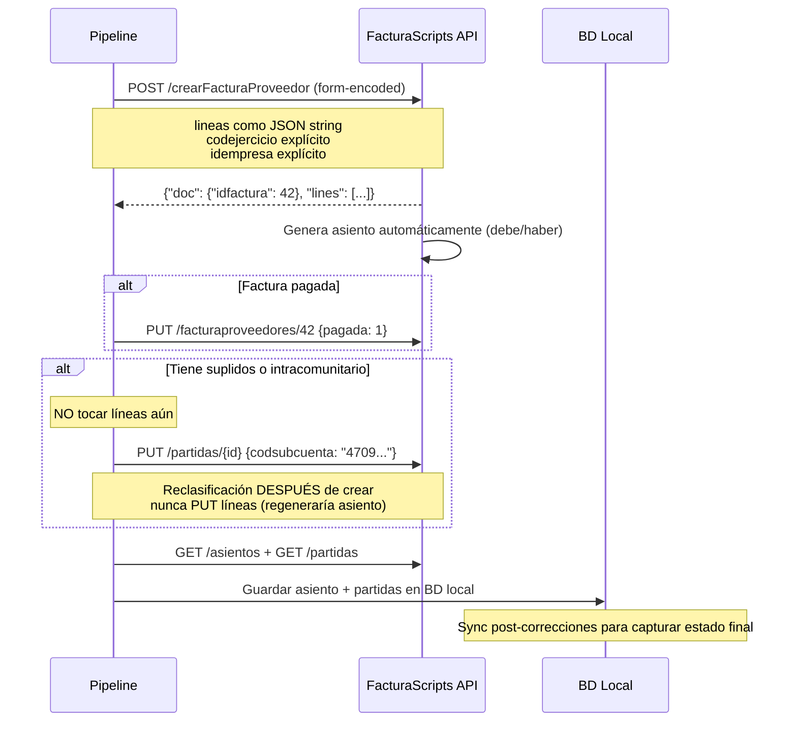

# FacturaScripts — API REST e Integracion

> **Estado:** COMPLETADO
> **Actualizado:** 2026-03-03
> **Fuentes principales:** `sfce/core/fs_api.py`, `CLAUDE.md` secciones API, `MEMORY.md`

---

## Conexion

**Instancia superadmin (compartida):**
```
Base URL: https://contabilidad.prometh-ai.es/api/3/
Header:   Token: iOXmrA1Bbn8RDWXLv91L
```

**Instancias independientes por gestoría (operativas desde sesión 48):**

| Instancia | URL | Token API | Gestoría | Empresas |
|-----------|-----|-----------|----------|----------|
| fs-uralde | https://fs-uralde.prometh-ai.es | `d0ed76fcc22785424b6c` | Uralde (id=1) | PASTORINO, GERARDO, CHIRINGUITO, ELENA |
| fs-gestoriaa | https://fs-gestoriaa.prometh-ai.es | `deaff29f162b66b7bbd2` | Gestoría A (id=2) | MARCOS, LAMAREA, AURORA, CATERING, DISTRIB |
| fs-javier | https://fs-javier.prometh-ai.es | `6f8307e8330dcb78022c` | Javier (id=3) | COMUNIDAD, FRANMORA, GASTRO, BERMUDEZ |

El token se lee de la variable de entorno `FS_API_TOKEN`. Si no existe, usa el valor de fallback en `sfce/core/fs_api.py`. Cargar con:

```bash
export $(grep -v '^#' .env | xargs)
```

El cliente HTTP unificado esta en `sfce/core/fs_api.py`. Funciones disponibles:

| Funcion | Descripcion |
|---------|-------------|
| `api_get(endpoint, params, limit=200)` | GET con paginacion automatica |
| `api_get_one(endpoint)` | GET un recurso por ID |
| `api_post(endpoint, data)` | POST form-encoded |
| `api_put(endpoint, data)` | PUT form-encoded |
| `api_delete(endpoint)` | DELETE |

---

## Tabla de endpoints disponibles

| Operacion | Endpoint | Metodo | Notas |
|-----------|----------|--------|-------|
| Listar facturas cliente | `/api/3/facturaclientes` | GET | Post-filtrar por idempresa en Python |
| Crear factura cliente | `/api/3/crearFacturaCliente` | POST | Form-encoded, retorna `{"doc":{...},"lines":[...]}` |
| Listar facturas proveedor | `/api/3/facturaproveedores` | GET | Post-filtrar por idempresa en Python |
| Crear factura proveedor | `/api/3/crearFacturaProveedor` | POST | Form-encoded; genera asientos automaticamente |
| Actualizar factura proveedor | `/api/3/facturaproveedores/{id}` | PUT | Incluye `pagada=1` para marcar pagada |
| Lineas factura proveedor | `/api/3/lineasfacturaproveedores` | GET/POST/PUT | PUT regenera el asiento — ver LECCIONES |
| Asientos | `/api/3/asientos` | GET/POST | POST retorna `{"ok":"...","data":{"idasiento":"X"}}` |
| Partidas | `/api/3/partidas` | GET/POST/PUT | PUT para reclasificar subcuentas |
| Clientes | `/api/3/clientes` | GET/POST/PUT | `codcliente` max 10 chars alfanumerico |
| Proveedores | `/api/3/proveedores` | GET/POST/PUT | No pasar `codsubcuenta` del config al crear |
| Contactos | `/api/3/contactos` | GET/PUT | Setear `codpais` aqui y en proveedores |
| Subcuentas | `/api/3/subcuentas` | GET/POST | Crear subcuentas 4000000xxx antes de asignar |
| Cuentas | `/api/3/cuentas` | GET | Consulta plan de cuentas |
| Empresas | `/api/3/empresas` | GET/POST | Crear nuevas empresas |
| Ejercicios | `/api/3/ejercicios` | GET/POST | Crear ejercicios por empresa |

**NO disponible via API**: modelos fiscales, conciliacion bancaria, informes.

---

## LECCIONES CRITICAS

Cada una de estas lecciones viene de errores reales que costaron horas. Leer antes de escribir cualquier script que use la API de FacturaScripts.

### 1. Form-encoded, NUNCA JSON

```python
# CORRECTO
requests.post(url, headers=headers, data=payload)

# INCORRECTO — retorna 422 o ignora los campos
requests.post(url, headers=headers, json=payload)
```

Aplica a todos los endpoints `crear*`, y tambien a POST de asientos y partidas.

### 2. Lineas de factura como JSON string dentro del form

```python
payload = {
    "codcliente": "ALUMNOS",
    "fecha": "2025-01-15",
    ...
}
# Las lineas van como string JSON, no como lista Python
payload["lineas"] = json.dumps([
    {
        "referencia": "PILATES",
        "descripcion": "Clase pilates enero",
        "cantidad": 1,
        "pvpunitario": 40.00,
        "codimpuesto": "IVA21"
    }
])
```

### 3. `codimpuesto` string, no campo `iva` numerico

```python
# CORRECTO
{"codimpuesto": "IVA21"}   # IVA0, IVA4, IVA10, IVA21
{"codimpuesto": "IVA0"}    # para suplidos, intracomunitarios, exentos

# INCORRECTO — campo ignorado
{"iva": 21}
```

### 4. Los filtros de la API NO funcionan — siempre post-filtrar en Python

Los parametros `idempresa`, `idasiento`, `codejercicio` en GET no filtran correctamente. La API devuelve todos los registros.

```python
# INCORRECTO — no filtra
registros = api_get("facturaproveedores", params={"idempresa": 5})

# CORRECTO
todos = api_get("facturaproveedores")
registros = [r for r in todos if r.get("idempresa") == 5]
```

### 5. Orden cronologico estricto en facturas cliente

`crearFacturaCliente` llama internamente a `testDate()` que valida que los numeros de factura esten en orden cronologico dentro del mismo `codejercicio` + `codserie`. Si se crea una factura con fecha anterior a otra ya existente con numero menor, retorna 422.

**Solucion**: pre-generar todas las fechas del ano, ordenarlas ASC, y crear las facturas en ese orden.

```python
# Ordenar por fecha antes de crear
facturas_ordenadas = sorted(facturas, key=lambda f: f["fecha"])
for fc in facturas_ordenadas:
    resultado = api_post("crearFacturaCliente", fc)
```

### 6. Siempre pasar `codejercicio` explicitamente

Sin `codejercicio` en el payload, FacturaScripts busca globalmente el ejercicio que encaje con la fecha. Si dos empresas tienen ejercicios solapados, la factura puede ir a la empresa equivocada.

```python
payload["codejercicio"] = config.codejercicio  # SIEMPRE
```

### 7. Asientos "invertidos" — causa real

Los asientos parecen invertidos (debe/haber intercambiados) cuando el proveedor tiene asignada en FS una subcuenta de gasto (6xx) en lugar de una de proveedores (4xx). No es un bug de FS — es un problema de configuracion.

**Solucion**: al crear proveedores via API, NO pasar `codsubcuenta`. FS auto-asigna la subcuenta 400xxxxxxxx correcta.

```python
# INCORRECTO — subcuenta del config.yaml es 6290000000 (gasto)
payload["codsubcuenta"] = config_proveedor["subcuenta"]

# CORRECTO — dejar que FS asigne la subcuenta 400x automaticamente
# (no incluir codsubcuenta en el payload)
```

### 8. `PUT lineasfacturaproveedores` regenera el asiento

Cuando se hace un PUT sobre las lineas de una factura de proveedor, FacturaScripts regenera el asiento contable desde cero, eliminando cualquier partida manual que se haya creado.

**Solucion**: hacer siempre las reclasificaciones de partidas DESPUES de cualquier modificacion de lineas.

### 9. `POST asientos` — siempre pasar `idempresa` explicitamente

FacturaScripts NO infiere la empresa a partir del `codejercicio` al crear asientos directamente. Sin `idempresa`, el asiento se asigna a la empresa 1 (empresa default).

```python
payload_asiento = {
    "concepto": "Pago nomina enero",
    "fecha": "2025-01-31",
    "codejercicio": config.codejercicio,
    "idempresa": config.idempresa,  # OBLIGATORIO
    "canal": "SFCE",
    ...
}
```

### 10. `POST asientos` — formato de respuesta

```python
respuesta = api_post("asientos", payload)
# {"ok": "Asiento creado", "data": {"idasiento": "123"}}
idasiento = respuesta["data"]["idasiento"]

# NO usar respuesta["idasiento"] — no existe
```

### 11. Nick de clientes/proveedores — maximo 10 caracteres alfanumericos

El campo `codcliente` / `codproveedor` tiene limite de 10 caracteres. Sin espacios ni acentos.

```python
# FALLA — 11 caracteres
{"codcliente": "GASTROCOSTA"}

# CORRECTO
{"codcliente": "GCOSTA"}
```

### 12. Subcuentas PGC que no existen en importacion estandar

Algunas subcuentas del PGC teorico no se importan con el plan estandar de FacturaScripts.

| Subcuenta teorica | Sustituir por | Descripcion |
|------------------|---------------|-------------|
| 4651000000 | 4650000000 | Remuneraciones pendientes de pago |
| 6811000000 | 6810000000 | Amortizacion inmovilizado material |

El error que aparece es: `"El campo idsubcuenta de la tabla partidas no puede ser nulo"`. Siempre verificar con un POST de prueba antes de usar una subcuenta en scripts masivos.

### 13. `personafisica` — usar entero 0/1, no string

```python
# CORRECTO
{"personafisica": 1}   # autonomo o persona fisica
{"personafisica": 0}   # sociedad

# INCORRECTO — interpretado como string, falla en validacion
{"personafisica": True}
{"personafisica": "true"}
```

### 14. `crearFactura*` sin codejercicio puede ir al ejercicio de otra empresa

Si hay dos empresas con ejercicios que cubren el mismo rango de fechas (ej: empresa 1 con ejercicio 2022 y empresa 4 con codejercicio "C422" ambos para el ano 2022), FacturaScripts asigna la factura al primer ejercicio que encuentra. SIEMPRE pasar `codejercicio` explicitamente.

### 15. `codejercicio` puede diferir del ano del ejercicio

| Empresa | Ano | codejercicio en FS |
|---------|-----|--------------------|
| Pastorino (1) | 2022-2024 | "2022", "2023", "2024" |
| Gerardo (2) | 2025 | "0002" |
| EMPRESA PRUEBA (3) | 2025 | "0003" |
| Chiringuito (4) | 2022-2025 | "C422", "C423", "C424", "0004" |
| Elena Navarro (5) | 2025 | "0005" |

Usar siempre `config.codejercicio` para API calls y `config.ejercicio` para rutas de archivos.

### 16. Al crear proveedor via API: NO pasar subcuenta del config

Ver leccion 7. La subcuenta del config.yaml es la cuenta de gasto (6xx). Al crear el proveedor en FS, no incluirla — FS auto-asigna una subcuenta de proveedores (4xx). Si se pasa la 6xx, los asientos saldran invertidos.

### 17. Paginacion — usar `limit=500`, no el default

El default de la API es `limit=50`. Para conjuntos grandes usar `limit=500` y paginacion con `offset`.

```python
# El cliente en fs_api.py ya gestiona esto automaticamente
registros = api_get("facturaproveedores")  # paginacion automatica con limit=200

# Para scripts ad-hoc directos:
params = {"limit": 500, "offset": 0}
while True:
    lote = requests.get(url, headers=headers, params=params).json()
    if not lote: break
    todos.extend(lote)
    if len(lote) < 500: break
    params["offset"] += 500
```

### 18. Marcar factura proveedor como pagada

Crear la factura primero, obtener su `idfactura`, luego hacer un PUT separado:

```python
resultado = api_post("crearFacturaProveedor", payload)
idfactura = resultado["doc"]["idfactura"]
# Marcar pagada DESPUES de crear
api_put(f"facturaproveedores/{idfactura}", {"pagada": 1})
```

### 19. Respuesta de `crear*`: estructura

```python
resultado = api_post("crearFacturaProveedor", payload)
# {"doc": {"idfactura": 42, "numero": "F-2025-042", ...}, "lines": [...]}
idfactura = resultado["doc"]["idfactura"]
```

---

## Plugins activos

Los 6 plugins estan activos en **todas las instancias** (incluidas fs-uralde, fs-gestoriaa, fs-javier). Se copiaron desde la instancia principal copiando `plugins.json` dentro del contenedor, seguido de `/deploy` para regenerar Dinamic.

| Plugin | Version | Funcionalidad |
|--------|---------|---------------|
| Modelo303 | 2.7 | Declaracion trimestral/anual IVA |
| Modelo111 | 2.2 | Retenciones IRPF rendimientos del trabajo y actividades |
| Modelo347 | 3.51 | Declaracion anual operaciones con terceros |
| Modelo130 | 3.71 | Pago fraccionado IRPF autonomos (estimacion directa) |
| Modelo115 | 1.6 | Retenciones arrendamientos de inmuebles |
| Verifactu | 0.84 | Facturacion electronica verificable AEAT |

**Metodo para copiar plugins a instancia nueva:**
```bash
# 1. Copiar plugins.json del contenedor principal
docker cp facturascripts_main:/var/www/html/MyFiles/plugins.json /tmp/plugins.json
docker cp /tmp/plugins.json fs-uralde:/var/www/html/MyFiles/plugins.json

# 2. Ajustar permisos
docker exec fs-uralde chown -R www-data:www-data /var/www/html/Plugins/

# 3. Regenerar Dinamic (core + plugins)
curl -s https://fs-uralde.prometh-ai.es/deploy
```

Estos modelos NO son accesibles via API REST. Se generan desde la interfaz web de FacturaScripts o con los scripts Python del SFCE (`scripts/generar_modelos_fiscales.py`).

---

## Instancias FS independientes — arquitectura completa

### Mapa de instancias (operativas desde sesion 48)

```
contabilidad.prometh-ai.es     → superadmin (carloscanetegomez, nivel 99, ve todo via SFCE)
fs-uralde.prometh-ai.es        → Uralde: PASTORINO(2), GERARDO(3), CHIRINGUITO(4), ELENA(5)
fs-gestoriaa.prometh-ai.es     → GestoriaA: MARCOS(2), LAMAREA(3), AURORA(4), CATERING(5), DISTRIB(6)
fs-javier.prometh-ai.es        → Javier: COMUNIDAD(2), FRANMORA(3), GASTRO(4), BERMUDEZ(5)
```

Los numeros entre parentesis son los `idempresa` dentro de cada instancia. La empresa `idempresa=1` en cada instancia es la empresa por defecto creada por el wizard (no usar).

### Docker — contenedores por instancia

| Instancia | Directorio servidor | Puerto app | Puerto BD |
|-----------|---------------------|------------|-----------|
| fs-uralde | `/opt/apps/fs-uralde/` | 8010 | interno MariaDB |
| fs-gestoriaa | `/opt/apps/fs-gestoriaa/` | 8011 | interno MariaDB |
| fs-javier | `/opt/apps/fs-javier/` | 8012 | interno MariaDB |

Credenciales BD (en `.env` de cada directorio):
- uralde: `FS_DB_PASS=fs_uralde_2026`
- gestoriaa: `FS_DB_PASS=fs_gestoriaa_2026`
- javier: `FS_DB_PASS=fs_javier_2026`

### Usuarios por instancia (password universal: `Uralde2026!`)

| Instancia | Usuario | Nivel | Rol |
|-----------|---------|-------|-----|
| uralde | carloscanete | 99 | superadmin |
| uralde | sergio | 10 | admin_gestoria |
| uralde | francisco, mgarcia, llupianez | 5 | asesor |
| gestoriaa | carloscanete | 99 | superadmin |
| gestoriaa | gestor1, gestor2 | 10 | admin_gestoria |
| javier | carloscanete | 99 | superadmin |
| javier | javier | 10 | admin_gestoria |

**CRITICO:** el nick `carloscanetegomez` se trunca a `carloscanete` (10 chars max) en las instancias FS. Usar `carloscanete` para login en fs-uralde/gestoriaa/javier.

### PGC importado — estado (sesion 49)

721 subcuentas del Plan General Contable espanol importadas en todos los ejercicios de las 3 instancias:

| Instancia | Ejercicios con PGC |
|-----------|-------------------|
| fs-uralde | 0002, 0003, 0004, 0005 (4 empresas) |
| fs-gestoriaa | 0002, 0003, 0004, 0005, 0006 (5 empresas) |
| fs-javier | 0002, 0003, 0004, 0005 (4 empresas) |

Metodo via HTTP (sin interfaz web, automatizable):
```python
# Login: obtener cookies fsNick + fsLogkey
resp = requests.post(
    "https://fs-uralde.prometh-ai.es/LoginController",
    data={"nick": "carloscanete", "password": "Uralde2026!"},
    allow_redirects=False
)
cookies = {"fsNick": resp.cookies["fsNick"], "fsLogkey": resp.cookies["fsLogkey"]}

# Importar PGC para un ejercicio
requests.post(
    "https://fs-uralde.prometh-ai.es/EditEjercicio",
    params={"code": "0002"},
    data={"action": "import-accounting", "multireqtoken": token_csrf},
    cookies=cookies
)
```

### Credenciales FS en SFCE PostgreSQL

Las URLs y tokens de cada instancia estan cifrados con Fernet en la tabla `gestorias`:
- `gestorias.fs_url` — URL base de la instancia
- `gestorias.fs_token_enc` — Token API cifrado Fernet

El helper `obtener_credenciales_gestoria(gestoria)` en `sfce/core/fs_api.py` descifra y devuelve `(url, token)`. Si la gestoria no tiene credenciales propias, usa el FS global del sistema.

---

## Crear empresa nueva en FacturaScripts — paso a paso

### 1. Crear la empresa

```bash
curl -X POST https://contabilidad.prometh-ai.es/api/3/empresas \
  -H "Token: iOXmrA1Bbn8RDWXLv91L" \
  -d "nombre=NUEVA EMPRESA S.L.&cifnif=B12345678&personafisica=0"
```

Guardar el `idempresa` devuelto.

### 2. Crear el ejercicio contable

```bash
# codejercicio: "000N" donde N es el idempresa (ej: "0006" para empresa 6)
curl -X POST https://contabilidad.prometh-ai.es/api/3/ejercicios \
  -H "Token: iOXmrA1Bbn8RDWXLv91L" \
  -d "idempresa=6&codejercicio=0006&nombre=2025&fechainicio=2025-01-01&fechafin=2025-12-31"
```

### 3. Importar el Plan General Contable

**Opcion A — Panel web:**
Navegar en FacturaScripts a:
`Contabilidad > Ejercicios > Editar ejercicio 0006 > Importar plan contable > Aceptar`

**Opcion B — HTTP automatizado** (ver seccion "PGC importado" mas arriba para el codigo Python completo).

Sin subir archivo — el boton importa el PGC general espanol por defecto:
- 802 cuentas (grupos 1-9)
- 721 subcuentas (nivel 10 digitos)

**Sin este paso el pipeline falla** al intentar crear partidas con subcuentas que no existen.

### 4. Actualizar config.yaml

```yaml
empresa:
  nombre: "NUEVA EMPRESA S.L."
  cif: "B12345678"
  tipo: sl
  idempresa: 6          # <-- valor real de FS
  ejercicio_activo: "2025"
  codejercicio: "0006"  # <-- valor real asignado
```

---

## Lecciones — Login FS via HTTP/PHP (sin interfaz web)

Descubiertas en sesion 49 al automatizar la importacion del PGC.

### 1. FS no usa PHP sessions — usa cookies propias

FacturaScripts autentica con dos cookies propias (no sesion PHP):
- `fsNick` — nombre de usuario
- `fsLogkey` — hash de autenticacion generado en login

```python
resp = requests.post(
    "https://fs-uralde.prometh-ai.es/LoginController",
    data={"nick": "carloscanete", "password": "Uralde2026!"},
    allow_redirects=False
)
cookies = {
    "fsNick": resp.cookies.get("fsNick"),
    "fsLogkey": resp.cookies.get("fsLogkey"),
}
```

Usar estas cookies en todas las peticiones web posteriores.

### 2. Nick de usuario truncado a 10 caracteres

El campo `nick` en FS tiene un maximo de 10 caracteres. El usuario `carloscanetegomez` se registra como `carloscanete` en las instancias nuevas. Siempre verificar el nick real en la BD si el login falla:

```bash
docker exec fs-uralde-db mysql -u root -p fs_uralde \
  -e "SELECT nick FROM fs_users LIMIT 10;"
```

### 3. Token CSRF `multireqtoken` — formula de generacion

Algunas acciones del panel web (como importar PGC) requieren el token CSRF `multireqtoken`. Se genera en PHP como:

```
sha1(PHP_VERSION + __FILE__ + db_name + db_pass + date('YmdH'))
```

Para obtenerlo sin parsearlo del HTML, ejecutar PHP dentro del contenedor:

```bash
docker exec fs-uralde php -r "
require_once '/var/www/html/vendor/autoload.php';
// leer configuracion de BD y calcular el token
"
```

O alternativamente, parsear el campo `multireqtoken` del HTML de la pagina de edicion del ejercicio.

### 4. Tablas FS — creacion bajo demanda (lazy)

FS crea las tablas de la BD solo cuando se accede a cada modelo por primera vez. Una instancia recien instalada puede tener tablas de configuracion pero no las contables.

Para forzar la creacion de todas las tablas contables relevantes, acceder a estas URLs (con cookies de sesion activas):
- `/ListCuenta` — tablas del plan de cuentas
- `/ListSubcuenta` — subcuentas
- `/ListFacturaProveedor` — facturas proveedor
- `/ListFacturaCliente` — facturas cliente

El endpoint `/Updater` es para actualizar la version de FS/plugins, NO para crear tablas.
El endpoint `/deploy` regenera el directorio `Dinamic/` desde Core + Plugins instalados.

### 5. Permisos tras copiar plugins manualmente

Si se copian archivos de plugins directamente al sistema de ficheros del contenedor, restaurar los permisos:

```bash
docker exec fs-uralde chown -R www-data:www-data /var/www/html/Plugins/
docker exec fs-uralde chown -R www-data:www-data /var/www/html/MyFiles/
```

Luego ejecutar `/deploy` para que FS registre los plugins y regenere el codigo dinamico.

---

## Diagrama — Flujo crear factura proveedor


