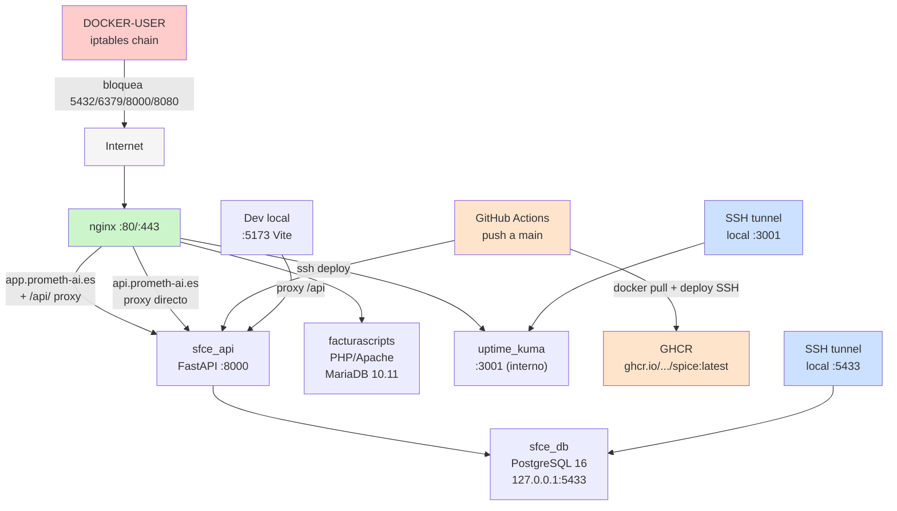

# 26 — Infraestructura Docker y Backups

> **Estado:** COMPLETADO
> **Actualizado:** 2026-03-02
> **Fuentes:** /opt/apps/sfce/, scripts/infra/, infra/nginx/, Dockerfile

---

## Contenedores Docker activos (SFCE)

Compose file: `/opt/apps/sfce/docker-compose.yml` (también en repo: `infra/sfce/docker-compose.yml`)

| Contenedor | Imagen | Puerto expuesto | Volumen principal | Descripcion |
|------------|--------|-----------------|-------------------|-------------|
| `sfce_api` | `ghcr.io/carlincarlichi78/spice:latest` | interno :8000 | `./docs/uploads`, `./reglas` | API FastAPI + workers OCR/pipeline. **PRODUCCIÓN** |
| `sfce_db` | postgres:16-alpine | `127.0.0.1:5433` | `./pg_data/` | BD principal SFCE. Solo accesible desde localhost |
| `uptime_kuma` | louislam/uptime-kuma:1 | `127.0.0.1:3001` | `./uptime_data/` | Monitoreo. Acceso via SSH tunnel |
| `facturascripts` | PHP/Apache custom | 443 (via nginx) | `/opt/apps/facturascripts/` | App contable PHP + MariaDB 10.11. NO TOCAR |
| `nginx` | nginx:alpine | 80, 443 | `/opt/infra/nginx/conf.d/` | Proxy inverso + SSL para todos los servicios |

**CRITICO — permisos `pg_data`:**
- `pg_data/` SIEMPRE debe ser `999:999` (usuario postgres del contenedor)
- NUNCA ejecutar `chown -R carli /opt/apps/sfce/` sin excluir `pg_data`
- Fix si se rompe: `chown -R 999:999 /opt/apps/sfce/pg_data && docker restart sfce_db`

**Uptime Kuma:**
- Credenciales: admin / admin123
- Acceso: `ssh -L 3001:127.0.0.1:3001 carli@65.108.60.69 -N` → http://localhost:3001
- Monitores activos: SFCE App (HTTP 200 app.prometh-ai.es) + SFCE API Health (keyword "ok")

## Diagrama de topologia



## Firewall

Script de configuracion: `scripts/infra/docker-user-firewall.sh`
Ejecutado como systemd service (`docker-user-firewall.service`) al arrancar, despues de Docker.

| Regla | Puerto | Accion | Comentario iptables |
|-------|--------|--------|---------------------|
| 0 (RETURN) | — | Permitir redes Docker internas `172.16.0.0/12` | `sfce-sec:docker-internal` |
| 1 | 5432 | DROP desde exterior | `sfce-sec:block-pg` (PostgreSQL) |
| 2 | 6379 | DROP desde exterior | `sfce-sec:block-redis` (Redis) |
| 3 | 8000 | DROP desde exterior | `sfce-sec:block-api` (API interna) |
| 4 | 8080 | DROP desde exterior | `sfce-sec:block-8080` (nginx interno) |

El script es **idempotente**: elimina las reglas con comentario `sfce-sec` antes de re-aplicar.

Ademas, ufw esta activo en el host con reglas basicas:
- SSH (22): permitido desde exterior
- HTTP (80) y HTTPS (443): permitidos desde exterior
- Todo lo demas: bloqueado por defecto

## nginx — configs prometh-ai.es

| Config en servidor | Repo local | Qué sirve |
|--------------------|------------|-----------|
| `/opt/infra/nginx/conf.d/app-prometh-ai.conf` | `infra/nginx/app-prometh-ai.conf` | React estático + proxy `/api/` → sfce_api:8000 |
| `/opt/infra/nginx/conf.d/api-prometh-ai.conf` | `infra/nginx/api-prometh-ai.conf` | Proxy directo sfce_api:8000, CORS = solo app.prometh-ai.es |
| `/opt/infra/nginx/conf.d/prometh-ai.conf` | — | Landing prometh-ai.es → /opt/apps/spice-landing/ |

**CRITICO al copiar configs con scp**: verificar que el nombre de destino NO tenga `.tmp`. nginx ignora archivos `.tmp`.

## SSL / HTTPS

- Certbot instalado en el **host** (NO dentro de Docker)
- Certificados Let's Encrypt para todos los dominios activos
- Los certs se montan en el contenedor nginx como volumen desde `/etc/letsencrypt/`
- Expiracion: **2026-05-31** (app/api.prometh-ai.es obtenidos 2026-03-02)

```bash
# Verificar certificados activos
certbot certificates

# Renovar (ejecutar en host, no dentro de Docker)
certbot renew

# Renovacion automatica recomendada via cron
# 0 3 1 * * root certbot renew --quiet
```

Configuracion TLS en nginx (del template `uptime-kuma.conf`):
- TLS 1.2 y 1.3 unicamente
- `ssl_prefer_server_ciphers off` (deja al cliente elegir)
- Session cache compartido 10m

## Sistema de Backups

### Scripts

| Script | Ubicacion | Descripcion |
|--------|-----------|-------------|
| `backup_total.sh` | `/opt/apps/sfce/backup_total.sh` (servidor) | Backup nocturno completo: 6 PG + 2 MariaDB + configs + SSL + Vaultwarden |
| `backup.sh` | `scripts/infra/backup.sh` (local) | Backup SFCE individual: solo `sfce_prod` via Restic |

### Que cubre el backup total

| Que | Herramienta | Destino |
|-----|-------------|---------|
| 6 bases de datos PostgreSQL | `pg_dump` + `docker exec` | Restic → Hetzner S3 |
| 2 bases de datos MariaDB (FacturaScripts + otras) | `mysqldump` + `docker exec` | Restic → Hetzner S3 |
| Configs del sistema (`/opt/apps/`, `/opt/infra/`) | `tar` | Restic → Hetzner S3 |
| Certificados SSL (`/etc/letsencrypt/`) | `tar` | Restic → Hetzner S3 |
| Vaultwarden (gestor de contrasenas) | `sqlite3` o volumen | Restic → Hetzner S3 |

### Como funciona el script local (`scripts/infra/backup.sh`)

1. Carga `.env` desde `/opt/apps/sfce/.env`
2. `docker exec sfce_db pg_dump -U sfce_user -d sfce_prod --format=custom --compress=9`
3. Guarda dump en directorio temporal `/tmp/sfce-backup-$$`
4. `restic backup` cifra y sube al repositorio S3 configurado
5. `restic forget` aplica politica de retencion
6. Los domingos: `restic check` verifica integridad del repositorio
7. Limpieza automatica del directorio temporal via `trap cleanup EXIT`

Variables de entorno requeridas en el servidor:
```
SFCE_DB_PASSWORD=...
RESTIC_REPOSITORY=s3:https://hel1.your-objectstorage.com/sfce-backups
AWS_ACCESS_KEY_ID=...
AWS_SECRET_ACCESS_KEY=...
RESTIC_PASSWORD=...
```

Inicializacion del repositorio (solo una vez):
```bash
/opt/apps/sfce/backup.sh --init
```

### Destino

- Proveedor: Hetzner Object Storage Helsinki
- Bucket: `sfce-backups` en `hel1.your-objectstorage.com`
- Cifrado: Restic (AES-256 con clave en `RESTIC_PASSWORD`)
- Credenciales: ACCESOS.md seccion 22

### Politica de retencion

| Frecuencia | Retencion |
|------------|-----------|
| Diario | 7 dias |
| Semanal | 4 semanas |
| Mensual | 12 meses |

Cron en servidor: `0 2 * * * root /opt/apps/sfce/backup_total.sh >> /var/log/sfce-backup.log 2>&1`

## Comandos de gestion Docker mas usados

| Operacion | Comando |
|-----------|---------|
| Ver estado de todos los contenedores | `docker ps -a` |
| Ver logs de un contenedor | `docker logs -f <contenedor> --tail 50` |
| Reiniciar contenedor | `docker restart <contenedor>` |
| Reload nginx (sin downtime) | `docker exec nginx nginx -s reload` |
| Conectar a PostgreSQL SFCE | `docker exec -it sfce_db psql -U sfce_user -d sfce_prod` |
| Ver redes Docker | `docker network ls` |
| Ver volumenes Docker | `docker volume ls` |
| Aplicar reglas firewall Docker | `bash /opt/apps/sfce/docker-user-firewall.sh` |
| Ver logs de backup | `tail -50 /var/log/sfce-backup.log` |
| Listar snapshots Restic | `restic snapshots --tag sfce_prod` |
| Verificar integridad backup | `restic check` |

## Notas operativas

- **NO TOCAR** el contenedor `facturascripts` (PHP/Apache + MariaDB). Gestionado de forma independiente.
- Al reiniciar el servidor, ejecutar `docker-user-firewall.sh` manualmente si el service no arranca automaticamente.
- El contenedor `nginx` incluye los certificados SSL montados desde el host. Si se renuevan los certs con certbot, hacer reload: `docker exec nginx nginx -s reload`.
- Uptime Kuma monitorea todos los servicios. Acceso local: `ssh -L 3001:127.0.0.1:3001 carli@65.108.60.69 -N` y luego http://localhost:3001.
