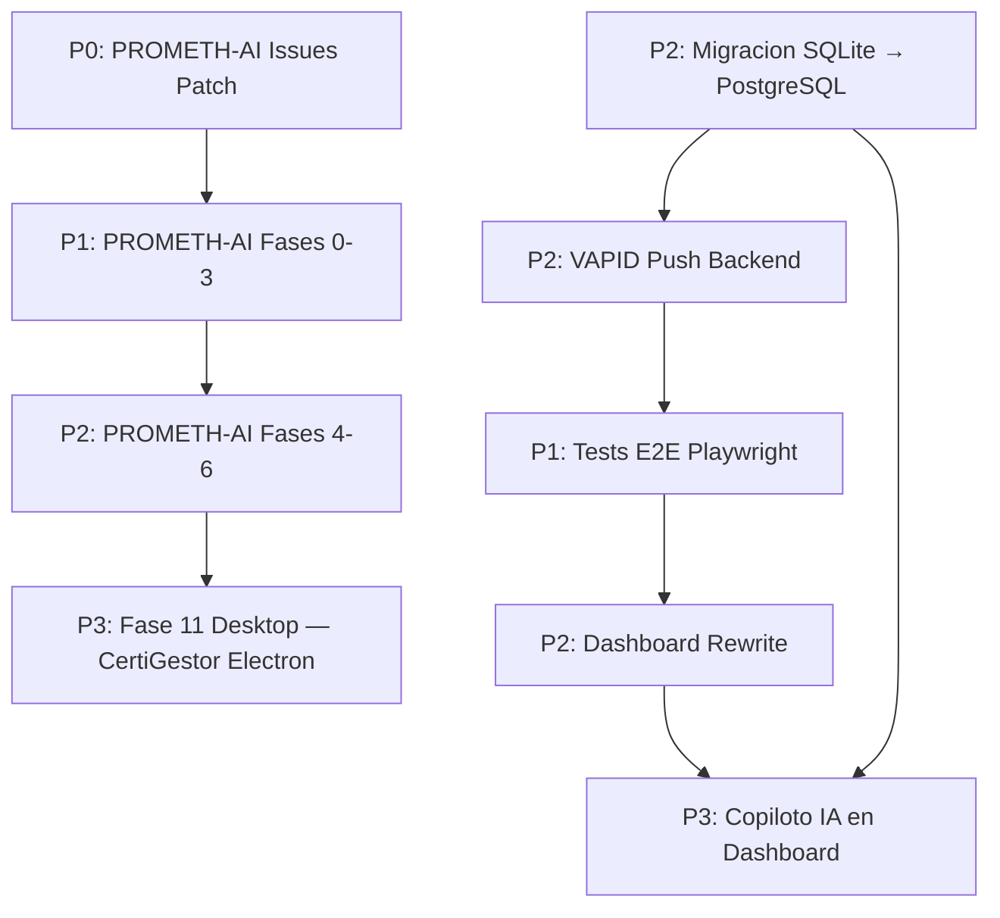

# Roadmap y Estado del Sistema

> **Estado:** COMPLETADO
> **Actualizado:** 2026-03-01
> **Fuentes principales:** `CLAUDE.md` seccion "Proximos pasos", `git log --oneline -20`, `docs/plans/`

---

## Estado del sistema a 2026-03-01

### Metricas del nucleo SFCE

| Metrica | Valor |
|---------|-------|
| Tests passing | ~1.793 |
| Tablas en BD | ~39 tablas |
| Endpoints API documentados | 66+ rutas activas |
| Modulos del dashboard | 21 modulos |
| Modelos fiscales implementados | 28 modelos |
| Familias de documentos (generador) | 43 familias |
| Documentos sinteticos generables | 2.343 docs |
| Clientes reales activos | 5 clientes |
| Plugins FacturaScripts activos | 4 (303, 111, 347, 130) |

### Commits recientes (git log --oneline -20)

```
8379c00 docs: libro 16-calendario-fiscal
31745e1 docs: libro 15-modelos-fiscales
ab9ec5b docs: libro 14-copiloto-ia
a939415 docs: plan implementacion motor de escenarios de campo SFCE
507d071 docs: libro 17-base-de-datos
fe42e91 feat: Home Centro de Operaciones — BarraEstadoGlobal + EmpresaCard
b9eece7 docs: libro 11-api-endpoints
9871240 docs: libro 13-dashboard-modulos
f02a587 docs: libro 12-websockets
3b13fe9 docs: libro 10-cuarentena
7af3199 docs: libro 09-motor-testeo
5ba12cb docs: libro 07-sistema-reglas-yaml
fbd3bda feat: OmniSearch Command Palette — busqueda global
7280b75 docs: libro 08-aprendizaje-scoring
7c3a0f2 docs: libro 06-motor-reglas
d557a52 docs: libro 05-ocr-ia-tiers
5bd326a docs: CLAUDE.md — Fases 4-6 Tasks 7-12 completados, 1934 tests
3b43fd3 docs: fix header 04-gate0-cola
bad73ed feat: electron-builder config Win/Mac/Linux
95f416d docs: libro 03-pipeline-fases
```

---

## Pendientes por prioridad

### P0 — Bloqueante (hacer ahora)

#### PROMETH-AI Issues Patch
**Plan**: `docs/plans/2026-03-01-prometh-ai-issues-patch.md`

7 issues criticos pendientes en la web PROMETH-AI. Detalles en el plan. Hasta resolver estos issues la landing no es apta para produccion.

---

### P1 — Proximo sprint

#### PROMETH-AI Fases 0-3
**Plan**: `docs/plans/2026-03-01-prometh-ai-fases-0-3.md`

21 tasks distribuidas en:
- Seguridad P0 (Task 1-6): headers CSP, rate limiting, sanitizacion inputs
- Onboarding empresas (Task 7-9): formulario alta, validacion CIF AEAT, confirmacion email
- Correo transaccional (Task 10-12): integracion CAP-Web desde `C:/Users/carli/PROYECTOS/CAP-WEB/`
- Gate 0 extendido (Task 13): webhook CertiGestor, HMAC, notificaciones AAPP

#### Tests E2E dashboard (Playwright)
**Estado**: 0 tests E2E escritos actualmente.

El dashboard tiene 21 modulos funcionales pero ninguno tiene cobertura E2E. Los flujos criticos que necesitan tests:
- Login → seleccion empresa → pipeline
- Subida extracto bancario → conciliacion
- Generacion modelo fiscal → descarga PDF
- Portal cliente → descarga RGPD

---

### P2 — Medio plazo

#### PROMETH-AI Fases 4-6 + Fase 11 Desktop
**Plan**: `docs/plans/2026-03-01-prometh-ai-fases-4-6.md`

12 tasks:
- Fase 4: Panel de gestion (empresas onboarding, documentos, estado pipeline)
- Fase 5: Facturacion y suscripciones (Stripe, planes, trial 30 dias)
- Fase 6: Analytics y reporting (metricas de uso, alertas fiscales)
- Fase 11 Desktop: integracion CertiGestor desde `C:/Users/carli/PROYECTOS/proyecto findiur/` — Electron + modulo nativo, autoarranque, bandeja sistema

#### Migracion SQLite → PostgreSQL en produccion
**Script**: `scripts/migrar_sqlite_a_postgres.py` (existe, no ejecutado)

El servidor ya tiene PostgreSQL 16 en Docker (`127.0.0.1:5433`, BD `sfce_prod`). La migracion es necesaria para:
- Soporte de concurrencia con multiples usuarios simultaneos
- Rendimiento en consultas sobre tablas grandes (asientos, partidas)
- Transacciones robustas para operaciones criticas

#### VAPID Push Notifications
**Estado**: Frontend implementado (suscripcion Web Push con VAPID). Falta el backend.

Tareas:
1. Generar par de claves VAPID y agregar `VITE_VAPID_PUBLIC_KEY` al `.env`
2. Implementar endpoint `POST /api/notificaciones/suscribir` en FastAPI
3. Implementar `POST /api/notificaciones/enviar` (disparado por eventos del pipeline)

#### Merge feat/frontend-pwa a main (PR pendiente)
La rama `feat/frontend-pwa` contiene el trabajo de PWA, seguridad, portal cliente y notificaciones. Hay un PR pendiente de merge.

---

### P3 — Largo plazo

#### Dashboard Rewrite — Plataforma de Inteligencia Contable
**Design doc**: `docs/plans/2026-03-01-dashboard-redesign-total-design.md`
**Plan implementacion**: `docs/plans/2026-03-01-dashboard-redesign-total-implementation.md`

Objetivo: transformar el dashboard de herramienta funcional a plataforma premium.

Alcance:
- 38 paginas rediseñadas con zero empty states
- Home Centro de Operaciones: portfolio de clientes con HealthRing, sparklines, KPIs en tiempo real
- OmniSearch real (Command Palette) con busqueda global
- Paleta amber unificada (eliminar colores aleatorios de charts)
- Copiloto IA integrado (sugerencias proactivas, anomalias, alertas fiscales)
- Dark mode completo (bugs actuales: fondo blanco en cards, charts desconectados de paleta)

#### Motor de Escenarios de Campo
**Design doc**: `docs/plans/2026-03-01-motor-campo-design.md`
**Plan**: `docs/plans/2026-03-01-motor-campo-plan.md`

Motor autonomo que testea todos los procesos SFCE con miles de variaciones parametricas. Sin coste de APIs IA (bypass OCR mediante inyeccion JSON directa). Empresa id=3 como sandbox. Detecta errores, intenta fix automatico, registra bugs en SQLite `motor_campo.db`.

---

## Deuda tecnica activa

| Item | Impacto | Accion requerida |
|------|---------|-----------------|
| `sfce.db` no en `.gitignore` | Bajo — BD de desarrollo se colo en commits | Agregar a `.gitignore` |
| `tmp/` no en `.gitignore` | Bajo — archivos temporales del pipeline | Agregar a `.gitignore` |
| `.coverage` no en `.gitignore` | Bajo — artefacto de pytest-cov | Agregar a `.gitignore` |
| 0 tests E2E dashboard (Playwright) | Alto — flujos criticos sin cobertura automatizada | Sprint P1 |
| `migrar_sqlite_a_postgres.py` no ejecutado | Medio — produccion sigue en SQLite | Sprint P2 |
| VAPID endpoint backend faltante | Medio — notificaciones push no funcionan en produccion | Sprint P2 |

---

## Dependencias entre tareas



### Dependencias criticas

| Tarea | Bloquea a |
|-------|-----------|
| PROMETH-AI Issues Patch (P0) | Todas las fases PROMETH-AI siguientes |
| Migracion SQLite → PostgreSQL | Dashboard Rewrite en produccion, Copiloto IA |
| Tests E2E Playwright (P1) | Dashboard Rewrite validable en CI |
| VAPID endpoint backend | Notificaciones push en portal cliente |

### Sin dependencias (pueden arrancar en paralelo)

- Tests E2E Playwright — independiente de PROMETH-AI
- Gitignore cleanup (`sfce.db`, `tmp/`, `.coverage`) — tarea trivial, independiente de todo
- VAPID endpoint backend — independiente de PROMETH-AI

---

## Proximos pasos inmediatos recomendados

1. **Ahora mismo**: `git rm --cached sfce.db tmp/ .coverage` + commit para limpiar `.gitignore`
2. **Esta semana**: PROMETH-AI Issues Patch (desbloquea el resto de la landing)
3. **Proximo sprint**: Tests E2E Playwright para los 3 flujos criticos del dashboard
4. **Mes siguiente**: Migracion SQLite → PostgreSQL (prerrequisito para escalar a mas clientes)
