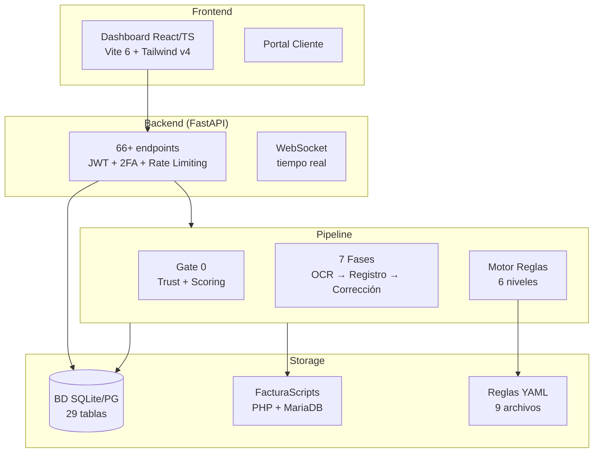

# Libro de Instrucciones Total — Implementation Plan

> **For Claude:** REQUIRED SUB-SKILL: Use superpowers:executing-plans to implement this plan task-by-task.

**Goal:** Crear 28 archivos de documentación técnica exhaustiva en `docs/LIBRO/_temas/` más 3 índices por versión (personal, producto, colaboradores), con diagramas Mermaid, tablas de referencia y secciones de bugs/limitaciones donde aplique.

**Architecture:** Enfoque A — Fuente Única, Vistas Múltiples. Todo el contenido real vive en `_temas/`. Los tres `LIBRO-*.md` son índices que referencian esos archivos. Sin duplicación de contenido.

**Design doc:** `docs/plans/2026-03-01-libro-instrucciones-design.md`

**Tech Stack:** Markdown con Mermaid, sin dependencias externas.

---

## Convenciones para TODOS los archivos `_temas/`

Cada archivo empieza con este header:

```markdown
# [Título]

> **Estado:** ✅ COMPLETADO / 🔄 PARCIAL / 📋 PENDIENTE
> **Actualizado:** 2026-03-01
> **Fuentes principales:** `ruta/archivo1.py`, `ruta/archivo2.py`

---
```

Y termina con (cuando aplique):

```markdown
---

## Bugs conocidos / Limitaciones

- ...
```

Longitud objetivo: 200-600 líneas por archivo.

---

### Task 1: Setup de estructura de directorios

**Files:**
- Crear directorio: `docs/LIBRO/_temas/`
- Crear: `docs/LIBRO/_temas/.gitkeep`

**Step 1: Crear la estructura**

```bash
mkdir -p docs/LIBRO/_temas
touch docs/LIBRO/_temas/.gitkeep
```

**Step 2: Verificar**

```bash
ls docs/LIBRO/_temas/
```
Esperado: `.gitkeep`

**Step 3: Commit**

```bash
git add docs/LIBRO/
git commit -m "chore: estructura directorio docs/LIBRO"
```

---

### Task 2: Infraestructura y Docker/Backups (archivos 01 + 26)

**Files:**
- Leer antes: `CLAUDE.md` (sección Infraestructura), `infra/nginx/`, `scripts/infra/backup.sh`
- Crear: `docs/LIBRO/_temas/01-infraestructura.md`
- Crear: `docs/LIBRO/_temas/26-infra-docker-backups.md`

**Contenido de `01-infraestructura.md`:**

```markdown
# 01 — Infraestructura

> **Estado:** ✅ COMPLETADO
> **Actualizado:** 2026-03-01
> **Fuentes:** CLAUDE.md, /opt/infra/nginx/conf.d/, scripts/infra/

---

## Servidor

| Campo | Valor |
|-------|-------|
| Proveedor | Hetzner |
| IP | 65.108.60.69 |
| Acceso | `ssh carli@65.108.60.69` (clave RSA) |
| OS | Ubuntu LTS |

## Variables de entorno requeridas

| Variable | Servicio | Descripción |
|----------|----------|-------------|
| FS_API_TOKEN | FacturaScripts | Token REST API |
| MISTRAL_API_KEY | Mistral OCR3 | OCR primario |
| OPENAI_API_KEY | GPT-4o | OCR fallback |
| GEMINI_API_KEY | Gemini Flash | Triple consenso |
| SFCE_JWT_SECRET | Auth | ≥32 chars, OBLIGATORIO |
| SFCE_CORS_ORIGINS | API | Origins permitidos, nunca "*" |
| SFCE_DB_TYPE | BD | "sqlite" (dev) o "postgresql" (prod) |

Cargar: `export $(grep -v '^#' .env | xargs)`

## Arranque local (desarrollo)

```bash
# Backend
cd sfce && uvicorn sfce.api.app:crear_app --factory --reload --port 8000

# Frontend
cd dashboard && npm run dev
```

O usar `iniciar_dashboard.bat` en raíz (Windows).

## Puertos

| Puerto | Servicio | Acceso |
|--------|----------|--------|
| 8000 | API FastAPI | localhost (dev) |
| 5173 | Vite dev server | localhost (dev) |
| 5433 | PostgreSQL 16 | 127.0.0.1 (solo servidor) |
| 3001 | Uptime Kuma | SSH tunnel: `ssh -L 3001:127.0.0.1:3001 carli@65.108.60.69 -N` |
| 80/443 | Nginx | público |

## Nginx

Configuraciones en `/opt/infra/nginx/conf.d/`.
Reload: `docker exec nginx nginx -s reload`

Headers de seguridad activos en todos los vhosts:
- `server_tokens off`
- `Strict-Transport-Security` (HSTS)
- `X-Frame-Options: SAMEORIGIN`
- `X-Content-Type-Options: nosniff`
- `Referrer-Policy: strict-origin-when-cross-origin`

## Credenciales

Ver `PROYECTOS/ACCESOS.md`, secciones 19 (FacturaScripts), 22 (backups S3).

```

**Contenido de `26-infra-docker-backups.md`:**

Incluye:
- Tabla de todos los contenedores Docker (nombre, imagen, puerto, volumen)
- Diagrama Mermaid de topología de contenedores
- Política de backups: qué cubre, destino S3, retención 7d/4w/12m
- Script: `/opt/apps/sfce/backup_total.sh`, cron 02:00 diario
- Comandos de gestión Docker más usados
- SSL: certbot host (no docker), expiración, renovación

**Step 1: Leer fuentes**

```bash
cat scripts/infra/backup.sh 2>/dev/null | head -80
ls infra/nginx/
```

**Step 2: Crear ambos archivos** con el contenido descrito arriba.

**Step 3: Verificar longitud**

```bash
wc -l docs/LIBRO/_temas/01-infraestructura.md docs/LIBRO/_temas/26-infra-docker-backups.md
```
Esperado: cada uno entre 80-200 líneas.

**Step 4: Commit**

```bash
git add docs/LIBRO/_temas/01-infraestructura.md docs/LIBRO/_temas/26-infra-docker-backups.md
git commit -m "docs: libro 01-infraestructura + 26-docker-backups"
```

---

### Task 3: Arquitectura General SFCE (archivo 02)

**Files:**
- Leer antes: `sfce/__init__.py`, `sfce/api/app.py` (primeras 80 líneas), `sfce/core/backend.py` (estructura)
- Crear: `docs/LIBRO/_temas/02-sfce-arquitectura.md`

**Contenido requerido:**

1. **Qué es SFCE**: descripción del producto, posición como SaaS para gestorías
2. **Diagrama Mermaid C4 nivel 2**: componentes principales (Pipeline, API FastAPI, Dashboard React, BD SQLite/PG, FacturaScripts) y sus conexiones
3. **Multi-tenant**: Gestoría → Empresas → Documentos (diagrama de jerarquía)
4. **Dual Backend**: FS + BD local simultáneo. Cuándo se usa `solo_local=True`. Sincronización post-corrección.
5. **Tabla de módulos** con estado (COMPLETADO/PARCIAL/PENDIENTE):

| Módulo | Estado | Tests |
|--------|--------|-------|
| Pipeline 7 fases | ✅ | ~200 |
| Motor OCR tiers | ✅ | 21 |
| Motor Reglas | ✅ | - |
| Modelos Fiscales (28) | ✅ | 544 |
| Dashboard (20 módulos) | ✅ | - |
| ... | ... | ... |

6. Stack tecnológico completo (backend Python + frontend React + infra)

**Step 1: Leer fuentes indicadas**

**Step 2: Crear archivo** con diagrama Mermaid:



**Step 3: Verificar**

```bash
wc -l docs/LIBRO/_temas/02-sfce-arquitectura.md
```
Esperado: 150-300 líneas.

**Step 4: Commit**

```bash
git add docs/LIBRO/_temas/02-sfce-arquitectura.md
git commit -m "docs: libro 02-sfce-arquitectura"
```

---

### Task 4: Pipeline — Las 7 Fases (archivo 03)

**Files:**
- Leer antes: `sfce/phases/intake.py` (primeras 50 líneas y funciones principales), `sfce/phases/correction.py` (funciones), `sfce/phases/registration.py` (funciones), `sfce/phases/pre_validation.py`, `sfce/core/asientos_directos.py`
- Leer también: `scripts/pipeline.py` (estructura general)
- Crear: `docs/LIBRO/_temas/03-pipeline-fases.md`

**Contenido requerido:**

1. **Tabla de fases** completa (fase, módulo, función entrada, inputs, outputs, condición de error)
2. **Tipos de documento** y su ruta por el pipeline: FC/FV/NC siguen OCR completo; BAN/NOM/RLC/IMP van directo a asientos
3. **Flags del pipeline**: `--dry-run`, `--resume`, `--fase N`, `--force`, `--no-interactivo`, `--inbox DIR`
4. **Estado pipeline**: `pipeline_state.json`, qué guarda, cómo se corrompe y cómo recuperar
5. **Detalle de cada fase**:
   - Fase 1 Intake: `_procesar_un_pdf()`, extracción texto, clasificación tipo, identificación entidad
   - Fase 2 Pre-Validation: los 14 checks con descripción y si son bloqueantes
   - Fase 3 OCR Consensus: función de votación entre motores
   - Fase 4 Registration: `_asegurar_entidades_fs()`, `_construir_form_data()`, loop aprendizaje
   - Fase 5 Correction: 9 handlers (`_check_cuadre`, `_check_divisas`, `_check_nota_credito`, `_check_intracomunitaria`, `_check_reglas_especiales`, `_check_subcuenta`, `_check_importe`, `_check_subcuenta_lado`, `_check_iva_por_linea`)
   - Fase 6 Cross-Validation: qué valida
   - Fase 7 Output: informe final, qué genera
6. **Orden crítico de correcciones** (si se altera, FS regenera asientos y deshace cambios)
7. **Diagrama Mermaid**: flowchart completo 7 fases con condiciones cuarentena/error
8. **Diagrama Mermaid**: árbol de decisión por tipo de documento

**Step 1: Leer archivos de fases** con `grep -n "^def\|^class" sfce/phases/*.py`

**Step 2: Crear archivo** (objetivo: 400-600 líneas)

**Step 3: Commit**

```bash
git add docs/LIBRO/_temas/03-pipeline-fases.md
git commit -m "docs: libro 03-pipeline-fases"
```

---

### Task 5: Gate 0 y Cola de Procesamiento (archivo 04)

**Files:**
- Leer antes: `sfce/core/gate0.py`, `sfce/api/rutas/gate0.py`, `sfce/db/modelos.py` (clases `ColaProcesamiento`, `DocumentoTracking`, `SupplierRule`)
- Crear: `docs/LIBRO/_temas/04-gate0-cola.md`

**Contenido requerido:**

1. **Trust Levels**: ALTA (gestoría), MEDIA (cliente con historial), BAJA (desconocido). Cómo se calcula `calcular_trust_level(fuente, rol)`
2. **Preflight**: validación SHA256 duplicados, estructura `ResultadoPreflight`
3. **Scoring**: función `calcular_score()`, factores, rangos, tabla de umbrales
4. **Decisiones**: enum `Decision` (PROCESAR/REVISION/RECHAZAR), función `decidir_destino(score, trust)`
5. **Tabla `cola_procesamiento`**: campos, estados (`PENDIENTE/PROCESANDO/COMPLETADO/ERROR`), `trust_level`, `score_final`, `hints_json`
6. **Tabla `documento_tracking`**: traza de estados con timestamps y actor
7. **`SupplierRule`** (nueva tabla):
   - Campos: `emisor_cif`, `emisor_nombre_patron`, `tipo_doc_sugerido`, `subcuenta_gasto`, `codimpuesto`, `regimen`
   - Métricas: `aplicaciones`, `confirmaciones`, `tasa_acierto`, `auto_aplicable`
   - Nivel: `empresa` (solo para esa empresa) o `global`
   - Cómo se aprende: confirmaciones del usuario en UI → actualiza regla
8. **API**: `POST /api/gate0/ingestar`, cómo consultar cola, cómo aprobar/rechazar manualmente
9. **Diagrama Mermaid**: flujo Gate 0 completo

**Step 1: Leer `sfce/core/gate0.py` completo**

**Step 2: Crear archivo** (objetivo: 250-400 líneas)

**Step 3: Commit**

```bash
git add docs/LIBRO/_temas/04-gate0-cola.md
git commit -m "docs: libro 04-gate0-cola"
```

---

### Task 6: OCR e IA — Tiers (archivo 05)

**Files:**
- Leer antes: `sfce/core/ocr_mistral.py`, `sfce/core/ocr_gemini.py`, `sfce/core/cache_ocr.py`, `sfce/phases/ocr_consensus.py`, funciones `_votacion_tres_motores` y `_evaluar_tier_0` en `sfce/phases/intake.py`
- Crear: `docs/LIBRO/_temas/05-ocr-ia-tiers.md`

**Contenido requerido:**

1. **Tabla de motores OCR**:

| Motor | API | Tier | Coste | Límites |
|-------|-----|------|-------|---------|
| Mistral OCR3 | `MISTRAL_API_KEY` | T0 | bajo | - |
| GPT-4o | `OPENAI_API_KEY` | T1 | medio | 30K TPM |
| Gemini Flash | `GEMINI_API_KEY` | T2 | bajo | 5 req/min, 20 req/día |

2. **Condiciones de escalada**:
   - T0 solo: confianza ≥ umbral Y tipo documento estándar
   - T1 (+ GPT): confianza T0 < umbral O campos críticos nulos
   - T2 (triple): T1 con discrepancia importante O documento de alto valor
3. **Función `_votacion_tres_motores()`**: cómo decide el ganador, manejo de empates
4. **Función `_evaluar_tier_0()`**: qué evalúa, qué devuelve
5. **Cache OCR** (`sfce/core/cache_ocr.py`):
   - Archivo `.ocr.json` junto a cada PDF
   - Clave: SHA256 del PDF
   - Invalidación: automática si el PDF cambia
   - Coste hit de caché: 0 llamadas API
6. **Workers paralelos**: 5 por defecto, saturación GPT con batches grandes
7. **Datos extraídos**: estructura del dict OCR (campos que extrae cada motor)
8. **Diagrama Mermaid**: escalada T0 → T1 → T2 con condiciones

**Step 1: Leer fuentes** (usar `head -100` para archivos grandes)

**Step 2: Crear archivo** (objetivo: 200-350 líneas)

**Step 3: Commit**

```bash
git add docs/LIBRO/_temas/05-ocr-ia-tiers.md
git commit -m "docs: libro 05-ocr-ia-tiers"
```

---

### Task 7: Motor de Reglas Contables (archivo 06)

**Files:**
- Leer antes: `sfce/core/motor_reglas.py`, `sfce/core/decision.py`, `sfce/core/perfil_fiscal.py`, `sfce/core/clasificador.py`, `sfce/normativa/vigente.py`, `sfce/core/reglas_pgc.py`
- Crear: `docs/LIBRO/_temas/06-motor-reglas.md`

**Contenido requerido:**

1. **Jerarquía de 6 niveles** con tabla completa (nivel, nombre, fuente, archivo, descripción)
2. **`PerfilFiscal`**: qué representa, formas jurídicas cubiertas (autónomo, SL, SA, CB, SC, coop, asociación, comunidad, fundación, SLP, SLU), regímenes IVA (general, simplificado, recargo equivalencia, módulos, intracomunitario), territorios (península, Canarias, Ceuta/Melilla)
3. **`Clasificador`**: inputs (datos OCR + tipo doc + config), outputs (`ResultadoClasificacion` con subcuenta base + tipo + confianza)
4. **`DecisionContable`**: estructura `Partida` resultante, cómo se construyen las partidas desde la decisión
5. **`MotorReglas`**: cómo orquesta los 6 niveles, qué es `decision_log` y qué contiene
6. **Ejemplos de override** por nivel (ej: normativa IVA0 Canarias sobreescribe PGC general)
7. **`sfce/normativa/vigente.py`**: qué es la normativa versionada, cómo se añade un año nuevo
8. **Diagrama Mermaid**: jerarquía 6 niveles con ejemplos de resolución

**Step 1: Leer motores completos** con `grep -n "class\|def" sfce/core/motor_reglas.py sfce/core/decision.py sfce/core/perfil_fiscal.py`

**Step 2: Crear archivo** (objetivo: 300-500 líneas)

**Step 3: Commit**

```bash
git add docs/LIBRO/_temas/06-motor-reglas.md
git commit -m "docs: libro 06-motor-reglas"
```

---

### Task 8: Sistema de Reglas YAML (archivo 07)

**Files:**
- Leer antes: todos los YAMLs en `reglas/` + `sfce/reglas/` (cabecera de cada uno)
- Crear: `docs/LIBRO/_temas/07-sistema-reglas-yaml.md`

**Contenido requerido:**

1. **Tabla de los 9 archivos YAML** con: ruta, propósito, quién lo lee, si se auto-modifica
2. **Estructura de cada YAML**: primeras 20 líneas del archivo como ejemplo de formato
3. **`aprendizaje.yaml`**: estructura de un patrón, campos, cómo se auto-actualiza en runtime, los 5 patrones activos (evol_001 a evol_005)
4. **`errores_conocidos.yaml`**: formato de un error conocido, cómo se aplica en el pipeline
5. **`patrones_suplidos.yaml`**: cómo detecta suplidos (IVA0 + reclasificación 4709)
6. **`subcuentas_pgc.yaml`**: mapa tipo_gasto → subcuenta, cómo extenderlo
7. **Cómo leer YAMLs en código**: carga lazy + caché, ejemplo mínimo
8. **Cómo añadir una nueva regla** sin tocar Python: paso a paso
9. **Tests con YAMLs**: obligatorio usar `tmp_path`, nunca el YAML real (causa side effects)
10. **Subcuentas PGC que NO existen** y sus sustitutos: 4651→4650, 6811→6810

**Step 1: Leer los 9 YAMLs** (solo cabeceras con `head -30`)

**Step 2: Crear archivo** (objetivo: 300-450 líneas)

**Step 3: Commit**

```bash
git add docs/LIBRO/_temas/07-sistema-reglas-yaml.md
git commit -m "docs: libro 07-sistema-reglas-yaml"
```

---

### Task 9: Motor de Aprendizaje, Scoring y Confianza (archivo 08)

**Files:**
- Leer antes: `sfce/core/aprendizaje.py`, `sfce/core/confidence.py`, `sfce/core/verificacion_fiscal.py`, `sfce/db/modelos.py` (clases `AprendizajeLog`, `ScoringHistorial`)
- Crear: `docs/LIBRO/_temas/08-aprendizaje-scoring.md`

**Contenido requerido:**

1. **`BaseConocimiento`**: API pública, cómo lee/escribe `aprendizaje.yaml`
2. **`Resolutor`**: las 6 estrategias con descripción de cuándo aplica cada una y qué hace:
   - `crear_entidad_desde_ocr`: cuándo el CIF no existe en config
   - `buscar_entidad_fuzzy`: match por nombre con distancia Levenshtein
   - `corregir_campo_null`: campo OCR nulo pero derivable de otros
   - `adaptar_campos_ocr`: campo con formato incorrecto → normalizar
   - `derivar_importes`: cuando suma de líneas ≠ total → recalcular
   - `crear_subcuenta_auto`: subcuenta no existe en PGC → crear en FS
3. **Retry loop en `registration.py`**: 3 intentos por documento, qué pasa en cada intento fallido
4. **Tabla `aprendizaje_log`**: campos, índices, cuándo se escribe
5. **`confidence.py`**: función principal, factores de puntuación, rangos (0-100), qué significa cada rango
6. **`verificacion_fiscal.py`**:
   - `verificar_cif_aeat()`: endpoint que consulta, campos que valida, caché de resultados
   - `verificar_vat_vies()`: para proveedores intracomunitarios
   - `inferir_tipo_persona(cif)`: reglas de inferencia desde el CIF (letra inicial, dígitos)
7. **`scoring_historial`**: cuándo se escribe, cómo se usa en el dashboard
8. **Diagrama Mermaid**: ciclo aprendizaje (doc → fallo → Resolutor → éxito → actualiza YAML)

**Step 1: Leer `sfce/core/aprendizaje.py` completo** (es ≤200 líneas)

**Step 2: Crear archivo** (objetivo: 300-450 líneas)

**Step 3: Commit**

```bash
git add docs/LIBRO/_temas/08-aprendizaje-scoring.md
git commit -m "docs: libro 08-aprendizaje-scoring"
```

---

### Task 10: Motor de Testeo Autónomo (archivo 09)

**Files:**
- Leer antes: `scripts/motor_testeo.py`, `docs/plans/2026-03-01-motor-testeo-design.md`
- Crear: `docs/LIBRO/_temas/09-motor-testeo.md`

**Contenido requerido:**

1. **Propósito**: diferencia entre Motor de Aprendizaje (tiempo real por documento) vs. Motor de Testeo (tiempo de desarrollo/QA)
2. **Las 5 fases** con descripción detallada, inputs y outputs de cada una:
   - Fase 1 Reconocimiento: escaneo de tests, métricas de cobertura, módulos sin tests
   - Fase 2 Triage: clasificación de fallos (regresión / nuevo / flaky / bloqueante), priorización
   - Fase 3 Corrección: fix automático de fallos conocidos, qué tipos de fallos puede arreglar
   - Fase 4 Generación: generación de tests para huecos, plantillas usadas
   - Fase 5 Cierre: métricas finales, comparación vs. run anterior
3. **Persistencia**: SQLite `tmp/testeo_historial.db`, esquema, cómo comparar runs
4. **Outputs**: terminal (colores), `tmp/test-report.html`, KPIs en dashboard
5. **Ejecución**: `python scripts/motor_testeo.py [opciones]` + skill `test-engine` en Claude
6. **Integración pytest**: captura stdout/stderr, parsing de resultados, extracción de fallos
7. **Cuándo usarlo**: antes de un PR, tras cambios en motor de reglas, al añadir nuevo tipo de documento
8. **Diagrama Mermaid**: ciclo 5 fases con bifurcaciones

**Step 1: Leer `scripts/motor_testeo.py`** (estructura general con `grep -n "^def\|^class"`)

**Step 2: Crear archivo** (objetivo: 200-350 líneas)

**Step 3: Commit**

```bash
git add docs/LIBRO/_temas/09-motor-testeo.md
git commit -m "docs: libro 09-motor-testeo"
```

---

### Task 11: Sistema de Cuarentena (archivo 10)

**Files:**
- Leer antes: `sfce/db/modelos.py` (clase `Cuarentena`), `sfce/phases/correction.py` (cómo genera preguntas), `sfce/phases/registration.py` (cómo mueve a cuarentena)
- Crear: `docs/LIBRO/_temas/10-cuarentena.md`

**Contenido requerido:**

1. **Cuarentena no es solo una carpeta**: es un sistema Q&A con preguntas estructuradas
2. **Tabla `Cuarentena`**: todos los campos con descripción
3. **`tipo_pregunta`**: subcuenta, iva, entidad, duplicado, importe, otro — qué genera cada tipo
4. **Formato de `opciones`** (JSON array): qué contiene cada opción sugerida
5. **Flujo completo**: documento → detección de problema → generación pregunta → UI dashboard → resolución manual/auto → reintento pipeline
6. **Carpeta física**: `cuarentena/` en `clientes/<slug>/`, PDFs se mueven físicamente
7. **Restaurar**: `mv cuarentena/*.pdf inbox/` para reintentar
8. **Resolución automática**: cuándo el Motor de Aprendizaje puede resolver sin intervención humana
9. **Métricas**: tasa de cuarentena por tipo de documento, tiempo medio de resolución
10. **Qué aprende el sistema** de cada resolución exitosa
11. **Diagrama Mermaid**: ciclo de vida documento en cuarentena

**Step 2: Crear archivo** (objetivo: 200-300 líneas)

**Step 3: Commit**

```bash
git add docs/LIBRO/_temas/10-cuarentena.md
git commit -m "docs: libro 10-cuarentena"
```

---

### Task 12: API — Todos los Endpoints (archivo 11)

**Files:**
- Leer antes: `sfce/api/rutas/` — todos los archivos Python (estructura con `grep -n "^@router\|^async def\|^def"`)
- Leer también: `sfce/api/schemas.py` (primeras 100 líneas para ver schemas disponibles)
- Crear: `docs/LIBRO/_temas/11-api-endpoints.md`

**Contenido requerido:**

Una tabla completa por dominio con columnas: Método, Ruta, Auth, Descripción breve.

Dominios a cubrir (un bloque `##` por dominio):
- Auth (login, refresh, 2FA setup/verify/confirm)
- Empresas (CRUD, trabajadores, exportar-datos)
- Directorio (búsqueda, validación AEAT/VIES)
- Documentos (listar, detalle, estado)
- Contabilidad (diario, balance, PyG, asientos, partidas)
- Económico (KPIs, ratios, presupuestos, centros de coste)
- Bancario (cuentas, ingesta, movimientos, conciliar)
- Modelos fiscales (calcular, histórico, generar, calendario)
- Copiloto (chat, feedback, conversaciones)
- Gate 0 (ingestar, cola, scoring)
- Correo (cuentas, procesar, clasificar)
- Certificados AAPP (listar, crear, alertas)
- CertiGestor (webhook)
- Informes (plantillas, generar, programados)
- Admin (gestorías, usuarios, audit log)
- Portal (vista cliente)
- RGPD (exportar, descargar)
- WebSocket (`ws://host/ws/{empresa_id}`)
- Salud (`GET /api/salud`)
- iCal (`GET /api/calendario.ics`)

Al final: sección con los headers de autenticación requeridos y formato del JWT.

**Step 1: Leer estructura de rutas**

```bash
grep -n "@router\|async def\|^def" sfce/api/rutas/*.py | grep -v "__pycache__"
```

**Step 2: Crear archivo** (objetivo: 400-600 líneas)

**Step 3: Commit**

```bash
git add docs/LIBRO/_temas/11-api-endpoints.md
git commit -m "docs: libro 11-api-endpoints"
```

---

### Task 13: WebSockets + Dashboard completo (archivos 12 + 13)

**Files:**
- Leer antes: `sfce/api/websocket.py`, `sfce/api/rutas/ws_rutas.py`, `dashboard/src/features/` (estructura de cada feature con `ls`)
- Crear: `docs/LIBRO/_temas/12-websockets.md`
- Crear: `docs/LIBRO/_temas/13-dashboard-modulos.md`

**Contenido de `12-websockets.md`:**
- Gestor de conexiones por `empresa_id`: cómo funciona el registro/desregistro
- Endpoint WS: `ws://host/ws/{empresa_id}`
- Eventos emitidos durante pipeline: qué se envía en cada fase
- Reconexión automática en el frontend: el hook React
- Limitación en Windows: `uvicorn --reload` falla (`WinError 6`) → reiniciar manualmente

**Contenido de `13-dashboard-modulos.md`:**
Tabla de los 20 módulos (ruta URL, componentes principales, endpoints API que consume).
Stack completo: React 18 + TS strict + Vite 6 + Tailwind v4 + shadcn/ui + Recharts + TanStack Query v5 + Zustand + vite-plugin-pwa + DOMPurify.
PWA: manifest, SW Workbox (cache-first assets, network-first API), offline page.
Seguridad frontend: JWT en sessionStorage (no localStorage), idle timer 30min, DOMPurify.
Lazy loading: todos los módulos con `React.lazy`.
Selector empresa: flujo de navegación, AppShell auto-hidrata store desde URL.

**Step 1: Leer estructura features**

```bash
ls dashboard/src/features/
grep -rn "^export\|import.*from" dashboard/src/features/home/ 2>/dev/null | head -20
```

**Step 2: Crear ambos archivos**

**Step 3: Commit**

```bash
git add docs/LIBRO/_temas/12-websockets.md docs/LIBRO/_temas/13-dashboard-modulos.md
git commit -m "docs: libro 12-websockets + 13-dashboard-modulos"
```

---

### Task 14: Copiloto IA + Modelos Fiscales + Calendario (archivos 14, 15, 16)

**Files:**
- Leer antes: `sfce/api/rutas/copilot.py`, `sfce/core/prompts.py` (si existe), `sfce/modelos_fiscales/motor_boe.py` (primeras 80 líneas), `sfce/modelos_fiscales/generador.py`, `sfce/core/exportar_ical.py`
- Crear: `docs/LIBRO/_temas/14-copiloto-ia.md`
- Crear: `docs/LIBRO/_temas/15-modelos-fiscales.md`
- Crear: `docs/LIBRO/_temas/16-calendario-fiscal.md`

**Contenido de `14-copiloto-ia.md`:**
- `_generar_respuesta_ia()` vs. `_respuesta_local()` (fallback): cuándo se usa cada uno
- Historial por empresa+usuario, estructura del JSON `mensajes`
- Feedback: valoración 1 (dislike) / 5 (like) + corrección textual
- Tablas BD: `copilot_conversaciones`, `copilot_feedback`
- Cómo mejorar prompts: modificar `sfce/core/prompts.py`

**Contenido de `15-modelos-fiscales.md`:**
- Tabla de los 28 modelos con número, nombre, tipo (IVA/IRPF/IS/Informativo), periodicidad, a quién aplica
- `MotorBOE`: formato texto fijo, función `_formatear_campo()`, tipos (alfanumérico ljust / numérico rjust / signo +/-), encoding latin-1
- `GeneradorPDF`: flujo PyPDF2 → fallback HTML render
- `ValidadorModelo`: qué valida antes de generar
- `ServicioFiscal`: orquesta → persistencia → tabla `modelos_fiscales_generados`
- Script `scripts/actualizar_disenos.py`: importante — exact match ANTES de substring para `_inferir_tipo()`
- Golden files: en `tests/test_modelos_fiscales/golden/`, cómo regenerar
- Diagrama Mermaid: árbol de modelos (autónomo vs SL, trimestral vs anual)

**Contenido de `16-calendario-fiscal.md`:**
- Endpoint: `GET /api/calendario.ics`, `GET /api/modelos/calendario/:id/:year`
- Cómo suscribir en Google Calendar / Apple Calendar / Outlook
- Vencimientos según forma jurídica: tabla autónomo vs SL con fechas exactas de cada trimestre/año
- `sfce/core/exportar_ical.py`: estructura del evento iCal generado

**Step 1: Leer modelos fiscales**

```bash
grep -n "^class\|^def" sfce/modelos_fiscales/motor_boe.py sfce/modelos_fiscales/generador.py
cat sfce/core/exportar_ical.py | head -60
```

**Step 2: Crear los 3 archivos**

**Step 3: Commit**

```bash
git add docs/LIBRO/_temas/14-copiloto-ia.md docs/LIBRO/_temas/15-modelos-fiscales.md docs/LIBRO/_temas/16-calendario-fiscal.md
git commit -m "docs: libro 14-copiloto + 15-modelos-fiscales + 16-calendario"
```

---

### Task 15: Base de Datos — Las 29 Tablas (archivo 17)

**Files:**
- Leer antes: `sfce/db/modelos.py` (completo), `sfce/db/modelos_auth.py`, `sfce/db/migraciones/` (lista de migraciones)
- Crear: `docs/LIBRO/_temas/17-base-de-datos.md`

**Contenido requerido:**

1. **Diagrama ER Mermaid** de las 29 tablas (agrupar por dominio para legibilidad, no poner todos juntos)
2. **Tabla resumen** de las 29 tablas: nombre, descripción una línea, tablas relacionadas principales
3. **Agrupación por dominio** con descripción de cada tabla + campos clave:
   - Núcleo: `empresas`, `gestorias`, `proveedores_clientes`, `directorio_entidades`
   - Documentos: `documentos`, `facturas`, `pagos`, `cuarentena`
   - Contabilidad: `asientos`, `partidas`, `audit_log`, `aprendizaje_log`
   - Bancario: `cuentas_bancarias`, `movimientos_bancarios`, `archivos_ingestados`
   - Activos: `activos_fijos`, `operaciones_periodicas`
   - Fiscal: `modelos_fiscales_generados`, `presupuestos`, `centros_coste`, `asignaciones_coste`
   - Correo: `cuentas_correo`, `emails_procesados`, `adjuntos_email`, `enlaces_email`, `reglas_clasificacion_correo`
   - AAPP: `certificados_aap`, `notificaciones_aap`
   - Gate 0: `cola_procesamiento`, `documento_tracking`, `supplier_rules`
   - Copiloto: `copilot_conversaciones`, `copilot_feedback`
   - Dashboard: `scoring_historial`, `informes_programados`, `vistas_usuario`
   - Auth: `usuarios` (en `modelos_auth.py`)
4. **Migraciones**: tabla con número, archivo, qué hace, si está ejecutada en prod
5. **Patrones SQLAlchemy críticos**:
   - `StaticPool` obligatorio en tests in-memory
   - `DetachedInstanceError`: capturar atributos ANTES del commit
   - `crear_motor()` incompatible con in-memory en tests
6. **Config BD**: `SFCE_DB_TYPE` sqlite|postgresql, DSN PostgreSQL prod

**Step 2: Crear archivo** (objetivo: 500-700 líneas — es el más extenso)

**Step 3: Commit**

```bash
git add docs/LIBRO/_temas/17-base-de-datos.md
git commit -m "docs: libro 17-base-de-datos"
```

---

### Task 16: Activos, Periódicas y Cierre (archivo 18)

**Files:**
- Leer antes: `sfce/core/operaciones_periodicas.py`, `sfce/core/cierre_ejercicio.py`, `sfce/core/recurrentes.py`, `sfce/db/modelos.py` (clase `ActivoFijo`, `OperacionPeriodica`)
- Crear: `docs/LIBRO/_temas/18-activos-periodicas-cierre.md`

**Contenido requerido:**

1. **Activos Fijos** (`ActivoFijo`):
   - Campos: tipo_bien, subcuenta_activo (21x), subcuenta_amortizacion (281x), valor_adquisicion, valor_residual, fecha_adquisicion, pct_amortizacion anual
   - Cómo registrar un activo nuevo
   - Asiento de amortización: debe 681x / haber 281x
2. **Operaciones Periódicas** (`OperacionesPeriodicas`):
   - Tipos: amortizacion, provision_paga, regularizacion_iva, periodificacion
   - Periodicidad: mensual/trimestral/anual, dia_ejecucion
   - `parametros` JSON: qué contiene para cada tipo
   - Cómo se ejecutan automáticamente
3. **Recurrentes** (`recurrentes.py`):
   - `detectar_patrones_recurrentes()`: qué analiza, umbral de confianza
   - `detectar_faltantes()`: lógica de "factura esperada no llegó"
   - `generar_alertas_recurrentes()`: a qué tabla/canal llegan
4. **Cierre Ejercicio** (`CierreEjercicio`):
   - Secuencia exacta de asientos: regularización → cierre → apertura
   - Subcuentas involucradas
   - Cuándo ejecutar, cuándo no
5. **Diagrama Mermaid**: secuencia de asientos cierre + apertura siguiente ejercicio

**Step 2: Crear archivo** (objetivo: 200-350 líneas)

**Step 3: Commit**

```bash
git add docs/LIBRO/_temas/18-activos-periodicas-cierre.md
git commit -m "docs: libro 18-activos-periodicas-cierre"
```

---

### Task 17: Bancario — Parsers, Ingesta y Conciliación (archivo 19)

**Files:**
- Leer antes: `sfce/conectores/bancario/parser_c43.py` (primeras 80 líneas), `sfce/conectores/bancario/ingesta.py`, `sfce/core/motor_conciliacion.py`
- Crear: `docs/LIBRO/_temas/19-bancario.md`

**Contenido requerido:**

1. **Formatos soportados**: Norma 43 TXT (estándar + CaixaBank extendido), XLS CaixaBank
2. **Auto-detección de formato**: criterio de detección CaixaBank (R22, 80 chars, prefijo 8 chars)
3. **Parser C43** (`parser_c43.py`):
   - Estructura de un archivo Norma 43 (registros 02, 11, 22, 33, 88)
   - Cómo infiere el signo desde `concepto_comun`
   - Limitación/bug de CaixaBank resuelto
4. **Ingesta** (`ingesta.py`):
   - `ingestar_movimientos()` para TXT
   - `ingestar_archivo_bytes()` para auto-detect TXT/XLS
   - Idempotencia: hash SHA256, tabla `archivos_ingestados`
5. **Motor Conciliación** (`motor_conciliacion.py`):
   - `ResultadoMatch`: campos del resultado
   - Match exacto: importe exacto + fecha exacta
   - Match aproximado: 1% tolerancia importe + ventana 2 días
   - Clasificación automática movimientos: TPV/PROVEEDOR/NOMINA/IMPUESTO/COMISION/OTRO
6. **API bancaria**: todos los endpoints con descripción
7. **Diagrama Mermaid**: flujo ingesta → parse → deduplicación → clasificación → conciliación

**Step 2: Crear archivo** (objetivo: 250-400 líneas)

**Step 3: Commit**

```bash
git add docs/LIBRO/_temas/19-bancario.md
git commit -m "docs: libro 19-bancario"
```

---

### Task 18: Correo — IMAP, Clasificación e Ingesta (archivo 20)

**Files:**
- Leer antes: `sfce/conectores/correo/imap_servicio.py`, `sfce/conectores/correo/ingesta_correo.py`, `sfce/conectores/correo/clasificacion/servicio_clasificacion.py`, `sfce/conectores/correo/extractor_enlaces.py`
- Crear: `docs/LIBRO/_temas/20-correo.md`

**Contenido requerido:**

1. **`ImapServicio`**: polling por defecto 120s, tracking de UID para no reprocesar, soporte SSL
2. **Tabla `CuentaCorreo`**: campos IMAP vs. Graph, cifrado de credenciales/tokens OAuth
3. **Clasificación 2 niveles**:
   - Nivel 1 (`clasificar_nivel1`): reglas fijas. Tipos: REMITENTE_EXACTO, DOMINIO, ASUNTO_CONTIENE, COMPOSITE
   - Nivel 2 IA (`clasificar_nivel2_ia`): fallback, qué modelo usa, qué devuelve
   - `clasificar_email()`: orquesta ambos niveles
4. **`ReglaClasificacionCorreo`**: campos, tipo de condición, prioridad, origen MANUAL vs. APRENDIZAJE
5. **`ingesta_correo.py`**: cómo extrae adjuntos PDF, dónde los deposita, cómo nombra
6. **`ExtractorEnlaces`**: patrones detectados (AEAT, BANCO, SUMINISTRO, CLOUD, OTRO), qué hace con cada URL
7. **`Renombrador`**: patrón de renombrado de adjuntos antes del pipeline
8. **Tablas**: `emails_procesados` (estados: PENDIENTE/CLASIFICADO/CUARENTENA/PROCESADO/ERROR/IGNORADO), `adjuntos_email`, `enlaces_email`
9. **Configuración**: cómo añadir una cuenta nueva, campos mínimos requeridos
10. **Diagrama Mermaid**: flujo email → clasificación → extracción → inbox → pipeline

**Step 2: Crear archivo** (objetivo: 250-400 líneas)

**Step 3: Commit**

```bash
git add docs/LIBRO/_temas/20-correo.md
git commit -m "docs: libro 20-correo"
```

---

### Task 19: Certificados AAPP + Seguridad (archivos 21 + 22)

**Files:**
- Leer antes: `sfce/core/certificados_aapp.py`, `sfce/api/rutas/certigestor.py`, `sfce/api/auth.py`, `sfce/api/rate_limiter.py`, `sfce/api/rutas/rgpd.py`
- Crear: `docs/LIBRO/_temas/21-certificados-aapp.md`
- Crear: `docs/LIBRO/_temas/22-seguridad.md`

**Contenido de `21-certificados-aapp.md`:**
- `ServicioCertificados`: métodos, alertas 30d/7d
- Tabla `certificados_aap`: campos, tipos (representante/firma/sello), organismos
- `ServicioNotificaciones`: tabla `notificaciones_aap`, tipos (requerimiento/notificación/sanción/embargo)
- **CertiGestor webhook**: `_verificar_firma_hmac()`, estructura `PayloadNotificacion`, qué hace con el payload
- Dashboard: dónde aparecen las alertas de caducidad

**Contenido de `22-seguridad.md`:**
- JWT: `SFCE_JWT_SECRET`, sessionStorage, contenido del payload (gestoria_id incluido)
- 2FA TOTP: flujo completo login → 202 + temp_token → `/api/auth/2fa/confirm`
- Rate limiting: `VentanaFijaLimiter`, límites (5 login/min, 100 auth/min), por qué no pyrate_limiter
- Lockout: 5 intentos → 423 + Retry-After 30min. Campos en tabla `usuarios`
- Multi-tenant: `gestoria_id` en JWT, `verificar_acceso_empresa()` en cada endpoint
- RGPD: flujo exportar → nonce único → ZIP CSV → descarga single-use
- CORS: `SFCE_CORS_ORIGINS`, nunca `"*"`, default solo localhost
- Audit: `audit_log` (pipeline) vs. `audit_log_seguridad` (auth/acceso)
- Cifrado: `sfce/core/cifrado.py` para credenciales email + OAuth tokens
- Licencia: `sfce/core/licencia.py` — protección del producto
- Nginx: headers de seguridad activos

**Step 2: Crear ambos archivos**

**Step 3: Commit**

```bash
git add docs/LIBRO/_temas/21-certificados-aapp.md docs/LIBRO/_temas/22-seguridad.md
git commit -m "docs: libro 21-certificados-aapp + 22-seguridad"
```

---

### Task 20: Clientes + FacturaScripts (archivos 23 + 24)

**Files:**
- Leer antes: `clientes/elena-navarro/config.yaml`, `sfce/core/config.py` (estructura `ConfigCliente`), `sfce/core/config_desde_bd.py`, `sfce/core/fs_api.py`
- Crear: `docs/LIBRO/_temas/23-clientes.md`
- Crear: `docs/LIBRO/_temas/24-facturascripts.md`

**Contenido de `23-clientes.md`:**
- Tabla de clientes reales (los 5: idempresa, slug, forma jurídica, estado, ejercicios)
- Tabla de empresas demo del generador (10 empresas)
- Estructura `config.yaml`: todos los campos con descripción y si son obligatorios
- `ConfigCliente` en Python: cómo cargar, cómo buscar entidad por CIF/nombre/alias
- Fallback sin CIF (`clientes-varios`): cuándo usarlo, cómo configurarlo
- `config_desde_bd.py`: modo SaaS, cómo difiere del YAML
- Onboarding paso a paso: CLI (`scripts/onboarding.py`) + UI (`/onboarding`)
- Alta en FacturaScripts: empresa → ejercicio → importar PGC (802 cuentas + 721 subcuentas)
- Watcher: `scripts/watcher.py`, qué monitoriza, cómo lanzar en background

**Contenido de `24-facturascripts.md`:**
- Base URL, header Token
- Tabla de todos los endpoints disponibles (los del CLAUDE.md + cualquier adicional)
- **Lecciones críticas** (CUIDADO: cada una puede costar horas):
  - form-encoded no JSON
  - líneas como JSON string dentro del form
  - `codimpuesto` no campo `iva`
  - Filtros no funcionan → post-filtrar
  - Orden cronológico estricto para FC
  - Siempre pasar `codejercicio` explícito
  - Asientos "invertidos" (causa real: subcuenta 600 en proveedor)
  - `PUT lineas` regenera asiento → reclasificar después
  - `POST asientos` → siempre `idempresa`
  - Nick ≤10 chars
  - Subcuentas PGC inexistentes: 4651→4650, 6811→6810
- Plugins activos y sus versiones
- Diagrama Mermaid: flujo crear factura → corrección asientos → sync BD local

**Step 1: Leer config.yaml de un cliente**

```bash
cat clientes/elena-navarro/config.yaml
```

**Step 2: Crear ambos archivos**

**Step 3: Commit**

```bash
git add docs/LIBRO/_temas/23-clientes.md docs/LIBRO/_temas/24-facturascripts.md
git commit -m "docs: libro 23-clientes + 24-facturascripts"
```

---

### Task 21: Generador de Datos + Planes y Roadmap (archivos 25, 27, 28)

**Files:**
- Leer antes: `tests/datos_prueba/generador/` (estructura), `docs/plans/` (lista de archivos con estado)
- Crear: `docs/LIBRO/_temas/25-generador-datos.md`
- Crear: `docs/LIBRO/_temas/27-planes-y-decisiones.md`
- Crear: `docs/LIBRO/_temas/28-roadmap.md`

**Contenido de `25-generador-datos.md`:**
- Qué es: sistema de generación de PDFs sintéticos para testing sin datos reales
- Estructura: `generadores/`, `plantillas/` (facturas/nóminas/suministros/bancarios/seguros), `datos/`, `css/variantes/`, `salida/`
- 43 familias de documentos, 2.343 docs totales, 189 tests
- 10 empresas demo con directorios en `salida/`
- Cómo generar datos frescos: comando y opciones
- Muestra estratificada 30%: algoritmo, cómo generar `inbox_muestra/`
- Uso en E2E: pipeline contra `inbox_muestra/` para tests de integración

**Contenido de `27-planes-y-decisiones.md`:**
- Tabla de los 45 planes con: fecha, nombre, estado (COMPLETADO/PENDIENTE), qué implementó
- Sección "Decisiones Arquitectónicas Clave" con ADRs compactos:
  - Enfoque B Motor de Reglas (vs. reglas en config.yaml)
  - Dual Backend FS+BD local (vs. solo FS)
  - SQLite dev / PostgreSQL prod (vs. solo SQLite)
  - `VentanaFijaLimiter` propia (vs. pyrate_limiter)

**Contenido de `28-roadmap.md`:**
- Estado a 2026-03-01: métricas del sistema (tests, tablas, endpoints, componentes)
- Pendientes por prioridad:
  - P0 (bloqueante): PROMETH-AI issues patch (7 issues)
  - P1 (próximo sprint): fases 0-3 PROMETH-AI, tests E2E dashboard
  - P2 (medio plazo): fases 4-6 PROMETH-AI, migración SQLite→PostgreSQL, VAPID push
  - P3 (largo plazo): CertiGestor desktop, módulo contabilidad rewrite
- Dependencias entre tareas pendientes

**Step 1: Listar planes**

```bash
ls docs/plans/ | sort
find tests/datos_prueba/generador -type d | sort
```

**Step 2: Crear los 3 archivos**

**Step 3: Commit**

```bash
git add docs/LIBRO/_temas/25-generador-datos.md docs/LIBRO/_temas/27-planes-y-decisiones.md docs/LIBRO/_temas/28-roadmap.md
git commit -m "docs: libro 25-generador + 27-planes + 28-roadmap"
```

---

### Task 22: Los 3 Índices (LIBRO-PERSONAL, LIBRO-PRODUCTO, LIBRO-COLABORADORES)

**Files:**
- Leer antes: todos los `_temas/` ya creados (verificar que existen)
- Crear: `docs/LIBRO/LIBRO-PERSONAL.md`
- Crear: `docs/LIBRO/LIBRO-PRODUCTO.md`
- Crear: `docs/LIBRO/LIBRO-COLABORADORES.md`

**Estructura de cada índice:**

Cada índice tiene:
1. Header con: público objetivo, cómo navegar, última actualización
2. Por cada sección relevante: párrafo de contexto de 2-3 líneas + enlace al `_temas/` correspondiente
3. Tablas de referencia rápida directamente en el índice (sin archivo separado)

**LIBRO-PERSONAL.md** — incluye todos los 28 temas:
- Extra: sección "Comandos de referencia rápida" al inicio (los 10 comandos más usados)
- Extra: sección "Variables de entorno" (tabla completa)
- Extra: sección "Bugs conocidos activos" (los que aún no tienen fix)
- Extra: sección "Deuda técnica" (lo que está hardcodeado, lo que no tiene tests, etc.)
- Orden: infraestructura → arquitectura → pipeline → OCR → motor reglas → BD → API → dashboard → clientes → FS → seguridad → fiscal → bancario → correo → AAPP → aprendizaje → testeo → planes → roadmap

**LIBRO-PRODUCTO.md** — orientado a capacidades del producto PROMETH-AI:
- Incluye: 02, 05, 06 (sin detalles internos), 13, 14, 15, 16, 19, 20, 21, 22 (solo lo comercial), 28
- Excluye: clientes reales, credenciales, lecciones FS, detalles BD, bugs internos
- Tone: orientado a valor de negocio ("El sistema procesa facturas con OCR triple-verificado...")
- Extra: sección "Capacidades clave" al inicio (tabla tipo feature list)

**LIBRO-COLABORADORES.md** — onboarding técnico:
- Incluye: 01 (arranque), 02 (arquitectura), 03 (pipeline), 06 (motor reglas), 07 (YAMLs), 17 (BD), 22 (seguridad), 23 (cómo añadir cliente)
- Extra: "Primer día" — paso a paso para tener el entorno levantado
- Extra: "Convenciones de código" (del global CLAUDE.md)
- Extra: "Flujo git" (conventional commits, atomic, sin co-authored-by)
- Extra: "Cómo correr tests": `pytest tests/` y subconjuntos por módulo

**Step 1: Verificar que todos los `_temas/` existen**

```bash
ls docs/LIBRO/_temas/ | wc -l
```
Esperado: 28 archivos.

**Step 2: Crear los 3 índices** (objetivo: 100-200 líneas cada uno)

**Step 3: Commit**

```bash
git add docs/LIBRO/LIBRO-PERSONAL.md docs/LIBRO/LIBRO-PRODUCTO.md docs/LIBRO/LIBRO-COLABORADORES.md
git commit -m "docs: libro 3 indices (personal + producto + colaboradores)"
```

---

### Task 23: Verificación final y commit de cierre

**Step 1: Verificar estructura completa**

```bash
find docs/LIBRO -type f -name "*.md" | sort
```

Esperado: 31 archivos (28 en `_temas/` + 3 índices).

**Step 2: Verificar longitudes razonables**

```bash
wc -l docs/LIBRO/_temas/*.md | sort -n | tail -30
```

Ningún archivo < 80 líneas ni > 800 líneas.

**Step 3: Verificar diagramas Mermaid presentes**

```bash
grep -l "^```mermaid" docs/LIBRO/_temas/*.md | wc -l
```

Esperado: ≥ 15 archivos con diagramas.

**Step 4: Commit final**

```bash
git add docs/LIBRO/
git commit -m "docs: libro de instrucciones completo — 28 temas + 3 indices"
```

---

## Resumen de tasks

| Task | Archivos | Prioridad |
|------|----------|-----------|
| 1 | Setup directorios | P0 |
| 2 | 01-infraestructura + 26-docker-backups | P1 |
| 3 | 02-sfce-arquitectura | P1 |
| 4 | 03-pipeline-fases | P1 |
| 5 | 04-gate0-cola | P1 |
| 6 | 05-ocr-ia-tiers | P1 |
| 7 | 06-motor-reglas | P1 |
| 8 | 07-sistema-reglas-yaml | P2 |
| 9 | 08-aprendizaje-scoring | P2 |
| 10 | 09-motor-testeo | P2 |
| 11 | 10-cuarentena | P2 |
| 12 | 11-api-endpoints | P1 |
| 13 | 12-websockets + 13-dashboard | P2 |
| 14 | 14-copiloto + 15-modelos-fiscales + 16-calendario | P2 |
| 15 | 17-base-de-datos | P1 |
| 16 | 18-activos-periodicas-cierre | P2 |
| 17 | 19-bancario | P2 |
| 18 | 20-correo | P2 |
| 19 | 21-certificados + 22-seguridad | P2 |
| 20 | 23-clientes + 24-facturascripts | P1 |
| 21 | 25-generador + 27-planes + 28-roadmap | P2 |
| 22 | 3 índices LIBRO-*.md | P1 (último) |
| 23 | Verificación final | P0 |

**Tasks independientes que pueden ir en paralelo**: 2+4+6, 3+5, 7+8+9, 10+11+12, 13+14+16, 17+18+19, 20+21.
